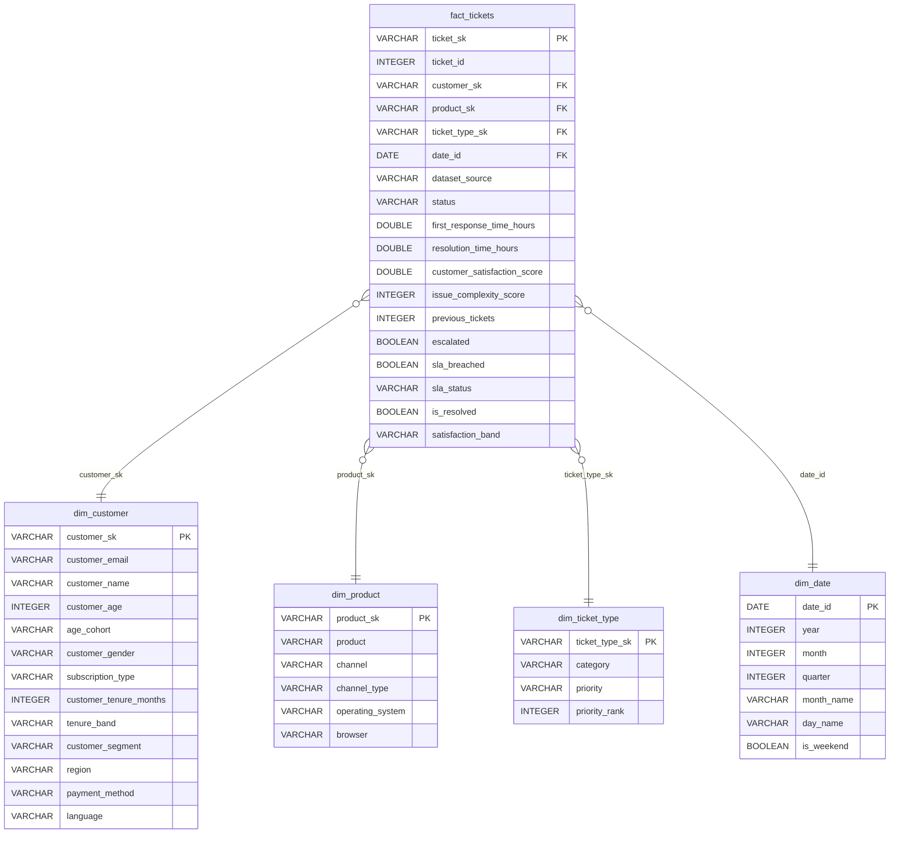

# 📊 Customer Support Analytics — DE Capstone
 
> **Stack:** Apache Spark · DuckDB · dbt · Kestra · PostgreSQL · Streamlit ·
> **Dataset:** [Customer Support Tickets 200k — Kaggle](https://www.kaggle.com/datasets/mirzayasirabdullah07/customer-support-tickets-dataset-200k-records)
> **Dataset:** [Customer Support Ticket Dataset](https://www.kaggle.com/datasets/suraj520/customer-support-ticket-dataset) — 8,469 tickets · 17 columns
 
---
 
## 📋 Problem Description
 
Consumer technology companies receive thousands of support tickets every month. Without structured analysis, it is impossible to answer critical questions such as:
 
- Which products generate the most unresolved critical complaints and are at risk of driving churn?
- Which support channel is truly the most efficient?
- Where exactly do tickets get stuck in the support pipeline?
- Which customers are about to leave due to repeatedly bad experiences?
This project builds an **end-to-end data pipeline** that ingests tickets from Kaggle, transforms them with dbt on DuckDB, and exposes concrete answers in an interactive Streamlit dashboard. The goal: enable any CX or product team to detect operational friction and make data-driven decisions.
 
---
 
## 🏗️ Pipeline Architecture
 
```
┌─────────────┐    ┌──────────────┐    ┌──────────────┐    ┌────────────────┐
│  Kaggle CSV │───▶│  Apache Spark│───▶│  PostgreSQL  │    │   Streamlit    │
│  200k rows  │    │  Batch ETL   │    │  (raw layer) │    │   Dashboard    │
└─────────────┘    └──────┬───────┘    └──────────────┘    └───────▲────────┘
                          │                                         │
                          │            ┌──────────────┐    ┌───────┴────────┐
                          └───────────▶│    DuckDB    │───▶│      dbt       │
                                       │ (analytical) │    │ Star Schema +  │
                                       └──────────────┘    │     Marts      │
                                                           └────────────────┘
                    ┌──────────────┐
                    │    Kestra    │  Pipeline orchestration (scheduler)
                    │  Scheduler  │
                    └──────────────┘
```
 
---
 
## ⭐ Star Schema (Data Warehouse)
 

 
---
 
## 📁 Project Structure
 
```
Customer_Support_Ticket-AnalyticsDE2/
├── Makefile                              # Local orchestration
├── README.md
├── docker-compose.yml                    # All services
│
├── data/                                 # (gitignored)
│   ├── customer_support_tickets_200k.csv
│   └── customer_support_tickets.csv      # original dataset (optional)
│
├── scripts/
│   ├── download_dataset.py               # Download from Kaggle API
│   ├── spark_batch_process.py            # CSV ingestion → PostgreSQL + DuckDB
│   └── spark_ingestion.py                # (legacy multi-dataset)
│
├── dbt/
│   ├── profiles.yml                      # DuckDB connection
│   ├── dbt_project.yml
│   ├── packages.yml                      # dbt_utils
│   └── capstone_support/
│       └── models/
│           ├── staging/
│           │   ├── sources.yml
│           │   ├── schema.yml
│           │   ├── stg_tickets_200k.sql       # cleaning + typing
│           │   └── stg_tickets_original.sql   # alignment to common schema
│           └── marts/
│               ├── schema.yml
│               │
│               ├── ── STAR SCHEMA ──
│               ├── dim_date.sql
│               ├── dim_customer.sql
│               ├── dim_product.sql
│               ├── dim_ticket_type.sql
│               ├── fact_tickets.sql           # central fact table
│               │
│               ├── ── MARTS (analytics) ──
│               ├── fct_global_tickets.sql     # denorm ready for Streamlit
│               ├── mart_operations_sla.sql
│               ├── mart_product_health.sql
│               ├── mart_channel_efficiency.sql
│               ├── mart_repeat_customers.sql  # churn risk
│               ├── mart_ticket_funnel.sql
│               └── mart_cx_satisfaction.sql
│
├── flows/
│   ├── Dockerfile.kestra
│   ├── support_data_pipeline.yaml
│   └── full_data_pipeline.yaml
│
├── streamlit/
│   ├── app.py                            # Home / index
│   ├── requirements.txt
│   ├── utils/
│   │   ├── db.py                         # DuckDB connection with cache
│   │   └── sidebar.py                    # reusable status sidebar
│   └── pages/
│       ├── 1_Product_Health.py
│       ├── 2_Churn_Risk.py
│       ├── 3_Explorer.py                 # interactive SQL console
│       ├── 4_Channel_Efficiency.py
│       ├── 5_Ticket_Funnel.py
│       ├── 6_General_Metrics.py
│       ├── 6_SLA_Deep_Dive.py
│       └── 7_Dataset_Benchmarking.py
│
├── duckdb/
│   └── support.duckdb                    # generated by pipeline (gitignored)
│
└── terraform/
    ├── main.tf
    ├── outputs.tf
    └── variables.tf
```
 
---
 
## 🚀 End-to-End Guide (first run)
 
### Prerequisites
 
- Docker + Docker Compose installed
- Python 3.11+
- Java 11 (JDK) at `./batch/jdk-11.0.2`
- Spark 3.3.2 at `./batch/spark-3.3.2-bin-hadoop3`
- Kaggle credentials (see below)
## ⚙️ Step 0 — Spark and Java Setup (local environment only)
 
> ⚠️ This step is **only required if you run Spark outside of Docker**.
> If you use `docker-compose`, you can skip it.
 
### 1. Download dependencies
 
```bash
wget https://archive.apache.org/dist/spark/spark-3.3.2/spark-3.3.2-bin-hadoop3.tgz
tar -xzvf spark-3.3.2-bin-hadoop3.tgz
 
wget https://download.java.net/java/GA/jdk11/9/GPL/openjdk-11.0.2_linux-x64_bin.tar.gz
tar -xzvf openjdk-11.0.2_linux-x64_bin.tar.gz
```
 
### 2. Set environment variables
 
```bash
export JAVA_HOME=$(pwd)/jdk-11.0.2
export PATH=$JAVA_HOME/bin:$PATH
 
export SPARK_HOME=$(pwd)/spark-3.3.2-bin-hadoop3
export PATH=$PATH:$SPARK_HOME/bin
```
 
### 3. Verify
 
```bash
java -version
spark-submit --version
```
 
Expected output:
 
* Java → `11.0.2`
* Spark → `3.3.2`
### Step 1 — Kaggle Credentials
 
```bash
# Option A — environment variables
export KAGGLE_USERNAME=your_username
export KAGGLE_KEY=your_api_key
 
# Option B — file
mkdir -p ~/.kaggle
# Copy kaggle.json downloaded from kaggle.com/settings → API → Create New Token
chmod 600 ~/.kaggle/kaggle.json
```
 
### Step 2 — Start services
 
```bash
make up
make status   # verify all containers are running
```
 
| Service    | URL                          | Credentials                       |
|------------|------------------------------|-----------------------------------|
| Streamlit  | http://localhost:8501         | —                                 |
| pgAdmin    | http://localhost:5050         | admin@support.io / support1234    |
| Kestra     | http://localhost:18080        | admin@kestra.io / Admin1234       |
| Jupyter    | http://localhost:8888         | token: `support`                  |
 
### Step 3 — Download dataset
 
```bash
python3 scripts/download_dataset.py
```
 
### Step 4 — Run full pipeline
 
```bash
make pipeline
```
 
This runs in order:
1. **`make ingest`** — Spark reads the CSVs and writes to PostgreSQL + DuckDB (`*_raw` tables)
2. **`dbt deps`** — installs `dbt_utils`
3. **`dbt run`** — materializes Staging → Dimensions → Fact → Marts
4. **`dbt test`** — validates integrity (not_null, unique, accepted_values)
### Step 5 — View the dashboard
 
Open http://localhost:8501 🎉
 
---
 
## 🔄 Useful Commands
 
```bash
make status           # container status + DuckDB tables
make logs-streamlit   # real-time dashboard logs
make logs-kestra      # orchestrator logs
 
make dbt-run          # regenerate dbt models only
make dbt-test         # run quality tests only
 
make shell-dbt        # bash inside the dbt container
make shell-postgres   # direct psql to PostgreSQL
 
make reset-db         # deletes DuckDB and restarts (data is regenerated with make pipeline)
make clean-all        # deep clean (DuckDB + storage + Docker volumes)
```
 
---
 
## 📊 dbt Models — Lineage
 
```
CSV raw
  └── tickets_200k_raw (DuckDB)
  └── tickets_original_raw (DuckDB)
        │
        ▼  STAGING
  stg_tickets_200k ──────┐
  stg_tickets_original ──┤
                         │
                         ▼  DIMENSIONS
                    dim_date
                    dim_customer
                    dim_product
                    dim_ticket_type
                         │
                         ▼  FACT
                    fact_tickets  (central)
                         │
                         ▼  MARTS
                    fct_global_tickets  ──── Streamlit (all pages)
                    mart_operations_sla
                    mart_product_health
                    mart_channel_efficiency
                    mart_repeat_customers
                    mart_ticket_funnel
                    mart_cx_satisfaction
```
 
---
 
## 🧪 Quality Tests (dbt)
 
| Model                | Test                                       |
|----------------------|--------------------------------------------|
| `stg_tickets_200k`   | not_null, unique (ticket_id)               |
| `stg_tickets_200k`   | accepted_values (priority, status)         |
| `dim_customer`       | not_null, unique (customer_sk, email)      |
| `fact_tickets`       | not_null, unique (ticket_sk)               |
| `fact_tickets`       | accepted_values (sla_status, satisfaction_band) |
| `mart_product_health`| accepted_range health_score (0–100)        |
 
---
 
## 🗃️ Dataset 200k — Columns
 
| Column                      | Type    | Description                                   |
|-----------------------------|---------|-----------------------------------------------|
| ticket_id                   | INT     | Unique ticket identifier                      |
| customer_email              | STRING  | Email (anonymized with SHA-256 in Spark)      |
| product                     | STRING  | Affected product                              |
| category                    | STRING  | Problem type                                  |
| priority                    | STRING  | Low / Medium / High / Urgent / Critical       |
| status                      | STRING  | Open / Closed / Pending / Resolved            |
| channel                     | STRING  | Email / Chat / Phone / Social Media           |
| region                      | STRING  | North / South America, etc.                   |
| resolution_time_hours       | DOUBLE  | Time to resolution                            |
| first_response_time_hours   | DOUBLE  | Time to first response                        |
| customer_satisfaction_score | DOUBLE  | Score 1–5                                     |
| issue_complexity_score      | INT     | Complexity 1–5                                |
| sla_breached                | BOOLEAN | True if SLA threshold was exceeded            |
| escalated                   | BOOLEAN | True if ticket was escalated                  |
| customer_tenure_months      | INT     | Months as a customer                          |
| customer_segment            | STRING  | Enterprise / SMB / Individual                 |
 
---
 
## ☁️ Cloud — GCP + Terraform (Optional)
 
```bash
cd terraform
terraform init
terraform apply -var="project_id=YOUR_PROJECT_ID"
# Output: Public IP + deployed stack URLs
```
 
Resources created: Compute Engine VM (e2-standard-4) · GCS Bucket · Firewall (ports 18080/8088/8888/8501) · Service Account with Storage Admin roles.
 
---
 
## 📊 Streamlit Dashboard Previews
 
All sections developed for the comprehensive analytics of this project:

| | |
|:---:|:---:|
| **Product Health** <br> | **Product Health — Full View** <br> |
| **Repeat Customers & Churn Risk** <br> | **Channel Efficiency** <br> |
| **Channel Efficiency — Detail** <br> | **Ticket Funnel** <br> |
| **General Metrics** <br> | **General Metrics — Full View** <br> |
| **SLA & Response Performance** <br> | **Dataset Benchmarking** <br> |
            *Capstone — Data Engineering Zoomcamp*
