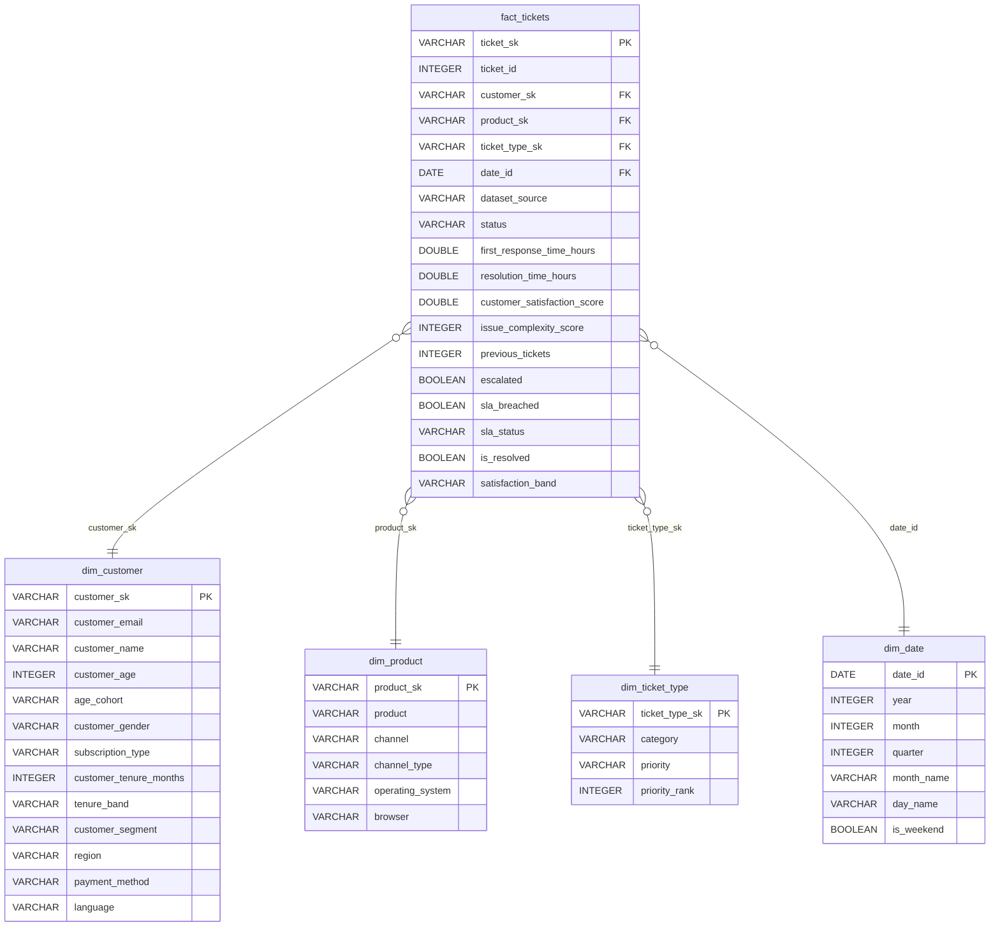

# 📊 Customer Support Analytics — DE Capstone

> **Stack:** Apache Spark · DuckDB · dbt · Kestra · PostgreSQL · Streamlit  
> **Dataset:** [Customer Support Tickets 200k — Kaggle](https://www.kaggle.com/datasets/mirzayasirabdullah07/customer-support-tickets-dataset-200k-records)

---
## 📋 Problem Description
 
Las empresas de tecnología de consumo reciben miles de tickets de soporte al mes. Sin análisis estructurado, es imposible responder preguntas críticas como:
 
- ¿Qué productos generan más quejas críticas sin resolver y están en riesgo de generar churn?
- ¿Qué canal de soporte es realmente el más eficiente?
- ¿Dónde exactamente se atascan los tickets en el pipeline de atención?
- ¿Qué clientes están a punto de abandonar por experiencias repetidamente malas?
 
Este proyecto construye un **pipeline de datos end-to-end** que ingesta tickets desde Kaggle, los transforma con dbt sobre DuckDB, y expone respuestas concretas en un dashboard interactivo con Streamlit. El objetivo: que cualquier equipo de CX o producto detecte fricciones operativas y tome decisiones basadas en datos.
 
---
---
---

## 🏗️ Arquitectura del Pipeline

```
┌─────────────┐    ┌──────────────┐    ┌──────────────┐    ┌────────────────┐
│  Kaggle CSV │───▶│  Apache Spark│───▶│  PostgreSQL  │    │   Streamlit    │
│  200k rows  │    │  Batch ETL   │    │  (raw layer) │    │   Dashboard    │
└─────────────┘    └──────┬───────┘    └──────────────┘    └───────▲────────┘
                          │                                         │
                          │            ┌──────────────┐    ┌───────┴────────┐
                          └───────────▶│    DuckDB    │───▶│      dbt       │
                                       │ (analytical) │    │ Star Schema +  │
                                       └──────────────┘    │     Marts      │
                                                           └────────────────┘
                    ┌──────────────┐
                    │    Kestra    │  Orquestación del pipeline (scheduler)
                    │  Scheduler  │
                    └──────────────┘
```

---

## ⭐ Star Schema (Data Warehouse)



---

## 📁 Project Structure

```
Customer_Support_Ticket-AnalyticsDE2/
├── Makefile                              # Orquestación local
├── README.md
├── docker-compose.yml                    # Todos los servicios
│
├── data/                                 # (gitignored)
│   ├── customer_support_tickets_200k.csv
│   └── customer_support_tickets.csv      # dataset original (opcional)
│
├── scripts/
│   ├── download_dataset.py               # Descarga desde Kaggle API
│   ├── spark_batch_process.py            # Ingesta CSV → PostgreSQL + DuckDB
│   └── spark_ingestion.py                # (legacy multi-dataset)
│
├── dbt/
│   ├── profiles.yml                      # Conexión DuckDB
│   ├── dbt_project.yml
│   ├── packages.yml                      # dbt_utils
│   └── capstone_support/
│       └── models/
│           ├── staging/
│           │   ├── sources.yml
│           │   ├── schema.yml
│           │   ├── stg_tickets_200k.sql       # limpieza + tipado
│           │   └── stg_tickets_original.sql   # alineación al schema común
│           └── marts/
│               ├── schema.yml
│               │
│               ├── ── STAR SCHEMA ──
│               ├── dim_date.sql
│               ├── dim_customer.sql
│               ├── dim_product.sql
│               ├── dim_ticket_type.sql
│               ├── fact_tickets.sql           # tabla de hechos central
│               │
│               ├── ── MARTS (analytics) ──
│               ├── fct_global_tickets.sql     # denorm lista para Streamlit
│               ├── mart_operations_sla.sql
│               ├── mart_product_health.sql
│               ├── mart_channel_efficiency.sql
│               ├── mart_repeat_customers.sql  # churn risk
│               ├── mart_ticket_funnel.sql
│               └── mart_cx_satisfaction.sql
│
├── flows/
│   ├── Dockerfile.kestra
│   ├── support_data_pipeline.yaml
│   └── full_data_pipeline.yaml
│
├── streamlit/
│   ├── app.py                            # Home / índice
│   ├── requirements.txt
│   ├── utils/
│   │   ├── db.py                         # conexión DuckDB con cache
│   │   └── sidebar.py                    # status sidebar reutilizable
│   └── pages/
│       ├── 1_Product_Health.py
│       ├── 2_Churn_Risk.py
│       ├── 3_Explorer.py                 # SQL console interactiva
│       ├── 4_Channel_Efficiency.py
│       ├── 5_Ticket_Funnel.py
│       ├── 6_General_Metrics.py
│       ├── 6_SLA_Deep_Dive.py
│       └── 7_Dataset_Benchmarking.py
│
├── duckdb/
│   └── support.duckdb                    # generado por pipeline (gitignored)
│
└── terraform/
    ├── main.tf
    ├── outputs.tf
    └── variables.tf
```

---

## 🚀 Guía End-to-End (primera vez)

### Pre-requisitos

- Docker + Docker Compose instalado
- Python 3.11+
- Java 11 (JDK) en `./batch/jdk-11.0.2`
- Spark 3.3.2 en `./batch/spark-3.3.2-bin-hadoop3`
- Credenciales Kaggle (ver abajo)

### Paso 1 — Credenciales Kaggle

```bash
# Opción A — variables de entorno
export KAGGLE_USERNAME=tu_usuario
export KAGGLE_KEY=tu_api_key

# Opción B — archivo
mkdir -p ~/.kaggle
# Copiar kaggle.json descargado de kaggle.com/settings → API → Create New Token
chmod 600 ~/.kaggle/kaggle.json
```

### Paso 2 — Levantar servicios

```bash
make up
make status   # verifica que todos los contenedores estén corriendo
```

| Servicio   | URL                          | Credenciales              |
|------------|------------------------------|---------------------------|
| Streamlit  | http://localhost:8501         | —                         |
| pgAdmin    | http://localhost:5050         | admin@support.io / support1234 |
| Kestra     | http://localhost:18080        | admin@kestra.io / Admin1234   |
| Jupyter    | http://localhost:8888         | token: `support`          |

### Paso 3 — Descargar dataset

```bash
python3 scripts/download_dataset.py
```

### Paso 4 — Ejecutar pipeline completo

```bash
make pipeline
```

Esto ejecuta en orden:
1. **`make ingest`** — Spark lee los CSV y escribe a PostgreSQL + DuckDB (tablas `*_raw`)
2. **`dbt deps`** — instala `dbt_utils`
3. **`dbt run`** — materializa Staging → Dimensiones → Fact → Marts
4. **`dbt test`** — valida integridad (not_null, unique, accepted_values)

### Paso 5 — Ver el dashboard

Abrí http://localhost:8501 🎉

---

## 🔄 Comandos útiles

```bash
make status           # estado de contenedores + tablas en DuckDB
make logs-streamlit   # logs en tiempo real del dashboard
make logs-kestra      # logs del orquestador

make dbt-run          # solo regenerar modelos dbt
make dbt-test         # solo correr tests de calidad

make shell-dbt        # bash dentro del contenedor dbt
make shell-postgres   # psql directo a PostgreSQL

make reset-db         # borra DuckDB y reinicia (datos se regeneran con make pipeline)
make clean-all        # limpieza profunda (DuckDB + storage + volúmenes Docker)
```

---

## 📊 Modelos dbt — Linaje

```
CSV raw
  └── tickets_200k_raw (DuckDB)
  └── tickets_original_raw (DuckDB)
        │
        ▼  STAGING
  stg_tickets_200k ──────┐
  stg_tickets_original ──┤
                         │
                         ▼  DIMENSIONES
                    dim_date
                    dim_customer
                    dim_product
                    dim_ticket_type
                         │
                         ▼  FACT
                    fact_tickets  (central)
                         │
                         ▼  MARTS
                    fct_global_tickets  ──── Streamlit (todas las páginas)
                    mart_operations_sla
                    mart_product_health
                    mart_channel_efficiency
                    mart_repeat_customers
                    mart_ticket_funnel
                    mart_cx_satisfaction
```

---

## 🧪 Tests de Calidad (dbt)

| Modelo               | Test                          |
|----------------------|-------------------------------|
| `stg_tickets_200k`   | not_null, unique (ticket_id)  |
| `stg_tickets_200k`   | accepted_values (priority, status) |
| `dim_customer`       | not_null, unique (customer_sk, email) |
| `fact_tickets`       | not_null, unique (ticket_sk)  |
| `fact_tickets`       | accepted_values (sla_status, satisfaction_band) |
| `mart_product_health`| accepted_range health_score (0-100) |

---

## 🗃️ Columnas del Dataset 200k

| Columna                     | Tipo    | Descripción                              |
|-----------------------------|---------|------------------------------------------|
| ticket_id                   | INT     | Identificador único del ticket           |
| customer_email              | STRING  | Email (anonimizado con SHA-256 en Spark) |
| product                     | STRING  | Producto afectado                        |
| category                    | STRING  | Tipo de problema                         |
| priority                    | STRING  | Low / Medium / High / Urgent / Critical  |
| status                      | STRING  | Open / Closed / Pending / Resolved       |
| channel                     | STRING  | Email / Chat / Phone / Social Media      |
| region                      | STRING  | Norte / Sur América, etc.                |
| resolution_time_hours       | DOUBLE  | Tiempo hasta resolución                  |
| first_response_time_hours   | DOUBLE  | Tiempo hasta primera respuesta           |
| customer_satisfaction_score | DOUBLE  | Score 1–5                                |
| issue_complexity_score      | INT     | Complejidad 1–5                          |
| sla_breached                | BOOLEAN | True si superó el umbral de SLA          |
| escalated                   | BOOLEAN | True si fue escalado                     |
| customer_tenure_months      | INT     | Meses como cliente                       |
| customer_segment            | STRING  | Enterprise / SMB / Individual            |

---

## ☁️ Cloud — GCP + Terraform (Optional)
 
```bash
cd terraform
terraform init
terraform apply -var="project_id=TU_PROJECT_ID"
# Output: IP pública + URLs del stack desplegado
```
 
Recursos creados: Compute Engine VM (e2-standard-4) · GCS Bucket · Firewall (puertos 18080/8088/8888/8501) · Service Account con roles Storage Admin.
 
---

## Dashboards sugeridos en Streamlit.
         


*Capstone — Data Engineering Zoomcamp*
