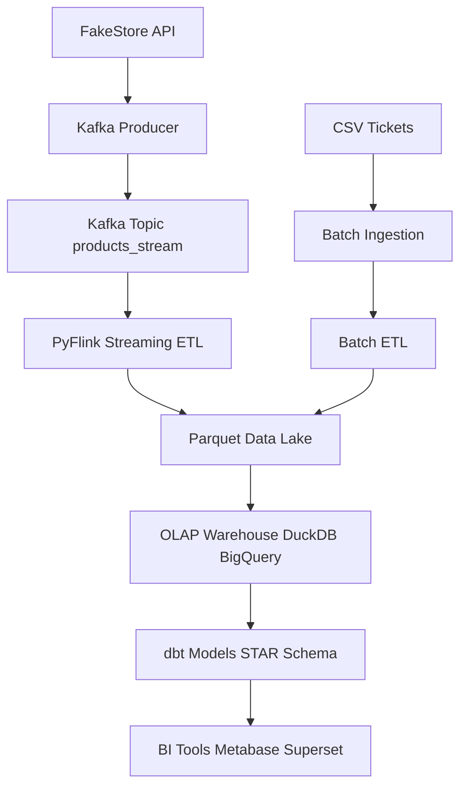
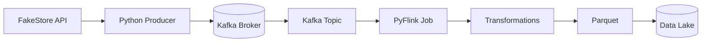
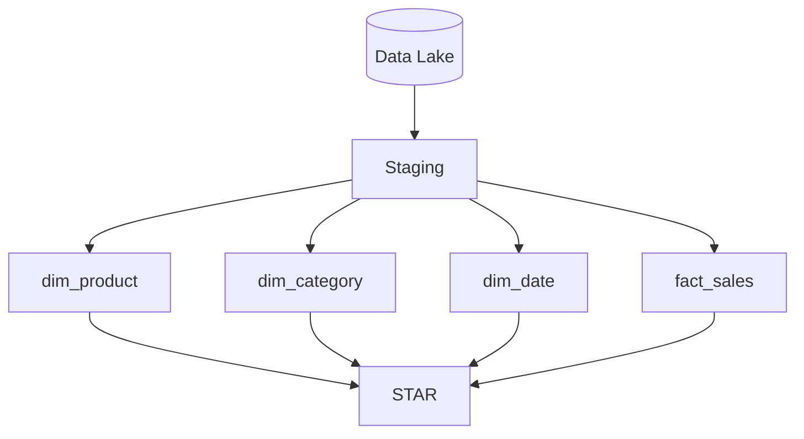
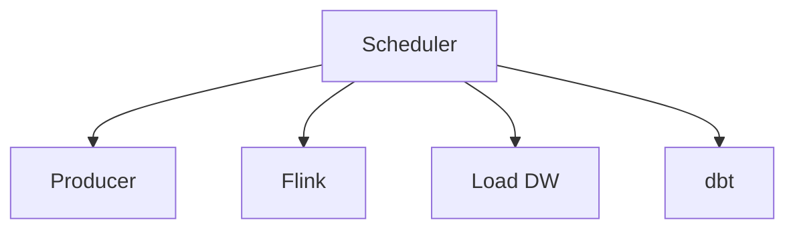
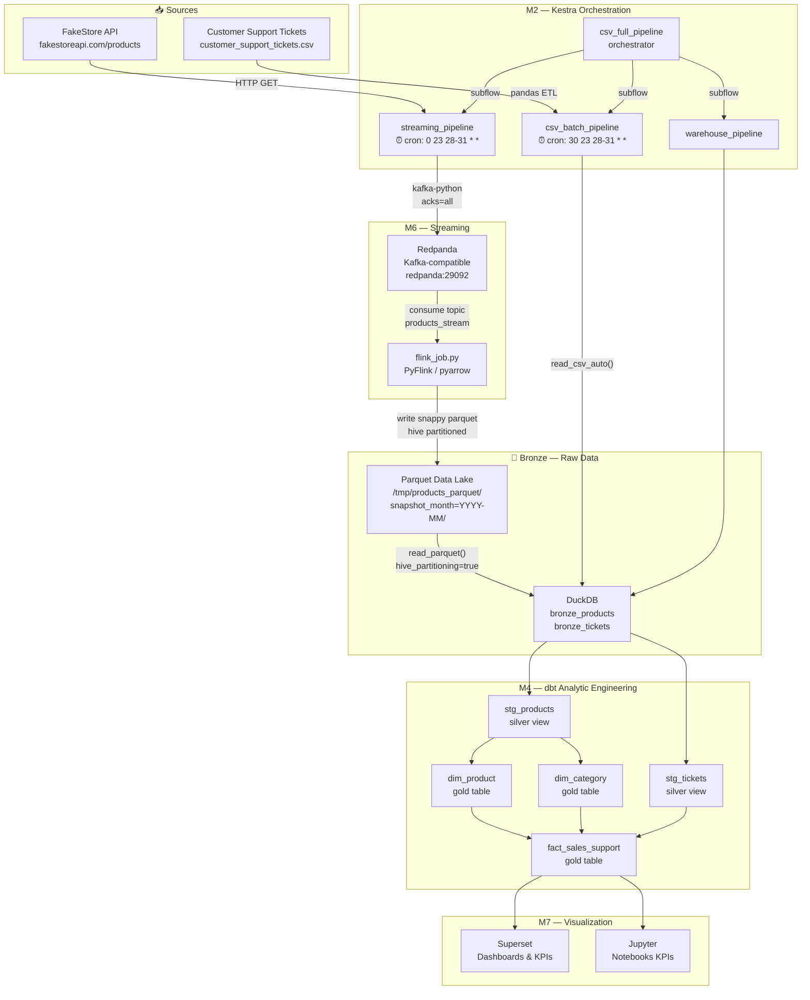
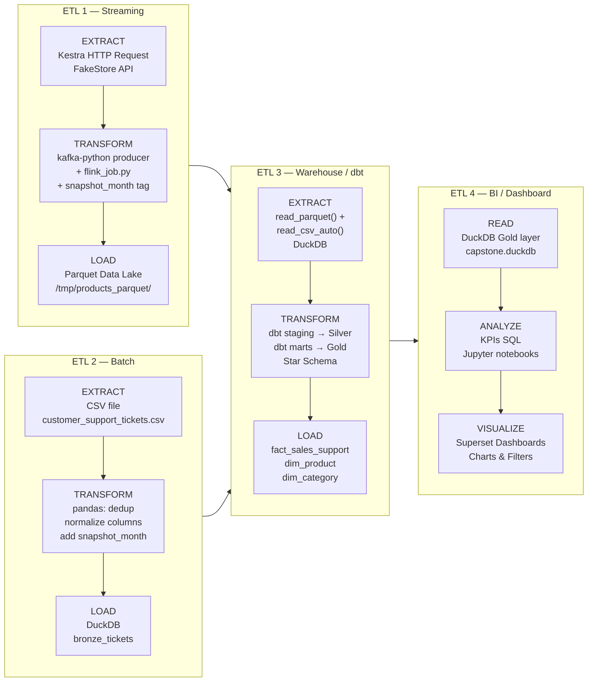
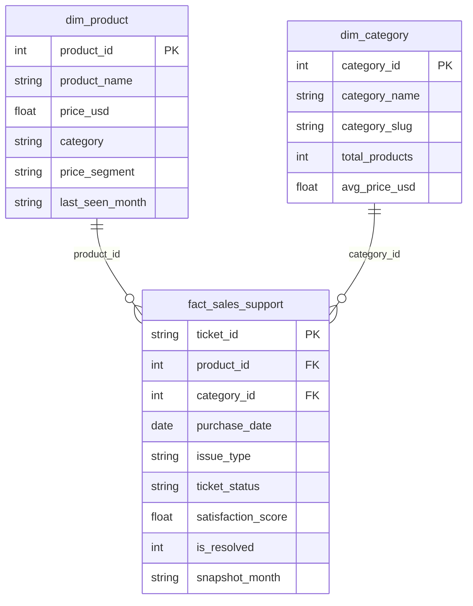
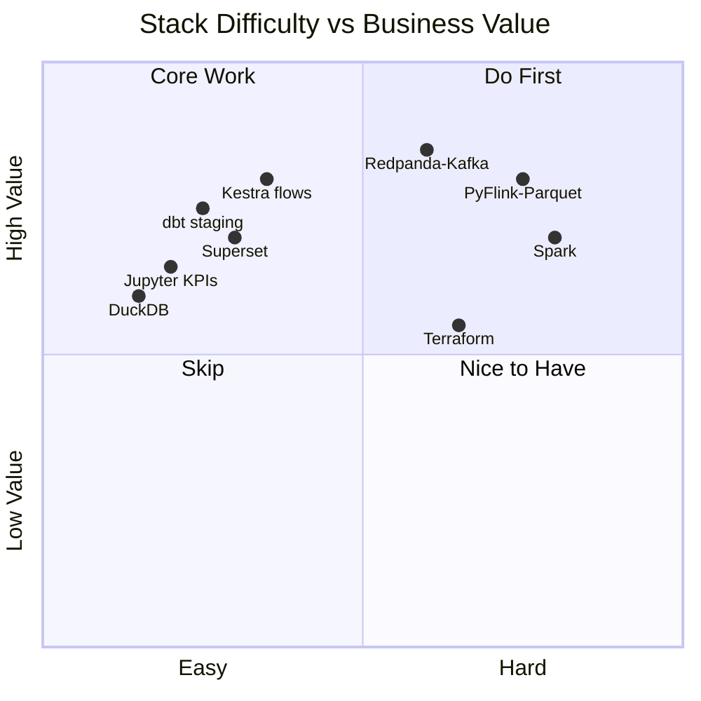
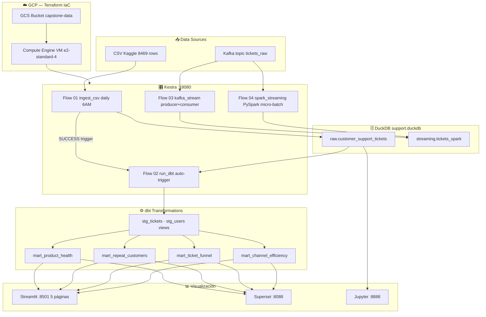

# Capstone: Customer Support Ticket Analytics
**Data Engineering Zoomcamp — Proyecto Final**
> **Stack:** Kestra · DuckDB · dbt · Streamlit · Docker · Spark · Terraform (GCP)
> **Dataset:** [Customer Support Ticket Dataset](https://www.kaggle.com/datasets/suraj520/customer-support-ticket-dataset) — 8,469 tickets · 17 columnas
 
---
 
## 📋 Problem Description
 
Las empresas de tecnología de consumo reciben miles de tickets de soporte al mes. Sin análisis estructurado, es imposible responder preguntas críticas como:
 
- ¿Qué productos generan más quejas críticas sin resolver y están en riesgo de generar churn?
- ¿Qué canal de soporte es realmente el más eficiente?
- ¿Dónde exactamente se atascan los tickets en el pipeline de atención?
- ¿Qué clientes están a punto de abandonar por experiencias repetidamente malas?
 
Este proyecto construye un **pipeline de datos end-to-end** que ingesta tickets desde Kaggle, los transforma con dbt sobre DuckDB, y expone respuestas concretas en un dashboard interactivo con Streamlit. El objetivo: que cualquier equipo de CX o producto detecte fricciones operativas y tome decisiones basadas en datos.
 
---
---

## Stack tecnológico

| Capa | Herramienta | Por qué |
|------|-------------|---------|
| Orquestación | Kestra | Flows YAML, UI web, sin código extra |
| Storage | DuckDB | OLAP embebido, perfecto para <5M filas |
| Transform | dbt-duckdb | Modelos ya hechos, lineage, tests |
| Visualización | Streamlit o Apache Superset | Conecta a DuckDB directo |
| Streaming (opcional) | Kafka nativo (bitnami) | ~300MB vs ~600MB de Redpanda |
| Exploración | Jupyter | Notebooks de análisis |

**¿Por qué NO Redpanda?**
Redpanda pesa ~600MB de imagen y corre un proceso pesado. `bitnami/kafka:3.7` hace exactamente lo mismo para este proyecto usando ~300MB. Si no necesitás streaming en producción, dejalo comentado en el docker-compose.

**¿Por qué NO Spark ni Postgres?**
El dataset tiene entre 8K y 200K filas. DuckDB corre queries analíticas a esa escala en milisegundos. Spark sería over-engineering y Postgres es OLTP, no OLAP.

---

## Dataset

**Primary:** [Customer Support Ticket Dataset](https://www.kaggle.com/datasets/suraj520/customer-support-ticket-dataset) — CSV, ~8,469 filas

**Columnas clave:**
- `Ticket ID`, `Customer Name`, `Customer Email`, `Customer Age`
- `Customer Gender`, `Product Purchased`, `Date of Purchase`
- `Ticket Type`, `Ticket Subject`, `Ticket Description`
- `Ticket Status` (Open / Closed / Pending Customer Response)
- `Resolution`, `Ticket Priority` (Critical / High / Medium / Low)
- `Ticket Channel` (Email / Chat / Phone / Social media)
- `First Response Time`, `Time to Resolution`
- `Customer Satisfaction Rating` (1-5)

**Alternativa batch mayor:**
[200K Records Version](https://www.kaggle.com/datasets/mirzayasirabdullah07/customer-support-tickets-dataset-200k-records)

---
---
## 📊 Dashboards de Streamlit
 
5 páginas en `./streamlit/pages/`, cada una conectada a un mart via DuckDB `read_only`.
 
### 🏥 1 — Product Health
**Mart:** `mart_product_health`
Health score por producto (0-100), scatter resolución vs satisfacción coloreado por risk level (🔴🟡🟢), top críticos sin resolver, heatmap producto × tipo de ticket, tabla filtrable por nivel de riesgo.
 
### 🚨 2 — Churn Risk
**Mart:** `mart_repeat_customers`
Segmentación Primera vez / Recurrente / Frecuente (3+), distribución de riesgo de churn, satisfacción por segmento vs neutral (3.0), canal preferido de clientes en riesgo, tabla top 50 clientes más críticos.
 
### 🗄️ 3 — SQL Explorer
Query libre sobre cualquier tabla DuckDB. 8 queries de ejemplo pre-cargadas, descarga de resultados en CSV, mini-visualización automática cuando hay columnas numéricas + categóricas.
 
### 📡 4 — Channel Efficiency
**Mart:** `mart_channel_efficiency`
% resuelto por canal vs benchmark global, desvío de resolución y satisfacción en grouped bar, heatmap canal × prioridad, heatmap canal × tipo, scatter volumen vs eficiencia para identificar cuellos de botella.
 
### 🔽 5 — Ticket Funnel
**Mart:** `mart_ticket_funnel`
Funnel visual Open → Pending → Closed con métricas absolutas, % atascados por subject, stacked bar estado por canal, heatmap canal × tipo, tabla de dead-ends (combinaciones con 0% cerrados).
 
---
## Preguntas analíticas que podés responder

### 🏥 Product Health
| Pregunta | Página |
|----------|--------|
| ¿Qué productos tienen peor tasa de resolución? | Product Health |
| ¿Cuál es el health score de cada producto (0-100)? | Product Health |
| ¿Qué combinación Producto × Subject acumula más críticos sin resolver? | Product Health |
| ¿Hay productos donde los tickets nunca se cierran? | Product Health |
| ¿Qué productos tienen baja satisfacción Y alta tasa de escalamiento? | Product Health |
 
### 🚨 Churn Risk
| Pregunta | Página |
|----------|--------|
| ¿Qué clientes abrieron más de 1 ticket? | Churn Risk |
| ¿Los clientes recurrentes tienen peor satisfacción que los de primera vez? | Churn Risk |
| ¿Qué productos generan más clientes recurrentes? | Churn Risk |
| ¿Cuáles son los clientes con mayor riesgo de abandono? | Churn Risk |
| ¿Qué canal prefieren los clientes en riesgo de churn? | Churn Risk |
 
### 🔽 Ticket Funnel
| Pregunta | Página |
|----------|--------|
| ¿Dónde se atascan más los tickets en el pipeline? | Ticket Funnel |
| ¿Hay subjects con 0% de cierre (dead-ends)? | Ticket Funnel |
| ¿Qué % de tickets críticos siguen sin primera respuesta? | Ticket Funnel |
| ¿Qué canal tiene mayor proporción de tickets Open? | Ticket Funnel |
| ¿Qué tipo de ticket tiene peor conversión a Closed? | Ticket Funnel |
 
### 📡 Channel Efficiency
| Pregunta | Página |
|----------|--------|
| ¿Qué canal resuelve por encima del promedio global? | Channel Efficiency |
| ¿Cuál es el cuello de botella: alto volumen + baja resolución? | Channel Efficiency |
| ¿Hay canales donde los tickets críticos se acumulan más? | Channel Efficiency |
| ¿El canal con más satisfacción también tiene más resolución? | Channel Efficiency |
| ¿Cuál es el desvío de satisfacción de cada canal vs el global? | Channel Efficiency |

---
### Architecture

Project Overview:

El proyecto consiste en el desarrollo de una plataforma de análisis en tiempo real para el seguimiento de tickets de servicio y órdenes de una tienda virtual. El sistema integra flujos de datos continuos, procesa eventos en tiempo real, almacena registros históricos en la nube y proporciona herramientas de visualización avanzada para la toma de decisiones proactivas en la gestión de clientes y logística.

Problem Statement

**El Desafío:** Los sistemas tradicionales de atención al cliente a menudo operan con datos estáticos o reportes diarios, lo que genera cuellos de botella, tiempos de respuesta lentos ante incidentes críticos y una desconexión entre el inventario real y las reclamaciones de los usuarios.

Solución Propuesta:

* **Ingestión de API en Tiempo Real:** **Captura de datos de pedidos y tickets mediante productores de Kafka sincronizados con la Fake Store API.**
* **Procesamiento de Flujos:** **Uso de Spark y Kestra para identificar anomalías y tendencias en el comportamiento de los servicios al instante.**
* **Almacenamiento de Datos de Niveles:** **Implementación de una arquitectura de medallón (Bronze, Silver, Gold) para asegurar la integridad de los datos.**
* **Dashboards Dinámicos:** **Visualización de métricas clave (SLA, volumen de tickets, estados de envío) mediante Superset.**

Project Architecture Overview

La arquitectura se centra en un flujo de datos sin interrupciones, orquestado por contenedores **Docker** y gestionado por  **Kestra** . Los eventos de la Fake Store API son capturados por un productor, enviados a un tópico de Kafka y procesados a través de pipelines de Spark para su transformación y posterior análisis en BigQuery.

## 📌 Overview

Este proyecto implementa una arquitectura completa de Data Engineering combinando:

- Ingesta batch (CSV)
- Ingesta streaming (API → Kafka)
- Procesamiento en tiempo real (PyFlink)
- Data Warehouse OLAP
- Modelado dimensional (Kimball - Star Schema)
- Orquestación con Kestra

---

## 🧠 Arquitectura General



---

## ⚡ Streaming Architecture



---

## 🧱 Data Warehouse (Kimball)



---

## 🔄 Orquestación (Kestra)



---

## 🛠️ Stack

- Kafka
- Kestra
- DuckDB /- BigQuery (Optional) -
- dbt
- PyFlink
- Superset

---

## 📈 Futuro

- Data Quality
- SCD Type 2
- Cloud Deployment
- Dashboard BI

# Capstone Project DE1 — FakeStore API × Customer Support Tickets

> **Stack:** Docker · Terraform · Kestra · Redpanda · PyFlink · DuckDB · dbt · Spark · Superset · Jupyter

Two data sources, one Star Schema, end-to-end ETL pipeline.

---

## Quick Start

**Prerequisites:** `docker`, `docker compose`, `git`. Terraform optional.

```bash
# 1. Clone and enter the project
git clone https://github.com/ngribc/.git
cd 

# 2. Copy your CSV to ./data/ and start the stack
cp /path/to/customer_support_tickets.csv ./data/
make up

# 3. Run the full pipeline
make pipeline-full
```

Open **Superset** at `http://localhost:8088` (admin / zoomcamp1234) and connect DuckDB:

```
duckdb:////shared/duckdb/capstone.duckdb
```

---

## ETL Architecture

### Full Data Flow



---

### ETL Breakdown — Which ETL did you build?



---

### Star Schema (Gold Layer)



---

### Difficulty Map



**Easiest path:** DuckDB → dbt → Superset (pure SQL, no infra)
**Hardest path:** Redpanda → PyFlink → Parquet (distributed streaming)

---

## dbt Models — What Each File Does

### Staging (Silver layer — `materialized: view`)

**`stg_products.sql`**

- **What:** Reads `bronze_products`, casts `id` to INTEGER, `price` to DOUBLE, `LOWER(category)` for normalization, filters `price > 0` and `id IS NOT NULL`.
- **Why:** Raw API data has inconsistent types. This view guarantees clean types before any join downstream.

**`stg_tickets.sql`**

- **What:** Reads `bronze_tickets`, maps `product_purchased` (string) to a `product_id` (1–20) via `HASH % 20 + 1`, casts `customer_satisfaction_rating` to DOUBLE, casts `date_of_purchase` to DATE.
- **Why:** The CSV has no `product_id` column — the hash creates a deterministic FK that joins with `dim_product`. Without this, ETL2 and ETL1 would be siloed.

### Marts (Gold layer — `materialized: table`)

**`dim_product.sql`**

- **What:** `SELECT DISTINCT` from `stg_products`, adds `price_segment` (`economy / mid-range / premium`), takes `MAX(snapshot_month)` to get the latest version of each product.
- **Why:** Dimension table for OLAP. The `price_segment` column enables grouping by tier without SQL `CASE` in every dashboard query.

**`dim_category.sql`**

- **What:** Derives categories from `stg_products` using `GROUP BY category`. Adds `category_id` via `ROW_NUMBER()`, `category_slug` (spaces → underscores), `avg_price_usd` and `total_products` per category.
- **Why:** Superset can filter by category without scanning the fact table. Also pre-computes aggregates for KPI cards.

**`fact_sales_support.sql`**

- **What:** Central join — `stg_tickets JOIN dim_product ON product_id JOIN dim_category ON category`. Adds `is_resolved` (1/0 from ticket_status), `purchase_month` (truncated date), `price_segment` denormalized for OLAP performance.
- **Why:** This is the single table that answers all business questions. One row per ticket, enriched with product and category context. Joining two completely different data sources is the whole point of the capstone.

### Tests (`models/marts/schema.yml`)

- `dim_product.product_id` → `unique` + `not_null`
- `dim_category.category_id` → `unique` + `not_null`
- `fact_sales_support.product_id` → `relationships` to `dim_product`
- `fact_sales_support.category_id` → `relationships` to `dim_category`
- `dim_product.price_segment` → `accepted_values: [economy, mid-range, premium]`

---

## Project Structure

```

├── Makefile                          # All commands — run: make help
├── docker-compose.yml                # Full stack: Kestra·Redpanda·dbt·Spark·Jupyter·Superset
├── .env                              # Credentials (generated by terraform or setup)
├── .env.example                      # Template to copy
├── .gitignore
│
│
├── M1_Infraestructure/               # Postgres + pgAdmin (standalone module)
│ ├── terraform/                        # M0: Infrastructure as Code
│   ├── main.tf                       # Docker network + volumes + .env generation
│   ├── variables.tf                  # All configurable params (ports, passwords)
│   ├── outputs.tf                    # URLs, resource names after apply
│   └── terraform.tfvars.example      # Copy to terraform.tfvars
|
├── M2_Orchestration/kestra/
│   └── flows/                        # Kestra flow YMLs
│       ├── streaming_pipeline.yml    # API → Kafka → Parquet (cron: end of month)
│       ├── csv_batch_pipeline.yml    # CSV → DuckDB bronze (cron: end of month +30m)
│       ├── warehouse_pipeline.yml    # Parquet+CSV → DuckDB → dbt run → dbt test
│       └── csv_full_pipeline.yml     # Orchestrator: runs all 3 above in sequence
│
├── M3_DataWarehouse/
│   └── duckdb/
│       └── capstone.duckdb           # Shared file: Kestra writes, dbt transforms, Jupyter reads
│
├── M4_AnalyticsEngineering/
│   └── dbt/
│       ├── Dockerfile                # python:3.11-slim + dbt-duckdb
│       ├── profiles.yml              # target: /shared/duckdb/capstone.duckdb
│       └── capstone_bi/
│           ├── dbt_project.yml       # staging=silver(view), marts=gold(table)
│           └── models/
│               ├── staging/
│               │   ├── sources.yml   # Declares bronze_products, bronze_tickets
│               │   ├── stg_products.sql
│               │   └── stg_tickets.sql
│               └── marts/
│                   ├── schema.yml    # All dbt tests (unique, not_null, relationships)
│                   ├── dim_product.sql
│                   ├── dim_category.sql
│                   └── fact_sales_support.sql
│
├── M5_Batch/
│   ├── notebooks/                    # Jupyter KPI analysis
│   └── spark/                        # Spark job scripts
│
├── M6_Streaming/
│   └── scripts/
│       └── flink_job.py              # Kafka consumer → Parquet writer (pyarrow)
│
├── M7_Visualization/                 # Superset config / exported dashboards
│
└── data/
    └── customer_support_tickets.csv  # ← Copy here before make up
```

---

## Common Commands

```bash
make help              # All available targets
make check             # Verify prerequisites
make up                # Start full stack
make ps                # Container status
make logs              # Live logs

make pipeline-full     # End-to-end ETL in one command
make kestra-trigger    # Trigger a flow  [FLOW=streaming_pipeline]
make dbt-run           # Run all dbt models  [MODEL=dim_product]
make dbt-test          # Data quality tests
make dbt-docs          # Docs at http://localhost:8081

make reset-duckdb      # ⚠️  Wipe DuckDB
make down              # Stop everything
```

---

## Ports

| Service  | URL                    | Credentials                 |
| -------- | ---------------------- | --------------------------- |
| Kestra   | http://localhost:18080 | admin@kestra.io / Admin1234 |
| Jupyter  | http://localhost:8888  | token: zoomcamp             |
| Superset | http://localhost:8088  | admin / zoomcamp1234        |
| Spark UI | http://localhost:8080  | —                          |
| Redpanda | http://localhost:29092 | —                          |

Data Flow

1. **Ingestión:** **Un contenedor de streaming extrae datos de la Fake Store API y los envía al tópico de Kafka**.
2. **Procesamiento Batch/Stream:** **Pipeline orquestado por** **Kestra** **que consume datos de Kafka, los almacena como datos** **Bronze** **(raw) en** **Google Cloud Storage (GCS)** **y en una base de datos**  **PostgreSQL** **.**
3. **Transformación (Silver):** **Apache Spark** **procesa los datos de GCS, aplica esquemas OLAP (Star Schema) y los guarda nuevamente en GCS como datos** **Silver** **(transformados).**
4. **Exportación a BigQuery:** **Un pipeline carga los datos "Silver" desde GCS hacia** **BigQuery** **para facilitar el análisis a gran escala.**
5. **Refinamiento de Negocio (Gold):** **dbt Core** **transforma los datos en BigQuery hacia tablas**  **Gold** **, listas para el consumo de analítica avanzada y modelos de machine learning.**

Tech Stack Used

* **Docker:** **Containerización para aislamiento y portabilidad de todos los servicios.**
* **Apache Kafka:** **Plataforma de streaming distribuido para la ingesta de datos.**
* **Kestra:** **Orquestadores para la ejecución de flujos de trabajo y pipelines.**
* **Apache Spark:** **Motor de computación distribuida para procesamiento de datos a gran escala.**
* **dbt (Data Build Tool):** **Transformación de datos SQL para convertir datos crudos en insights.**
* **Superset:** **Herramienta de BI para creación de visualizaciones y dashboards.**
* (Optional)
* **PostgreSQL:** **Base de datos relacional para almacenamiento operativo y metadatos.**
* **Google BigQuery & GCS:** **Infraestructura de almacenamiento y Data Warehouse en la nube (GCP).**
* **Terraform:** **Infraestructura como Código (IaC) para el aprovisionamiento de recursos.**

Pipeline Overview

1. **Batch Pipeline:** **Procesa datos históricos desde GCS, realiza transformaciones OLAP con Spark y los exporta a BigQuery.**
2. **Streaming Pipeline:** **Componente dinámico que procesa flujos continuos de la API en tiempo real usando Kafka y Kestra.**
3. **dbt Pipeline:** **Transforma los datos de nivel Silver en tablas Gold dentro de BigQuery, creando modelos de dimensiones y hechos.**
4. **Dockerized Services:** **Gestión de servicios de infraestructura (Broker de Kafka, Zookeeper, Spark Master/Workers, Jupyter, Metabase).**

Step-by-Step Execution Guide

Para ejecutar el proyecto, siga estos pasos tras clonar el repositorio:

1. **Inicialización de Infraestructura:**
   * **Configurar las credenciales de GCP en** `google-cred.json`.
   * **Ejecutar** `terraform-start` **para crear los buckets de GCS y datasets de BigQuery.**
2. **Levantamiento de Servicios:**
   * **Ejecutar** `docker-compose up -d` **para iniciar Kafka, Spark, Postgres y Metabase.**
3. **Activación del Ingestor:**
   * **Ejecutar el script productor:** `python producer_api.py` **para comenzar a poblar Kafka con datos de la Fake Store API.**
4. **Ejecución de Pipelines:**
   * **Acceder a la interfaz de Kestra/Mage para activar el flujo de ingesta y transformación.**
   * **Correr** `dbt run` **para generar las tablas Gold en BigQuery.**
5. **Visualización:**
   * **Conectar Metabase a BigQuery y cargar el archivo de configuración del dashboard predefinido.**

Deliverables

* **Infraestructura:** **Código de Terraform para el despliegue automático en GCP.**
* **Pipelines:** **Scripts de Spark (PySpark) y configuraciones de Kestra/Mage.**
* **Modelos de Datos:** **Repositorio dbt con modelos Gold documentados y testeados.**
* **Dashboard:** **Panel en Metabase con KPIs de Service Ticker (Ej: Tiempo medio de respuesta, Tickets por categoría).**
* **Documentación:** **Guía de depuración (Debug README) y especificación de la arquitectura.**

Additional Benefits

* **Modularidad:** **El diseño permite actualizar componentes individuales (ej. cambiar Spark por Flink) sin afectar el sistema completo.**
* **Costo-Eficiencia:** **Al usar GCS y BigQuery, solo se paga por el almacenamiento y las consultas realizadas.**
* **Escalabilidad Automática:** **La naturaleza distribuida de Kafka y Spark permite manejar incrementos súbitos en el volumen de datos de la API.**

Conclusion

Este proyecto demuestra una implementación robusta de ingeniería de datos moderna. Al integrar tecnologías de punta como Spark, Kafka y dbt bajo una arquitectura de medallón, se logra transformar datos crudos de una API en inteligencia de negocio accionable en tiempo real, garantizando escalabilidad, calidad y mantenibilidad.
---


Archivo: [`architecture.mmd`](./architecture.mmd) — renderizable en [mermaid.live](https://mermaid.live) o con `mmdc`.
 
---

## Estructura del proyecto

```
capstone_support/
├── Makefile                    ← All
├── docker-compose.yml          ← Stack completo
├── .env                        ← Credenciales (no commitear)
├── README.md
├── flows/                             # Kestra flows
│   ├── 01_ingest_csv.yml              # Descarga + ingesta + quality check
│   ├── 02_run_dbt.yml                 # dbt run + test (auto-trigger)
│   ├── 03_kafka_stream.yml            # Producer + consumer Kafka
│   └── 04_spark_streaming.yml        # PySpark Structured Streaming
├── dbt/capstone_support/
│   └── models/
│         ├── staging/
|           └── schema.yml
|           └── sources.yml
│           └── stg_tickets.sql        # Limpieza, tipos, flags, surrogate key
│           └── stg_users.sql          # Dedup de clientes
│         ├── marts/
│           └── mart_product_health.sql
│           └── mart_repeat_customers.sql
│           └── mart_ticket_funnel.sql
│           └── mart_channel_efficiency.sql
|         ├─ seeds
                └──customer_support_tickets.csv
|         ├─ target
|         ├─ tests
|         ├─ dbt_project.yml
|         ├─ packages.yml
|         ├─ packages-lock.yml
|         ├─ Dockerfile.dbt
|         ├─ dockerfile
|         ├─ package-lock.yml
|         ├─ profiles.yml
├── terraform/
│   ├── main.tf                        # VM + GCS + Firewall + SA
│   ├── variables.tf
│   └── outputs.tf                     # IPs y URLs del stack
├── scripts/
│   └── download_dataset.py            # Descarga automática desde Kaggle
├── streamlit/
│   ├── app.py                         # Home con links a las 5 páginas
│   ├── requirements.txt
│   ├── .streamlit/config.toml         # Tema oscuro + puerto 8501
│   ├── utils/
│   │   ├── db.py                      # Conexión DuckDB auto-detect
│   │   └── sidebar.py                 # Sidebar compartido
│   └── pages/
│       ├── 1_Product_Health.py
│       ├── 2_Churn_Risk.py
│       ├── 3_Explorer.py
│       ├── 4_Channel_Efficiency.py
│       └── 5_Ticket_Funnel.py
├── notebooks/
│   ├── 1_ingestion.ipynb 
│   ├── 2_batch_processing_tickets.ipynb
│   ├── 2_transformation.ipynb
│   ├── 3_analytics_and_output.ipynb
│   └── customer_service1.ipynb
├── duckdb/
│   └── support.duckdb          ← Generado automáticamente
└── data/
    └── customer_support_tickets.csv
```

---

## Capas de DuckDB

```
raw.*          ← Datos tal cual vienen del CSV (sin transformar)
staging.*      ← Limpieza, tipos, renombrado (dbt)
marts.*        ← Tablas agregadas para dashboards (dbt)
streaming.*    ← Datos que llegan por Kafka (opcional)
```

---

---
 
## ☁️ Cloud — GCP + Terraform (Optional)
 
```bash
cd terraform
terraform init
terraform apply -var="project_id=TU_PROJECT_ID"
# Output: IP pública + URLs del stack desplegado
```
 
Recursos creados: Compute Engine VM (e2-standard-4) · GCS Bucket · Firewall (puertos 18080/8088/8888/8501) · Service Account con roles Storage Admin.
 
---

## Dashboards sugeridos en Streamlit.
         

---


## Setup rápido

```
# 1. Git clone repo or open codespace
git clone https://github.com/N2026-2025/Customer_Support_Ticket-AnalyticsDE2.git
cd capstone-support-analytics
make setup

# 2. Descargar el dataset

# Opción A — Automático (requiere API key Kaggle)
export KAGGLE_USERNAME=tu_usuario
export KAGGLE_KEY=tu_api_key
python3 scripts/download_dataset.py
 
# Opción B — Manual
# Descargar desde: https://www.kaggle.com/datasets/suraj520/customer-support-ticket-dataset
# Guardar como: ./data/customer_support_tickets.csv

# 3. Levantar el stack 
make up
make check

# 4. kestra + dbt + streamlit
Make pipeline 

# 5. Ver el dashboard
make streamlit       # → http://localhost:8501

```

---

**Recomendaciones:**
- Kafka queda comentado — activalo solo para el módulo de streaming

Alternative (200k .CSV)

# 🎫 Customer Support Ticket Analytics

End-to-end Modern Data Stack pipeline — **Spark → PostgreSQL → dbt/Bruin → Streamlit**.

## Architecture

```
Kaggle API → Spark 3.3.2 (Host) → PostgreSQL (Docker)
                                       ↓
                              dbt  /  Bruin  (Star Schema)
                                       ↓
                              Streamlit Dashboard (Docker)
```

See [`architecture.mmd`](architecture.mmd) for the full Mermaid diagram.

---

## Quick Start

```bash
# 1. Clone & configure
cp infrastructure/.env.example .env
# Fill POSTGRES_PASSWORD, KAGGLE_USERNAME, KAGGLE_KEY, SPARK_HOME in .env

# 2. Bootstrap (downloads JDBC driver + starts Docker services)
make setup

# 3. Test connectivity
make test-conn

# 4. Download dataset from Kaggle
make ingest-download

# 5. Run Spark ingestion
make ingest-spark

# 6. Run dbt transformations
make transform-dbt

# 7. Open Streamlit dashboard
open http://localhost:8501
```

---

## Chunk Detection (Spark Notebook)

The notebook auto-detects how to split the 200k dataset:

| Mode | Trigger | How to activate |
|---|---|---|
| **`batch_folder`** | `data/batch/chunk_*.csv` exists | Run `split_csv_into_batch_folder()` cell once, then re-run notebook |
| **`single_csv`** | Only `data/raw/*.csv` present | Default — no setup needed |

Checkpoints are saved in `data/processed/checkpoints.json`.  
If the notebook crashes mid-run, simply re-run it — already-written chunks are skipped.

---

## Project Structure

```
.
├── infrastructure/
│   ├── docker-compose.yaml      # Postgres + Kestra + Streamlit
│   ├── init.sql                 # Medallion schemas + roles + audit table
│   ├── .env.example             # Template — copy to .env
│   └── test_conn.py             # Connectivity check
│
├── ingestion/
│   ├── kaggle_download.py       # Kaggle API download (idempotent)
│   ├── batch_ingestion.ipynb    # Spark ingestion with chunk detection
│   └── data_profiler.py        # Quality gate before transform
│
├── transform/
│   ├── dbt/                     # dbt-postgres project (Option A)
│   │   ├── models/staging/      # stg_tickets view
│   │   ├── models/dimensions/   # dim_customers, dim_agents, dim_categories
│   │   ├── models/facts/        # fact_tickets
│   │   └── models/schema.yml    # Tests: not_null, unique, relationships
│   │
│   └── bruin/                   # Bruin pipeline (Option B — mirror of dbt)
│       ├── .bruin.yaml
│       └── assets/              # stg_, dim_, fact_ SQL assets
│
├── orchestration/
│   └── kestra_workflow.yaml     # Full E2E Kestra flow
│
├── app/
│   ├── streamlit_app.py         # Dashboard (4 charts + filters)
│   ├── Dockerfile
│   └── requirements.txt
│
├── data/
│   ├── raw/                     # Kaggle CSV lands here
│   ├── batch/                   # Pre-split chunk_NNN.csv files (optional)
│   └── processed/               # Logs + checkpoints.json
│
├── drivers/                     # JDBC .jar (auto-downloaded by make setup)
├── architecture.mmd             # Mermaid architecture diagram
├── docker-compose.yaml
├── Makefile
└── requirements.txt
```

---

## Idempotency Strategy

| Layer | Strategy |
|---|---|
| Spark ingest | `ON CONFLICT (ticket_id) DO UPDATE` upsert via psycopg2 |
| Chunk tracking | `checkpoints.json` — already-done chunks are skipped |
| dbt | `materialized: table` with `strategy: replace` |
| Bruin | `materialization.strategy: replace` |

---

## Services

| Service | URL |
|---|---|
| Kestra UI | http://localhost:8080 |
| Streamlit | http://localhost:8501 |
| Postgres | localhost:5432 |