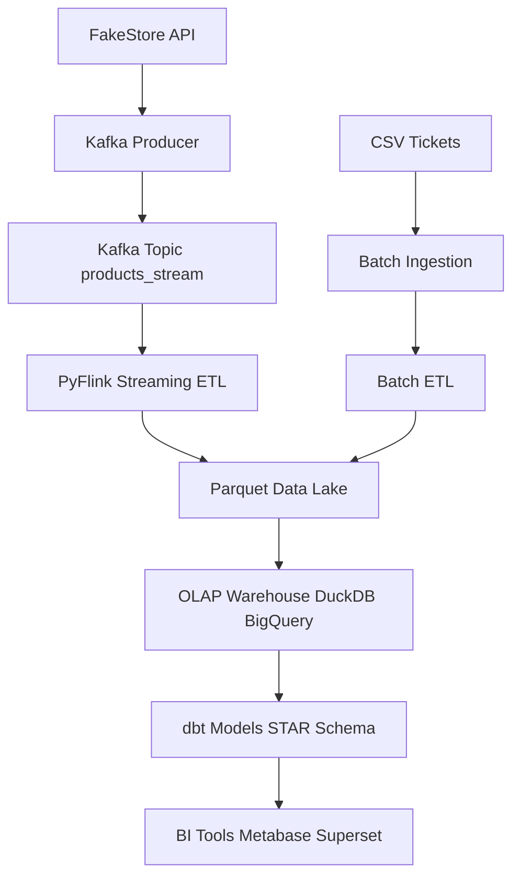
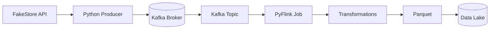
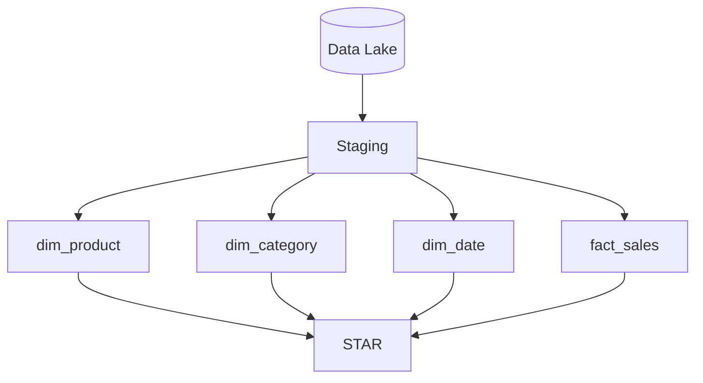
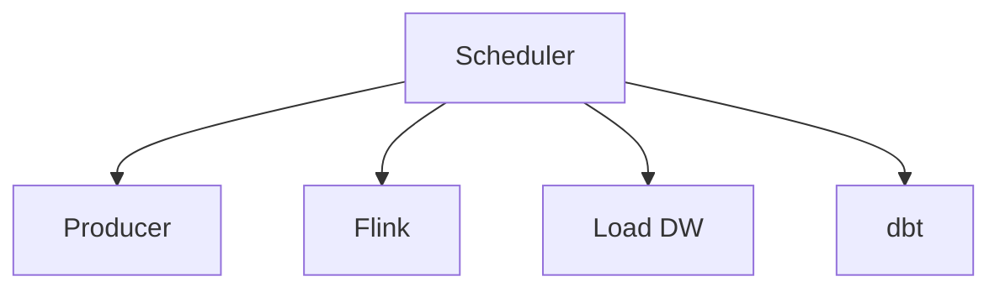
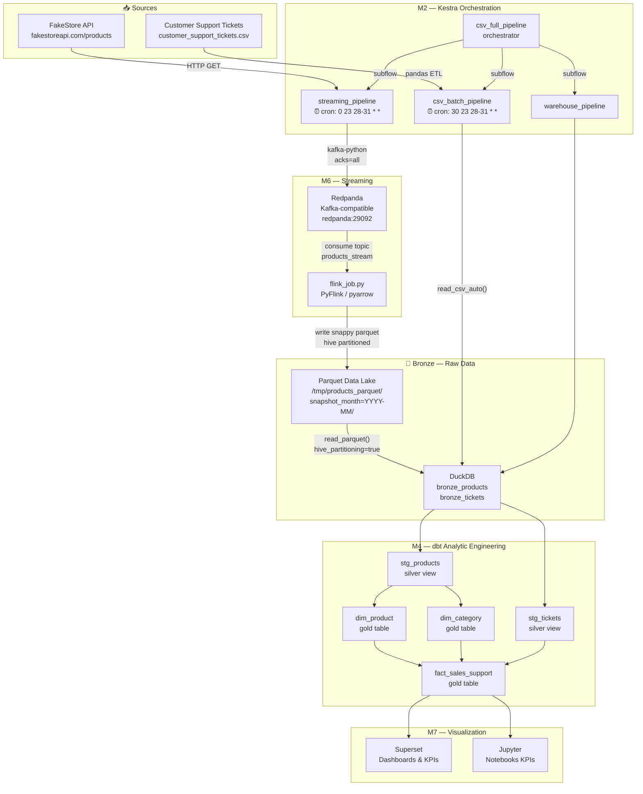
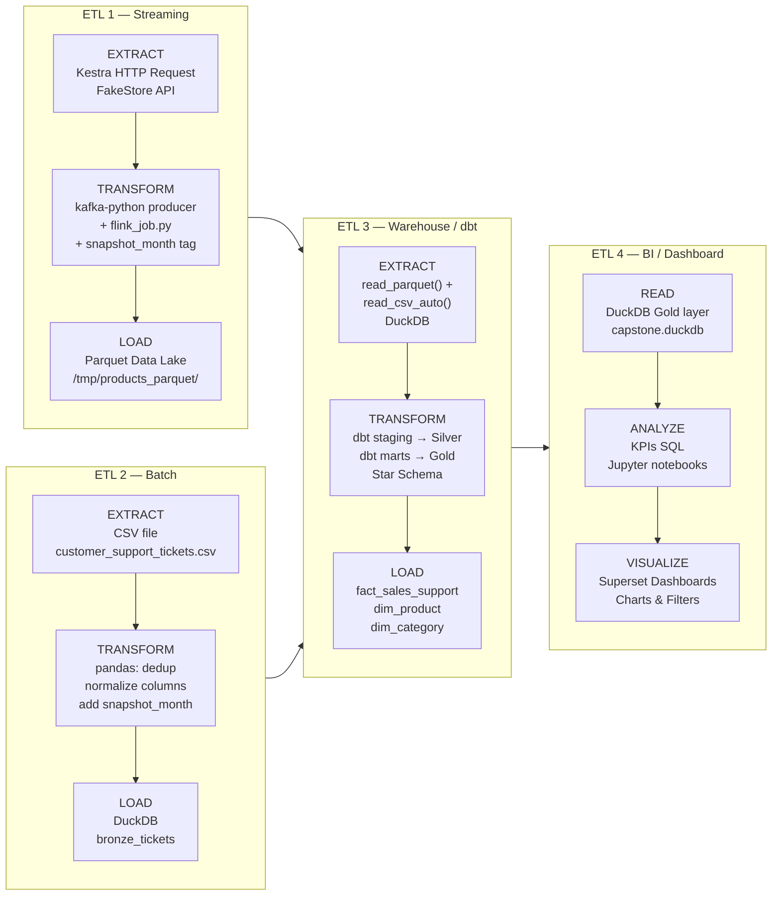
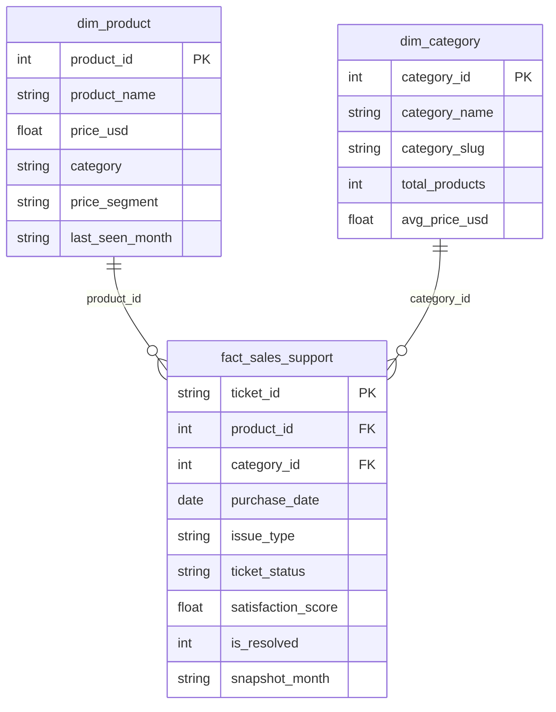
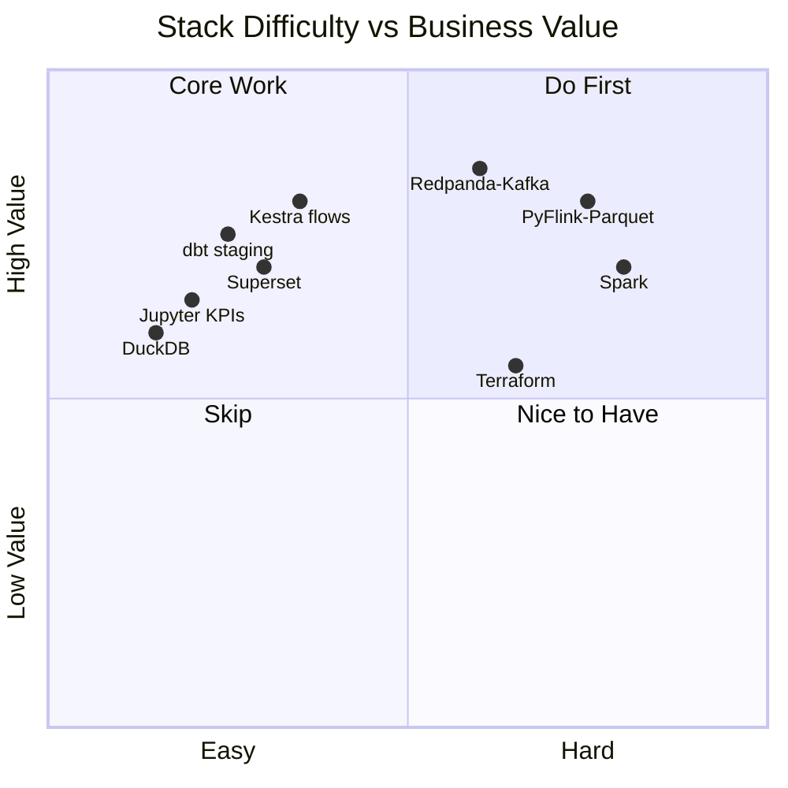
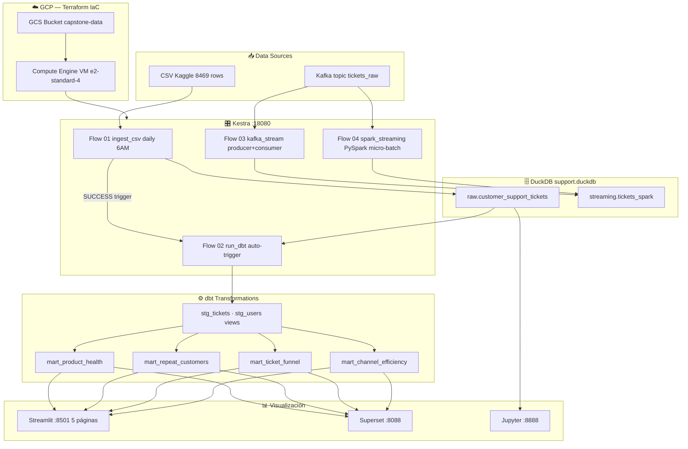

# Capstone: Customer Support Ticket Analytics
**Data Engineering Zoomcamp — Proyecto Final**
> **Stack:** Kestra · DuckDB · dbt · Streamlit · Docker · Spark · Terraform (GCP)
> **Dataset:** [Customer Support Ticket Dataset](https://www.kaggle.com/datasets/suraj520/customer-support-ticket-dataset) — 8,469 tickets · 17 columnas
 
---
 
## 📋 Problem Description
 
Las empresas de tecnología de consumo reciben miles de tickets de soporte al mes. Sin análisis estructurado, es imposible responder preguntas críticas como:
 
- ¿Qué productos generan más quejas críticas sin resolver y están en riesgo de generar churn?
- ¿Qué canal de soporte es realmente el más eficiente?
- ¿Dónde exactamente se atascan los tickets en el pipeline de atención?
- ¿Qué clientes están a punto de abandonar por experiencias repetidamente malas?
 
Este proyecto construye un **pipeline de datos end-to-end** que ingesta tickets desde Kaggle, los transforma con dbt sobre DuckDB, y expone respuestas concretas en un dashboard interactivo con Streamlit. El objetivo: que cualquier equipo de CX o producto detecte fricciones operativas y tome decisiones basadas en datos.
 
---
---

## Stack tecnológico

| Capa | Herramienta | Por qué |
|------|-------------|---------|
| Orquestación | Kestra | Flows YAML, UI web, sin código extra |
| Storage | DuckDB | OLAP embebido, perfecto para <5M filas |
| Transform | dbt-duckdb | Modelos ya hechos, lineage, tests |
| Visualización | Streamlit o Apache Superset | Conecta a DuckDB directo |
| Streaming (opcional) | Kafka nativo (bitnami) | ~300MB vs ~600MB de Redpanda |
| Exploración | Jupyter | Notebooks de análisis |

**¿Por qué NO Redpanda?**
Redpanda pesa ~600MB de imagen y corre un proceso pesado. `bitnami/kafka:3.7` hace exactamente lo mismo para este proyecto usando ~300MB. Si no necesitás streaming en producción, dejalo comentado en el docker-compose.

**¿Por qué NO Spark ni Postgres?**
El dataset tiene entre 8K y 200K filas. DuckDB corre queries analíticas a esa escala en milisegundos. Spark sería over-engineering y Postgres es OLTP, no OLAP.

---

## Dataset

**Primary:** [Customer Support Ticket Dataset](https://www.kaggle.com/datasets/suraj520/customer-support-ticket-dataset) — CSV, ~8,469 filas

**Columnas clave:**
- `Ticket ID`, `Customer Name`, `Customer Email`, `Customer Age`
- `Customer Gender`, `Product Purchased`, `Date of Purchase`
- `Ticket Type`, `Ticket Subject`, `Ticket Description`
- `Ticket Status` (Open / Closed / Pending Customer Response)
- `Resolution`, `Ticket Priority` (Critical / High / Medium / Low)
- `Ticket Channel` (Email / Chat / Phone / Social media)
- `First Response Time`, `Time to Resolution`
- `Customer Satisfaction Rating` (1-5)

**Alternativa batch mayor:**
[200K Records Version](https://www.kaggle.com/datasets/mirzayasirabdullah07/customer-support-tickets-dataset-200k-records)

---
---
## 📊 Dashboards de Streamlit
 
5 páginas en `./streamlit/pages/`, cada una conectada a un mart via DuckDB `read_only`.
 
### 🏥 1 — Product Health
**Mart:** `mart_product_health`
Health score por producto (0-100), scatter resolución vs satisfacción coloreado por risk level (🔴🟡🟢), top críticos sin resolver, heatmap producto × tipo de ticket, tabla filtrable por nivel de riesgo.
 
### 🚨 2 — Churn Risk
**Mart:** `mart_repeat_customers`
Segmentación Primera vez / Recurrente / Frecuente (3+), distribución de riesgo de churn, satisfacción por segmento vs neutral (3.0), canal preferido de clientes en riesgo, tabla top 50 clientes más críticos.
 
### 🗄️ 3 — SQL Explorer
Query libre sobre cualquier tabla DuckDB. 8 queries de ejemplo pre-cargadas, descarga de resultados en CSV, mini-visualización automática cuando hay columnas numéricas + categóricas.
 
### 📡 4 — Channel Efficiency
**Mart:** `mart_channel_efficiency`
% resuelto por canal vs benchmark global, desvío de resolución y satisfacción en grouped bar, heatmap canal × prioridad, heatmap canal × tipo, scatter volumen vs eficiencia para identificar cuellos de botella.
 
### 🔽 5 — Ticket Funnel
**Mart:** `mart_ticket_funnel`
Funnel visual Open → Pending → Closed con métricas absolutas, % atascados por subject, stacked bar estado por canal, heatmap canal × tipo, tabla de dead-ends (combinaciones con 0% cerrados).
 
---
## Preguntas analíticas que podés responder

### 🏥 Product Health
| Pregunta | Página |
|----------|--------|
| ¿Qué productos tienen peor tasa de resolución? | Product Health |
| ¿Cuál es el health score de cada producto (0-100)? | Product Health |
| ¿Qué combinación Producto × Subject acumula más críticos sin resolver? | Product Health |
| ¿Hay productos donde los tickets nunca se cierran? | Product Health |
| ¿Qué productos tienen baja satisfacción Y alta tasa de escalamiento? | Product Health |
 
### 🚨 Churn Risk
| Pregunta | Página |
|----------|--------|
| ¿Qué clientes abrieron más de 1 ticket? | Churn Risk |
| ¿Los clientes recurrentes tienen peor satisfacción que los de primera vez? | Churn Risk |
| ¿Qué productos generan más clientes recurrentes? | Churn Risk |
| ¿Cuáles son los clientes con mayor riesgo de abandono? | Churn Risk |
| ¿Qué canal prefieren los clientes en riesgo de churn? | Churn Risk |
 
### 🔽 Ticket Funnel
| Pregunta | Página |
|----------|--------|
| ¿Dónde se atascan más los tickets en el pipeline? | Ticket Funnel |
| ¿Hay subjects con 0% de cierre (dead-ends)? | Ticket Funnel |
| ¿Qué % de tickets críticos siguen sin primera respuesta? | Ticket Funnel |
| ¿Qué canal tiene mayor proporción de tickets Open? | Ticket Funnel |
| ¿Qué tipo de ticket tiene peor conversión a Closed? | Ticket Funnel |
 
### 📡 Channel Efficiency
| Pregunta | Página |
|----------|--------|
| ¿Qué canal resuelve por encima del promedio global? | Channel Efficiency |
| ¿Cuál es el cuello de botella: alto volumen + baja resolución? | Channel Efficiency |
| ¿Hay canales donde los tickets críticos se acumulan más? | Channel Efficiency |
| ¿El canal con más satisfacción también tiene más resolución? | Channel Efficiency |
| ¿Cuál es el desvío de satisfacción de cada canal vs el global? | Channel Efficiency |

---
### Architecture

Project Overview:

El proyecto consiste en el desarrollo de una plataforma de análisis en tiempo real para el seguimiento de tickets de servicio y órdenes de una tienda virtual. El sistema integra flujos de datos continuos, procesa eventos en tiempo real, almacena registros históricos en la nube y proporciona herramientas de visualización avanzada para la toma de decisiones proactivas en la gestión de clientes y logística.

Problem Statement

**El Desafío:** Los sistemas tradicionales de atención al cliente a menudo operan con datos estáticos o reportes diarios, lo que genera cuellos de botella, tiempos de respuesta lentos ante incidentes críticos y una desconexión entre el inventario real y las reclamaciones de los usuarios.

Solución Propuesta:

* **Ingestión de API en Tiempo Real:** **Captura de datos de pedidos y tickets mediante productores de Kafka sincronizados con la Fake Store API.**
* **Procesamiento de Flujos:** **Uso de Spark y Kestra para identificar anomalías y tendencias en el comportamiento de los servicios al instante.**
* **Almacenamiento de Datos de Niveles:** **Implementación de una arquitectura de medallón (Bronze, Silver, Gold) para asegurar la integridad de los datos.**
* **Dashboards Dinámicos:** **Visualización de métricas clave (SLA, volumen de tickets, estados de envío) mediante Superset.**

Project Architecture Overview

La arquitectura se centra en un flujo de datos sin interrupciones, orquestado por contenedores **Docker** y gestionado por  **Kestra** . Los eventos de la Fake Store API son capturados por un productor, enviados a un tópico de Kafka y procesados a través de pipelines de Spark para su transformación y posterior análisis en BigQuery.

## 📌 Overview

Este proyecto implementa una arquitectura completa de Data Engineering combinando:

- Ingesta batch (CSV)
- Ingesta streaming (API → Kafka)
- Procesamiento en tiempo real (PyFlink)
- Data Warehouse OLAP
- Modelado dimensional (Kimball - Star Schema)
- Orquestación con Kestra

---

## 🧠 Arquitectura General



---

## ⚡ Streaming Architecture



---

## 🧱 Data Warehouse (Kimball)



---

## 🔄 Orquestación (Kestra)



---

## 🛠️ Stack

- Kafka
- Kestra
- DuckDB /- BigQuery (Optional) -
- dbt
- PyFlink
- Superset

---

## 📈 Futuro

- Data Quality
- SCD Type 2
- Cloud Deployment
- Dashboard BI

# Capstone Project DE1 — FakeStore API × Customer Support Tickets

> **Stack:** Docker · Terraform · Kestra · Redpanda · PyFlink · DuckDB · dbt · Spark · Superset · Jupyter

Two data sources, one Star Schema, end-to-end ETL pipeline.

---

## Quick Start

**Prerequisites:** `docker`, `docker compose`, `git`. Terraform optional.

```bash
# 1. Clone and enter the project
git clone https://github.com/ngribc/.git
cd 

# 2. Copy your CSV to ./data/ and start the stack
cp /path/to/customer_support_tickets.csv ./data/
make up

# 3. Run the full pipeline
make pipeline-full
```

Open **Superset** at `http://localhost:8088` (admin / zoomcamp1234) and connect DuckDB:

```
duckdb:////shared/duckdb/capstone.duckdb
```

---

## ETL Architecture

### Full Data Flow



---

### ETL Breakdown — Which ETL did you build?



---

### Star Schema (Gold Layer)



flowchart TD A[(Data Lake - Parquet)] --> B[Staging Tables] B --> C[dim_product] B --> D[dim_category] B --> E[dim_date] B --> F[fact_sales] C --> G[STAR SCHEMA] D --> G E --> G F --> G G --> H[OLAP Queries]
---

### Difficulty Map



**Easiest path:** DuckDB → dbt → Superset (pure SQL, no infra)
**Hardest path:** Redpanda → PyFlink → Parquet (distributed streaming)

---

## dbt Models — What Each File Does

### Staging (Silver layer — `materialized: view`)

**`stg_products.sql`**

- **What:** Reads `bronze_products`, casts `id` to INTEGER, `price` to DOUBLE, `LOWER(category)` for normalization, filters `price > 0` and `id IS NOT NULL`.
- **Why:** Raw API data has inconsistent types. This view guarantees clean types before any join downstream.

**`stg_tickets.sql`**

- **What:** Reads `bronze_tickets`, maps `product_purchased` (string) to a `product_id` (1–20) via `HASH % 20 + 1`, casts `customer_satisfaction_rating` to DOUBLE, casts `date_of_purchase` to DATE.
- **Why:** The CSV has no `product_id` column — the hash creates a deterministic FK that joins with `dim_product`. Without this, ETL2 and ETL1 would be siloed.

### Marts (Gold layer — `materialized: table`)

**`dim_product.sql`**

- **What:** `SELECT DISTINCT` from `stg_products`, adds `price_segment` (`economy / mid-range / premium`), takes `MAX(snapshot_month)` to get the latest version of each product.
- **Why:** Dimension table for OLAP. The `price_segment` column enables grouping by tier without SQL `CASE` in every dashboard query.

**`dim_category.sql`**

- **What:** Derives categories from `stg_products` using `GROUP BY category`. Adds `category_id` via `ROW_NUMBER()`, `category_slug` (spaces → underscores), `avg_price_usd` and `total_products` per category.
- **Why:** Superset can filter by category without scanning the fact table. Also pre-computes aggregates for KPI cards.

**`fact_sales_support.sql`**

- **What:** Central join — `stg_tickets JOIN dim_product ON product_id JOIN dim_category ON category`. Adds `is_resolved` (1/0 from ticket_status), `purchase_month` (truncated date), `price_segment` denormalized for OLAP performance.
- **Why:** This is the single table that answers all business questions. One row per ticket, enriched with product and category context. Joining two completely different data sources is the whole point of the capstone.

### Tests (`models/marts/schema.yml`)

- `dim_product.product_id` → `unique` + `not_null`
- `dim_category.category_id` → `unique` + `not_null`
- `fact_sales_support.product_id` → `relationships` to `dim_product`
- `fact_sales_support.category_id` → `relationships` to `dim_category`
- `dim_product.price_segment` → `accepted_values: [economy, mid-range, premium]`

---

---

## Common Commands

```bash
make help              # All available targets
make check             # Verify prerequisites
make up                # Start full stack
make ps                # Container status
make logs              # Live logs

make pipeline-full     # End-to-end ETL in one command
make kestra-trigger    # Trigger a flow  [FLOW=streaming_pipeline]
make dbt-run           # Run all dbt models  [MODEL=dim_product]
make dbt-test          # Data quality tests
make dbt-docs          # Docs at http://localhost:8081

make reset-duckdb      # ⚠️  Wipe DuckDB
make down              # Stop everything
```

---

## Ports

| Service  | URL                    | Credentials                 |
| -------- | ---------------------- | --------------------------- |
| Kestra   | http://localhost:18080 | admin@kestra.io / Admin1234 |
| Jupyter  | http://localhost:8888  | token: zoomcamp             |
| Superset | http://localhost:8088  | admin / zoomcamp1234        |
| Spark UI | http://localhost:8080  | —                          |
| Redpanda | http://localhost:29092 | —                          |

Data Flow

1. **Ingestión:** **Un contenedor de streaming extrae datos de la Fake Store API y los envía al tópico de Kafka**.
2. **Procesamiento Batch/Stream:** **Pipeline orquestado por** **Kestra** **que consume datos de Kafka, los almacena como datos** **Bronze** **(raw) en** **Google Cloud Storage (GCS)** **y en una base de datos**  **PostgreSQL** **.**
3. **Transformación (Silver):** **Apache Spark** **procesa los datos de GCS, aplica esquemas OLAP (Star Schema) y los guarda nuevamente en GCS como datos** **Silver** **(transformados).**
4. **Exportación a BigQuery:** **Un pipeline carga los datos "Silver" desde GCS hacia** **BigQuery** **para facilitar el análisis a gran escala.**
5. **Refinamiento de Negocio (Gold):** **dbt Core** **transforma los datos en BigQuery hacia tablas**  **Gold** **, listas para el consumo de analítica avanzada y modelos de machine learning.**

Tech Stack Used

* **Docker:** **Containerización para aislamiento y portabilidad de todos los servicios.**
* **Apache Kafka:** **Plataforma de streaming distribuido para la ingesta de datos.**
* **Kestra:** **Orquestadores para la ejecución de flujos de trabajo y pipelines.**
* **Apache Spark:** **Motor de computación distribuida para procesamiento de datos a gran escala.**
* **dbt (Data Build Tool):** **Transformación de datos SQL para convertir datos crudos en insights.**
* **Superset:** **Herramienta de BI para creación de visualizaciones y dashboards.**
* (Optional)
* **PostgreSQL:** **Base de datos relacional para almacenamiento operativo y metadatos.**
* **Google BigQuery & GCS:** **Infraestructura de almacenamiento y Data Warehouse en la nube (GCP).**
* **Terraform:** **Infraestructura como Código (IaC) para el aprovisionamiento de recursos.**

Pipeline Overview

1. **Batch Pipeline:** **Procesa datos históricos desde GCS, realiza transformaciones OLAP con Spark y los exporta a BigQuery.**
2. **Streaming Pipeline:** **Componente dinámico que procesa flujos continuos de la API en tiempo real usando Kafka y Kestra.**
3. **dbt Pipeline:** **Transforma los datos de nivel Silver en tablas Gold dentro de BigQuery, creando modelos de dimensiones y hechos.**
4. **Dockerized Services:** **Gestión de servicios de infraestructura (Broker de Kafka, Zookeeper, Spark Master/Workers, Jupyter, Metabase).**

Step-by-Step Execution Guide

Para ejecutar el proyecto, siga estos pasos tras clonar el repositorio:

1. **Inicialización de Infraestructura:**
   * **Configurar las credenciales de GCP en** `google-cred.json`.
   * **Ejecutar** `terraform-start` **para crear los buckets de GCS y datasets de BigQuery.**
2. **Levantamiento de Servicios:**
   * **Ejecutar** `docker-compose up -d` **para iniciar Kafka, Spark, Postgres y Metabase.**
3. **Activación del Ingestor:**
   * **Ejecutar el script productor:** `python producer_api.py` **para comenzar a poblar Kafka con datos de la Fake Store API.**
4. **Ejecución de Pipelines:**
   * **Acceder a la interfaz de Kestra/Mage para activar el flujo de ingesta y transformación.**
   * **Correr** `dbt run` **para generar las tablas Gold en BigQuery.**
5. **Visualización:**
   * **Conectar Metabase a BigQuery y cargar el archivo de configuración del dashboard predefinido.**

Deliverables

* **Infraestructura:** **Código de Terraform para el despliegue automático en GCP.**
* **Pipelines:** **Scripts de Spark (PySpark) y configuraciones de Kestra/Mage.**
* **Modelos de Datos:** **Repositorio dbt con modelos Gold documentados y testeados.**
* **Dashboard:** **Panel en Metabase con KPIs de Service Ticker (Ej: Tiempo medio de respuesta, Tickets por categoría).**
* **Documentación:** **Guía de depuración (Debug README) y especificación de la arquitectura.**

Additional Benefits

* **Modularidad:** **El diseño permite actualizar componentes individuales (ej. cambiar Spark por Flink) sin afectar el sistema completo.**
* **Costo-Eficiencia:** **Al usar GCS y BigQuery, solo se paga por el almacenamiento y las consultas realizadas.**
* **Escalabilidad Automática:** **La naturaleza distribuida de Kafka y Spark permite manejar incrementos súbitos en el volumen de datos de la API.**

Conclusion

Este proyecto demuestra una implementación robusta de ingeniería de datos moderna. Al integrar tecnologías de punta como Spark, Kafka y dbt bajo una arquitectura de medallón, se logra transformar datos crudos de una API en inteligencia de negocio accionable en tiempo real, garantizando escalabilidad, calidad y mantenibilidad.
---


Archivo: [`architecture.mmd`](./architecture.mmd) — renderizable en [mermaid.live](https://mermaid.live) o con `mmdc`.
 
---

## Estructura del proyecto

.
├── Makefile
├── README.md
├── batch
│   ├── jdk-11.0.2
│   │   ├── bin
│   │   │   ├── jaotc
│   │   │   ├── jar
│   │   │   ├── jarsigner
│   │   │   ├── java
│   │   │   ├── javac
│   │   │   ├── javadoc
│   │   │   ├── javap
│   │   │   ├── jcmd
│   │   │   ├── jconsole
│   │   │   ├── jdb
│   │   │   ├── jdeprscan
│   │   │   ├── jdeps
│   │   │   ├── jhsdb
│   │   │   ├── jimage
│   │   │   ├── jinfo
│   │   │   ├── jjs
│   │   │   ├── jlink
│   │   │   ├── jmap
│   │   │   ├── jmod
│   │   │   ├── jps
│   │   │   ├── jrunscript
│   │   │   ├── jshell
│   │   │   ├── jstack
│   │   │   ├── jstat
│   │   │   ├── jstatd
│   │   │   ├── keytool
│   │   │   ├── pack200
│   │   │   ├── rmic
│   │   │   ├── rmid
│   │   │   ├── rmiregistry
│   │   │   ├── serialver
│   │   │   └── unpack200
│   │   ├── conf
│   │   │   ├── logging.properties
│   │   │   ├── management
│   │   │   │   ├── jmxremote.access
│   │   │   │   ├── jmxremote.password.template
│   │   │   │   └── management.properties
│   │   │   ├── net.properties
│   │   │   ├── security
│   │   │   │   ├── java.policy
│   │   │   │   ├── java.security
│   │   │   │   └── policy
│   │   │   │       ├── README.txt
│   │   │   │       ├── limited
│   │   │   │       │   ├── default_US_export.policy
│   │   │   │       │   ├── default_local.policy
│   │   │   │       │   └── exempt_local.policy
│   │   │   │       └── unlimited
│   │   │   │           ├── default_US_export.policy
│   │   │   │           └── default_local.policy
│   │   │   └── sound.properties
│   │   ├── include
│   │   │   ├── classfile_constants.h
│   │   │   ├── jawt.h
│   │   │   ├── jdwpTransport.h
│   │   │   ├── jni.h
│   │   │   ├── jvmti.h
│   │   │   ├── jvmticmlr.h
│   │   │   └── linux
│   │   │       ├── jawt_md.h
│   │   │       └── jni_md.h
│   │   ├── jmods
│   │   │   ├── java.base.jmod
│   │   │   ├── java.compiler.jmod
│   │   │   ├── java.datatransfer.jmod
│   │   │   ├── java.desktop.jmod
│   │   │   ├── java.instrument.jmod
│   │   │   ├── java.logging.jmod
│   │   │   ├── java.management.jmod
│   │   │   ├── java.management.rmi.jmod
│   │   │   ├── java.naming.jmod
│   │   │   ├── java.net.http.jmod
│   │   │   ├── java.prefs.jmod
│   │   │   ├── java.rmi.jmod
│   │   │   ├── java.scripting.jmod
│   │   │   ├── java.se.jmod
│   │   │   ├── java.security.jgss.jmod
│   │   │   ├── java.security.sasl.jmod
│   │   │   ├── java.smartcardio.jmod
│   │   │   ├── java.sql.jmod
│   │   │   ├── java.sql.rowset.jmod
│   │   │   ├── java.transaction.xa.jmod
│   │   │   ├── java.xml.crypto.jmod
│   │   │   ├── java.xml.jmod
│   │   │   ├── jdk.accessibility.jmod
│   │   │   ├── jdk.aot.jmod
│   │   │   ├── jdk.attach.jmod
│   │   │   ├── jdk.charsets.jmod
│   │   │   ├── jdk.compiler.jmod
│   │   │   ├── jdk.crypto.cryptoki.jmod
│   │   │   ├── jdk.crypto.ec.jmod
│   │   │   ├── jdk.dynalink.jmod
│   │   │   ├── jdk.editpad.jmod
│   │   │   ├── jdk.hotspot.agent.jmod
│   │   │   ├── jdk.httpserver.jmod
│   │   │   ├── jdk.internal.ed.jmod
│   │   │   ├── jdk.internal.jvmstat.jmod
│   │   │   ├── jdk.internal.le.jmod
│   │   │   ├── jdk.internal.opt.jmod
│   │   │   ├── jdk.internal.vm.ci.jmod
│   │   │   ├── jdk.internal.vm.compiler.jmod
│   │   │   ├── jdk.internal.vm.compiler.management.jmod
│   │   │   ├── jdk.jartool.jmod
│   │   │   ├── jdk.javadoc.jmod
│   │   │   ├── jdk.jcmd.jmod
│   │   │   ├── jdk.jconsole.jmod
│   │   │   ├── jdk.jdeps.jmod
│   │   │   ├── jdk.jdi.jmod
│   │   │   ├── jdk.jdwp.agent.jmod
│   │   │   ├── jdk.jfr.jmod
│   │   │   ├── jdk.jlink.jmod
│   │   │   ├── jdk.jshell.jmod
│   │   │   ├── jdk.jsobject.jmod
│   │   │   ├── jdk.jstatd.jmod
│   │   │   ├── jdk.localedata.jmod
│   │   │   ├── jdk.management.agent.jmod
│   │   │   ├── jdk.management.jfr.jmod
│   │   │   ├── jdk.management.jmod
│   │   │   ├── jdk.naming.dns.jmod
│   │   │   ├── jdk.naming.rmi.jmod
│   │   │   ├── jdk.net.jmod
│   │   │   ├── jdk.pack.jmod
│   │   │   ├── jdk.rmic.jmod
│   │   │   ├── jdk.scripting.nashorn.jmod
│   │   │   ├── jdk.scripting.nashorn.shell.jmod
│   │   │   ├── jdk.sctp.jmod
│   │   │   ├── jdk.security.auth.jmod
│   │   │   ├── jdk.security.jgss.jmod
│   │   │   ├── jdk.unsupported.desktop.jmod
│   │   │   ├── jdk.unsupported.jmod
│   │   │   ├── jdk.xml.dom.jmod
│   │   │   └── jdk.zipfs.jmod
│   │   ├── legal
│   │   │   ├── java.base
│   │   │   │   ├── ADDITIONAL_LICENSE_INFO
│   │   │   │   ├── ASSEMBLY_EXCEPTION
│   │   │   │   ├── LICENSE
│   │   │   │   ├── aes.md
│   │   │   │   ├── asm.md
│   │   │   │   ├── c-libutl.md
│   │   │   │   ├── cldr.md
│   │   │   │   ├── icu.md
│   │   │   │   ├── public_suffix.md
│   │   │   │   └── unicode.md
│   │   │   ├── java.compiler
│   │   │   │   ├── ADDITIONAL_LICENSE_INFO -> ../java.base/ADDITIONAL_LICENSE_INFO
│   │   │   │   ├── ASSEMBLY_EXCEPTION -> ../java.base/ASSEMBLY_EXCEPTION
│   │   │   │   └── LICENSE -> ../java.base/LICENSE
│   │   │   ├── java.datatransfer
│   │   │   │   ├── ADDITIONAL_LICENSE_INFO -> ../java.base/ADDITIONAL_LICENSE_INFO
│   │   │   │   ├── ASSEMBLY_EXCEPTION -> ../java.base/ASSEMBLY_EXCEPTION
│   │   │   │   └── LICENSE -> ../java.base/LICENSE
│   │   │   ├── java.desktop
│   │   │   │   ├── ADDITIONAL_LICENSE_INFO -> ../java.base/ADDITIONAL_LICENSE_INFO
│   │   │   │   ├── ASSEMBLY_EXCEPTION -> ../java.base/ASSEMBLY_EXCEPTION
│   │   │   │   ├── LICENSE -> ../java.base/LICENSE
│   │   │   │   ├── colorimaging.md
│   │   │   │   ├── giflib.md
│   │   │   │   ├── harfbuzz.md
│   │   │   │   ├── jpeg.md
│   │   │   │   ├── lcms.md
│   │   │   │   ├── libpng.md
│   │   │   │   ├── mesa3d.md
│   │   │   │   ├── opengl.md
│   │   │   │   └── xwindows.md
│   │   │   ├── java.instrument
│   │   │   │   ├── ADDITIONAL_LICENSE_INFO -> ../java.base/ADDITIONAL_LICENSE_INFO
│   │   │   │   ├── ASSEMBLY_EXCEPTION -> ../java.base/ASSEMBLY_EXCEPTION
│   │   │   │   └── LICENSE -> ../java.base/LICENSE
│   │   │   ├── java.logging
│   │   │   │   ├── ADDITIONAL_LICENSE_INFO -> ../java.base/ADDITIONAL_LICENSE_INFO
│   │   │   │   ├── ASSEMBLY_EXCEPTION -> ../java.base/ASSEMBLY_EXCEPTION
│   │   │   │   └── LICENSE -> ../java.base/LICENSE
│   │   │   ├── java.management
│   │   │   │   ├── ADDITIONAL_LICENSE_INFO -> ../java.base/ADDITIONAL_LICENSE_INFO
│   │   │   │   ├── ASSEMBLY_EXCEPTION -> ../java.base/ASSEMBLY_EXCEPTION
│   │   │   │   └── LICENSE -> ../java.base/LICENSE
│   │   │   ├── java.management.rmi
│   │   │   │   ├── ADDITIONAL_LICENSE_INFO -> ../java.base/ADDITIONAL_LICENSE_INFO
│   │   │   │   ├── ASSEMBLY_EXCEPTION -> ../java.base/ASSEMBLY_EXCEPTION
│   │   │   │   └── LICENSE -> ../java.base/LICENSE
│   │   │   ├── java.naming
│   │   │   │   ├── ADDITIONAL_LICENSE_INFO -> ../java.base/ADDITIONAL_LICENSE_INFO
│   │   │   │   ├── ASSEMBLY_EXCEPTION -> ../java.base/ASSEMBLY_EXCEPTION
│   │   │   │   └── LICENSE -> ../java.base/LICENSE
│   │   │   ├── java.net.http
│   │   │   │   ├── ADDITIONAL_LICENSE_INFO -> ../java.base/ADDITIONAL_LICENSE_INFO
│   │   │   │   ├── ASSEMBLY_EXCEPTION -> ../java.base/ASSEMBLY_EXCEPTION
│   │   │   │   └── LICENSE -> ../java.base/LICENSE
│   │   │   ├── java.prefs
│   │   │   │   ├── ADDITIONAL_LICENSE_INFO -> ../java.base/ADDITIONAL_LICENSE_INFO
│   │   │   │   ├── ASSEMBLY_EXCEPTION -> ../java.base/ASSEMBLY_EXCEPTION
│   │   │   │   └── LICENSE -> ../java.base/LICENSE
│   │   │   ├── java.rmi
│   │   │   │   ├── ADDITIONAL_LICENSE_INFO -> ../java.base/ADDITIONAL_LICENSE_INFO
│   │   │   │   ├── ASSEMBLY_EXCEPTION -> ../java.base/ASSEMBLY_EXCEPTION
│   │   │   │   └── LICENSE -> ../java.base/LICENSE
│   │   │   ├── java.scripting
│   │   │   │   ├── ADDITIONAL_LICENSE_INFO -> ../java.base/ADDITIONAL_LICENSE_INFO
│   │   │   │   ├── ASSEMBLY_EXCEPTION -> ../java.base/ASSEMBLY_EXCEPTION
│   │   │   │   └── LICENSE -> ../java.base/LICENSE
│   │   │   ├── java.se
│   │   │   │   ├── ADDITIONAL_LICENSE_INFO -> ../java.base/ADDITIONAL_LICENSE_INFO
│   │   │   │   ├── ASSEMBLY_EXCEPTION -> ../java.base/ASSEMBLY_EXCEPTION
│   │   │   │   └── LICENSE -> ../java.base/LICENSE
│   │   │   ├── java.security.jgss
│   │   │   │   ├── ADDITIONAL_LICENSE_INFO -> ../java.base/ADDITIONAL_LICENSE_INFO
│   │   │   │   ├── ASSEMBLY_EXCEPTION -> ../java.base/ASSEMBLY_EXCEPTION
│   │   │   │   └── LICENSE -> ../java.base/LICENSE
│   │   │   ├── java.security.sasl
│   │   │   │   ├── ADDITIONAL_LICENSE_INFO -> ../java.base/ADDITIONAL_LICENSE_INFO
│   │   │   │   ├── ASSEMBLY_EXCEPTION -> ../java.base/ASSEMBLY_EXCEPTION
│   │   │   │   └── LICENSE -> ../java.base/LICENSE
│   │   │   ├── java.smartcardio
│   │   │   │   ├── ADDITIONAL_LICENSE_INFO -> ../java.base/ADDITIONAL_LICENSE_INFO
│   │   │   │   ├── ASSEMBLY_EXCEPTION -> ../java.base/ASSEMBLY_EXCEPTION
│   │   │   │   ├── LICENSE -> ../java.base/LICENSE
│   │   │   │   └── pcsclite.md
│   │   │   ├── java.sql
│   │   │   │   ├── ADDITIONAL_LICENSE_INFO -> ../java.base/ADDITIONAL_LICENSE_INFO
│   │   │   │   ├── ASSEMBLY_EXCEPTION -> ../java.base/ASSEMBLY_EXCEPTION
│   │   │   │   └── LICENSE -> ../java.base/LICENSE
│   │   │   ├── java.sql.rowset
│   │   │   │   ├── ADDITIONAL_LICENSE_INFO -> ../java.base/ADDITIONAL_LICENSE_INFO
│   │   │   │   ├── ASSEMBLY_EXCEPTION -> ../java.base/ASSEMBLY_EXCEPTION
│   │   │   │   └── LICENSE -> ../java.base/LICENSE
│   │   │   ├── java.transaction.xa
│   │   │   │   ├── ADDITIONAL_LICENSE_INFO -> ../java.base/ADDITIONAL_LICENSE_INFO
│   │   │   │   ├── ASSEMBLY_EXCEPTION -> ../java.base/ASSEMBLY_EXCEPTION
│   │   │   │   └── LICENSE -> ../java.base/LICENSE
│   │   │   ├── java.xml
│   │   │   │   ├── ADDITIONAL_LICENSE_INFO -> ../java.base/ADDITIONAL_LICENSE_INFO
│   │   │   │   ├── ASSEMBLY_EXCEPTION -> ../java.base/ASSEMBLY_EXCEPTION
│   │   │   │   ├── LICENSE -> ../java.base/LICENSE
│   │   │   │   ├── bcel.md
│   │   │   │   ├── dom.md
│   │   │   │   ├── jcup.md
│   │   │   │   ├── xalan.md
│   │   │   │   └── xerces.md
│   │   │   ├── java.xml.crypto
│   │   │   │   ├── ADDITIONAL_LICENSE_INFO -> ../java.base/ADDITIONAL_LICENSE_INFO
│   │   │   │   ├── ASSEMBLY_EXCEPTION -> ../java.base/ASSEMBLY_EXCEPTION
│   │   │   │   ├── LICENSE -> ../java.base/LICENSE
│   │   │   │   └── santuario.md
│   │   │   ├── jdk.accessibility
│   │   │   │   ├── ADDITIONAL_LICENSE_INFO -> ../java.base/ADDITIONAL_LICENSE_INFO
│   │   │   │   ├── ASSEMBLY_EXCEPTION -> ../java.base/ASSEMBLY_EXCEPTION
│   │   │   │   └── LICENSE -> ../java.base/LICENSE
│   │   │   ├── jdk.aot
│   │   │   │   ├── ADDITIONAL_LICENSE_INFO -> ../java.base/ADDITIONAL_LICENSE_INFO
│   │   │   │   ├── ASSEMBLY_EXCEPTION -> ../java.base/ASSEMBLY_EXCEPTION
│   │   │   │   └── LICENSE -> ../java.base/LICENSE
│   │   │   ├── jdk.attach
│   │   │   │   ├── ADDITIONAL_LICENSE_INFO -> ../java.base/ADDITIONAL_LICENSE_INFO
│   │   │   │   ├── ASSEMBLY_EXCEPTION -> ../java.base/ASSEMBLY_EXCEPTION
│   │   │   │   └── LICENSE -> ../java.base/LICENSE
│   │   │   ├── jdk.charsets
│   │   │   │   ├── ADDITIONAL_LICENSE_INFO -> ../java.base/ADDITIONAL_LICENSE_INFO
│   │   │   │   ├── ASSEMBLY_EXCEPTION -> ../java.base/ASSEMBLY_EXCEPTION
│   │   │   │   └── LICENSE -> ../java.base/LICENSE
│   │   │   ├── jdk.compiler
│   │   │   │   ├── ADDITIONAL_LICENSE_INFO -> ../java.base/ADDITIONAL_LICENSE_INFO
│   │   │   │   ├── ASSEMBLY_EXCEPTION -> ../java.base/ASSEMBLY_EXCEPTION
│   │   │   │   └── LICENSE -> ../java.base/LICENSE
│   │   │   ├── jdk.crypto.cryptoki
│   │   │   │   ├── ADDITIONAL_LICENSE_INFO -> ../java.base/ADDITIONAL_LICENSE_INFO
│   │   │   │   ├── ASSEMBLY_EXCEPTION -> ../java.base/ASSEMBLY_EXCEPTION
│   │   │   │   ├── LICENSE -> ../java.base/LICENSE
│   │   │   │   ├── pkcs11cryptotoken.md
│   │   │   │   └── pkcs11wrapper.md
│   │   │   ├── jdk.crypto.ec
│   │   │   │   ├── ADDITIONAL_LICENSE_INFO -> ../java.base/ADDITIONAL_LICENSE_INFO
│   │   │   │   ├── ASSEMBLY_EXCEPTION -> ../java.base/ASSEMBLY_EXCEPTION
│   │   │   │   ├── LICENSE -> ../java.base/LICENSE
│   │   │   │   └── ecc.md
│   │   │   ├── jdk.dynalink
│   │   │   │   ├── ADDITIONAL_LICENSE_INFO -> ../java.base/ADDITIONAL_LICENSE_INFO
│   │   │   │   ├── ASSEMBLY_EXCEPTION -> ../java.base/ASSEMBLY_EXCEPTION
│   │   │   │   ├── LICENSE -> ../java.base/LICENSE
│   │   │   │   └── dynalink.md
│   │   │   ├── jdk.editpad
│   │   │   │   ├── ADDITIONAL_LICENSE_INFO -> ../java.base/ADDITIONAL_LICENSE_INFO
│   │   │   │   ├── ASSEMBLY_EXCEPTION -> ../java.base/ASSEMBLY_EXCEPTION
│   │   │   │   └── LICENSE -> ../java.base/LICENSE
│   │   │   ├── jdk.hotspot.agent
│   │   │   │   ├── ADDITIONAL_LICENSE_INFO -> ../java.base/ADDITIONAL_LICENSE_INFO
│   │   │   │   ├── ASSEMBLY_EXCEPTION -> ../java.base/ASSEMBLY_EXCEPTION
│   │   │   │   └── LICENSE -> ../java.base/LICENSE
│   │   │   ├── jdk.httpserver
│   │   │   │   ├── ADDITIONAL_LICENSE_INFO -> ../java.base/ADDITIONAL_LICENSE_INFO
│   │   │   │   ├── ASSEMBLY_EXCEPTION -> ../java.base/ASSEMBLY_EXCEPTION
│   │   │   │   └── LICENSE -> ../java.base/LICENSE
│   │   │   ├── jdk.internal.ed
│   │   │   │   ├── ADDITIONAL_LICENSE_INFO -> ../java.base/ADDITIONAL_LICENSE_INFO
│   │   │   │   ├── ASSEMBLY_EXCEPTION -> ../java.base/ASSEMBLY_EXCEPTION
│   │   │   │   └── LICENSE -> ../java.base/LICENSE
│   │   │   ├── jdk.internal.jvmstat
│   │   │   │   ├── ADDITIONAL_LICENSE_INFO -> ../java.base/ADDITIONAL_LICENSE_INFO
│   │   │   │   ├── ASSEMBLY_EXCEPTION -> ../java.base/ASSEMBLY_EXCEPTION
│   │   │   │   └── LICENSE -> ../java.base/LICENSE
│   │   │   ├── jdk.internal.le
│   │   │   │   ├── ADDITIONAL_LICENSE_INFO -> ../java.base/ADDITIONAL_LICENSE_INFO
│   │   │   │   ├── ASSEMBLY_EXCEPTION -> ../java.base/ASSEMBLY_EXCEPTION
│   │   │   │   ├── LICENSE -> ../java.base/LICENSE
│   │   │   │   └── jline.md
│   │   │   ├── jdk.internal.opt
│   │   │   │   ├── ADDITIONAL_LICENSE_INFO -> ../java.base/ADDITIONAL_LICENSE_INFO
│   │   │   │   ├── ASSEMBLY_EXCEPTION -> ../java.base/ASSEMBLY_EXCEPTION
│   │   │   │   ├── LICENSE -> ../java.base/LICENSE
│   │   │   │   └── jopt-simple.md
│   │   │   ├── jdk.internal.vm.ci
│   │   │   │   ├── ADDITIONAL_LICENSE_INFO -> ../java.base/ADDITIONAL_LICENSE_INFO
│   │   │   │   ├── ASSEMBLY_EXCEPTION -> ../java.base/ASSEMBLY_EXCEPTION
│   │   │   │   └── LICENSE -> ../java.base/LICENSE
│   │   │   ├── jdk.internal.vm.compiler
│   │   │   │   ├── ADDITIONAL_LICENSE_INFO -> ../java.base/ADDITIONAL_LICENSE_INFO
│   │   │   │   ├── ASSEMBLY_EXCEPTION -> ../java.base/ASSEMBLY_EXCEPTION
│   │   │   │   └── LICENSE -> ../java.base/LICENSE
│   │   │   ├── jdk.internal.vm.compiler.management
│   │   │   │   ├── ADDITIONAL_LICENSE_INFO -> ../java.base/ADDITIONAL_LICENSE_INFO
│   │   │   │   ├── ASSEMBLY_EXCEPTION -> ../java.base/ASSEMBLY_EXCEPTION
│   │   │   │   └── LICENSE -> ../java.base/LICENSE
│   │   │   ├── jdk.jartool
│   │   │   │   ├── ADDITIONAL_LICENSE_INFO -> ../java.base/ADDITIONAL_LICENSE_INFO
│   │   │   │   ├── ASSEMBLY_EXCEPTION -> ../java.base/ASSEMBLY_EXCEPTION
│   │   │   │   └── LICENSE -> ../java.base/LICENSE
│   │   │   ├── jdk.javadoc
│   │   │   │   ├── ADDITIONAL_LICENSE_INFO -> ../java.base/ADDITIONAL_LICENSE_INFO
│   │   │   │   ├── ASSEMBLY_EXCEPTION -> ../java.base/ASSEMBLY_EXCEPTION
│   │   │   │   ├── LICENSE -> ../java.base/LICENSE
│   │   │   │   ├── jquery-migrate.md
│   │   │   │   ├── jquery.md
│   │   │   │   ├── jqueryUI.md
│   │   │   │   ├── jszip.md
│   │   │   │   └── pako.md
│   │   │   ├── jdk.jcmd
│   │   │   │   ├── ADDITIONAL_LICENSE_INFO -> ../java.base/ADDITIONAL_LICENSE_INFO
│   │   │   │   ├── ASSEMBLY_EXCEPTION -> ../java.base/ASSEMBLY_EXCEPTION
│   │   │   │   └── LICENSE -> ../java.base/LICENSE
│   │   │   ├── jdk.jconsole
│   │   │   │   ├── ADDITIONAL_LICENSE_INFO -> ../java.base/ADDITIONAL_LICENSE_INFO
│   │   │   │   ├── ASSEMBLY_EXCEPTION -> ../java.base/ASSEMBLY_EXCEPTION
│   │   │   │   └── LICENSE -> ../java.base/LICENSE
│   │   │   ├── jdk.jdeps
│   │   │   │   ├── ADDITIONAL_LICENSE_INFO -> ../java.base/ADDITIONAL_LICENSE_INFO
│   │   │   │   ├── ASSEMBLY_EXCEPTION -> ../java.base/ASSEMBLY_EXCEPTION
│   │   │   │   └── LICENSE -> ../java.base/LICENSE
│   │   │   ├── jdk.jdi
│   │   │   │   ├── ADDITIONAL_LICENSE_INFO -> ../java.base/ADDITIONAL_LICENSE_INFO
│   │   │   │   ├── ASSEMBLY_EXCEPTION -> ../java.base/ASSEMBLY_EXCEPTION
│   │   │   │   └── LICENSE -> ../java.base/LICENSE
│   │   │   ├── jdk.jdwp.agent
│   │   │   │   ├── ADDITIONAL_LICENSE_INFO -> ../java.base/ADDITIONAL_LICENSE_INFO
│   │   │   │   ├── ASSEMBLY_EXCEPTION -> ../java.base/ASSEMBLY_EXCEPTION
│   │   │   │   └── LICENSE -> ../java.base/LICENSE
│   │   │   ├── jdk.jfr
│   │   │   │   ├── ADDITIONAL_LICENSE_INFO -> ../java.base/ADDITIONAL_LICENSE_INFO
│   │   │   │   ├── ASSEMBLY_EXCEPTION -> ../java.base/ASSEMBLY_EXCEPTION
│   │   │   │   └── LICENSE -> ../java.base/LICENSE
│   │   │   ├── jdk.jlink
│   │   │   │   ├── ADDITIONAL_LICENSE_INFO -> ../java.base/ADDITIONAL_LICENSE_INFO
│   │   │   │   ├── ASSEMBLY_EXCEPTION -> ../java.base/ASSEMBLY_EXCEPTION
│   │   │   │   └── LICENSE -> ../java.base/LICENSE
│   │   │   ├── jdk.jshell
│   │   │   │   ├── ADDITIONAL_LICENSE_INFO -> ../java.base/ADDITIONAL_LICENSE_INFO
│   │   │   │   ├── ASSEMBLY_EXCEPTION -> ../java.base/ASSEMBLY_EXCEPTION
│   │   │   │   └── LICENSE -> ../java.base/LICENSE
│   │   │   ├── jdk.jsobject
│   │   │   │   ├── ADDITIONAL_LICENSE_INFO -> ../java.base/ADDITIONAL_LICENSE_INFO
│   │   │   │   ├── ASSEMBLY_EXCEPTION -> ../java.base/ASSEMBLY_EXCEPTION
│   │   │   │   └── LICENSE -> ../java.base/LICENSE
│   │   │   ├── jdk.jstatd
│   │   │   │   ├── ADDITIONAL_LICENSE_INFO -> ../java.base/ADDITIONAL_LICENSE_INFO
│   │   │   │   ├── ASSEMBLY_EXCEPTION -> ../java.base/ASSEMBLY_EXCEPTION
│   │   │   │   └── LICENSE -> ../java.base/LICENSE
│   │   │   ├── jdk.localedata
│   │   │   │   ├── ADDITIONAL_LICENSE_INFO -> ../java.base/ADDITIONAL_LICENSE_INFO
│   │   │   │   ├── ASSEMBLY_EXCEPTION -> ../java.base/ASSEMBLY_EXCEPTION
│   │   │   │   ├── LICENSE -> ../java.base/LICENSE
│   │   │   │   ├── cldr.md -> ../java.base/cldr.md
│   │   │   │   └── thaidict.md
│   │   │   ├── jdk.management
│   │   │   │   ├── ADDITIONAL_LICENSE_INFO -> ../java.base/ADDITIONAL_LICENSE_INFO
│   │   │   │   ├── ASSEMBLY_EXCEPTION -> ../java.base/ASSEMBLY_EXCEPTION
│   │   │   │   └── LICENSE -> ../java.base/LICENSE
│   │   │   ├── jdk.management.agent
│   │   │   │   ├── ADDITIONAL_LICENSE_INFO -> ../java.base/ADDITIONAL_LICENSE_INFO
│   │   │   │   ├── ASSEMBLY_EXCEPTION -> ../java.base/ASSEMBLY_EXCEPTION
│   │   │   │   └── LICENSE -> ../java.base/LICENSE
│   │   │   ├── jdk.management.jfr
│   │   │   │   ├── ADDITIONAL_LICENSE_INFO -> ../java.base/ADDITIONAL_LICENSE_INFO
│   │   │   │   ├── ASSEMBLY_EXCEPTION -> ../java.base/ASSEMBLY_EXCEPTION
│   │   │   │   └── LICENSE -> ../java.base/LICENSE
│   │   │   ├── jdk.naming.dns
│   │   │   │   ├── ADDITIONAL_LICENSE_INFO -> ../java.base/ADDITIONAL_LICENSE_INFO
│   │   │   │   ├── ASSEMBLY_EXCEPTION -> ../java.base/ASSEMBLY_EXCEPTION
│   │   │   │   └── LICENSE -> ../java.base/LICENSE
│   │   │   ├── jdk.naming.rmi
│   │   │   │   ├── ADDITIONAL_LICENSE_INFO -> ../java.base/ADDITIONAL_LICENSE_INFO
│   │   │   │   ├── ASSEMBLY_EXCEPTION -> ../java.base/ASSEMBLY_EXCEPTION
│   │   │   │   └── LICENSE -> ../java.base/LICENSE
│   │   │   ├── jdk.net
│   │   │   │   ├── ADDITIONAL_LICENSE_INFO -> ../java.base/ADDITIONAL_LICENSE_INFO
│   │   │   │   ├── ASSEMBLY_EXCEPTION -> ../java.base/ASSEMBLY_EXCEPTION
│   │   │   │   └── LICENSE -> ../java.base/LICENSE
│   │   │   ├── jdk.pack
│   │   │   │   ├── ADDITIONAL_LICENSE_INFO -> ../java.base/ADDITIONAL_LICENSE_INFO
│   │   │   │   ├── ASSEMBLY_EXCEPTION -> ../java.base/ASSEMBLY_EXCEPTION
│   │   │   │   └── LICENSE -> ../java.base/LICENSE
│   │   │   ├── jdk.rmic
│   │   │   │   ├── ADDITIONAL_LICENSE_INFO -> ../java.base/ADDITIONAL_LICENSE_INFO
│   │   │   │   ├── ASSEMBLY_EXCEPTION -> ../java.base/ASSEMBLY_EXCEPTION
│   │   │   │   └── LICENSE -> ../java.base/LICENSE
│   │   │   ├── jdk.scripting.nashorn
│   │   │   │   ├── ADDITIONAL_LICENSE_INFO -> ../java.base/ADDITIONAL_LICENSE_INFO
│   │   │   │   ├── ASSEMBLY_EXCEPTION -> ../java.base/ASSEMBLY_EXCEPTION
│   │   │   │   ├── LICENSE -> ../java.base/LICENSE
│   │   │   │   ├── double-conversion.md
│   │   │   │   └── joni.md
│   │   │   ├── jdk.scripting.nashorn.shell
│   │   │   │   ├── ADDITIONAL_LICENSE_INFO -> ../java.base/ADDITIONAL_LICENSE_INFO
│   │   │   │   ├── ASSEMBLY_EXCEPTION -> ../java.base/ASSEMBLY_EXCEPTION
│   │   │   │   └── LICENSE -> ../java.base/LICENSE
│   │   │   ├── jdk.sctp
│   │   │   │   ├── ADDITIONAL_LICENSE_INFO -> ../java.base/ADDITIONAL_LICENSE_INFO
│   │   │   │   ├── ASSEMBLY_EXCEPTION -> ../java.base/ASSEMBLY_EXCEPTION
│   │   │   │   └── LICENSE -> ../java.base/LICENSE
│   │   │   ├── jdk.security.auth
│   │   │   │   ├── ADDITIONAL_LICENSE_INFO -> ../java.base/ADDITIONAL_LICENSE_INFO
│   │   │   │   ├── ASSEMBLY_EXCEPTION -> ../java.base/ASSEMBLY_EXCEPTION
│   │   │   │   └── LICENSE -> ../java.base/LICENSE
│   │   │   ├── jdk.security.jgss
│   │   │   │   ├── ADDITIONAL_LICENSE_INFO -> ../java.base/ADDITIONAL_LICENSE_INFO
│   │   │   │   ├── ASSEMBLY_EXCEPTION -> ../java.base/ASSEMBLY_EXCEPTION
│   │   │   │   └── LICENSE -> ../java.base/LICENSE
│   │   │   ├── jdk.unsupported
│   │   │   │   ├── ADDITIONAL_LICENSE_INFO -> ../java.base/ADDITIONAL_LICENSE_INFO
│   │   │   │   ├── ASSEMBLY_EXCEPTION -> ../java.base/ASSEMBLY_EXCEPTION
│   │   │   │   └── LICENSE -> ../java.base/LICENSE
│   │   │   ├── jdk.unsupported.desktop
│   │   │   │   ├── ADDITIONAL_LICENSE_INFO -> ../java.base/ADDITIONAL_LICENSE_INFO
│   │   │   │   ├── ASSEMBLY_EXCEPTION -> ../java.base/ASSEMBLY_EXCEPTION
│   │   │   │   └── LICENSE -> ../java.base/LICENSE
│   │   │   ├── jdk.xml.dom
│   │   │   │   ├── ADDITIONAL_LICENSE_INFO -> ../java.base/ADDITIONAL_LICENSE_INFO
│   │   │   │   ├── ASSEMBLY_EXCEPTION -> ../java.base/ASSEMBLY_EXCEPTION
│   │   │   │   └── LICENSE -> ../java.base/LICENSE
│   │   │   └── jdk.zipfs
│   │   │       ├── ADDITIONAL_LICENSE_INFO -> ../java.base/ADDITIONAL_LICENSE_INFO
│   │   │       ├── ASSEMBLY_EXCEPTION -> ../java.base/ASSEMBLY_EXCEPTION
│   │   │       └── LICENSE -> ../java.base/LICENSE
│   │   ├── lib
│   │   │   ├── classlist
│   │   │   ├── ct.sym
│   │   │   ├── jexec
│   │   │   ├── jfr
│   │   │   │   ├── default.jfc
│   │   │   │   └── profile.jfc
│   │   │   ├── jli
│   │   │   │   └── libjli.so
│   │   │   ├── jrt-fs.jar
│   │   │   ├── jvm.cfg
│   │   │   ├── libattach.so
│   │   │   ├── libawt.so
│   │   │   ├── libawt_headless.so
│   │   │   ├── libawt_xawt.so
│   │   │   ├── libdt_socket.so
│   │   │   ├── libextnet.so
│   │   │   ├── libfontmanager.so
│   │   │   ├── libinstrument.so
│   │   │   ├── libj2gss.so
│   │   │   ├── libj2pcsc.so
│   │   │   ├── libj2pkcs11.so
│   │   │   ├── libjaas.so
│   │   │   ├── libjava.so
│   │   │   ├── libjavajpeg.so
│   │   │   ├── libjawt.so
│   │   │   ├── libjdwp.so
│   │   │   ├── libjimage.so
│   │   │   ├── libjsig.so
│   │   │   ├── libjsound.so
│   │   │   ├── liblcms.so
│   │   │   ├── libmanagement.so
│   │   │   ├── libmanagement_agent.so
│   │   │   ├── libmanagement_ext.so
│   │   │   ├── libmlib_image.so
│   │   │   ├── libnet.so
│   │   │   ├── libnio.so
│   │   │   ├── libprefs.so
│   │   │   ├── librmi.so
│   │   │   ├── libsaproc.so
│   │   │   ├── libsctp.so
│   │   │   ├── libsplashscreen.so
│   │   │   ├── libsunec.so
│   │   │   ├── libunpack.so
│   │   │   ├── libverify.so
│   │   │   ├── libzip.so
│   │   │   ├── modules
│   │   │   ├── psfont.properties.ja
│   │   │   ├── psfontj2d.properties
│   │   │   ├── security
│   │   │   │   ├── blacklisted.certs
│   │   │   │   ├── cacerts
│   │   │   │   ├── default.policy
│   │   │   │   └── public_suffix_list.dat
│   │   │   ├── server
│   │   │   │   ├── Xusage.txt
│   │   │   │   ├── libjsig.so
│   │   │   │   └── libjvm.so
│   │   │   ├── src.zip
│   │   │   └── tzdb.dat
│   │   └── release
│   ├── notebooks
│   │   ├── 1_ingestion.ipynb
│   │   ├── 2_batch_processing_tickets.ipynb
│   │   ├── 2_transformation.ipynb
│   │   ├── 3_analytics_and_output.ipynb
│   │   ├── batch.md
│   │   ├── batchvariablesentorno.md
│   │   ├── customer_service1.ipynb
│   │   └── customersupport-tickets-200kde.ipynb
│   └── spark-3.3.2-bin-hadoop3
│       ├── LICENSE
│       ├── NOTICE
│       ├── R
│       │   └── lib
│       │       ├── SparkR
│       │       │   ├── DESCRIPTION
│       │       │   ├── INDEX
│       │       │   ├── Meta
│       │       │   │   ├── Rd.rds
│       │       │   │   ├── features.rds
│       │       │   │   ├── hsearch.rds
│       │       │   │   ├── links.rds
│       │       │   │   ├── nsInfo.rds
│       │       │   │   ├── package.rds
│       │       │   │   └── vignette.rds
│       │       │   ├── NAMESPACE
│       │       │   ├── R
│       │       │   │   ├── SparkR
│       │       │   │   ├── SparkR.rdb
│       │       │   │   └── SparkR.rdx
│       │       │   ├── doc
│       │       │   │   ├── index.html
│       │       │   │   ├── sparkr-vignettes.R
│       │       │   │   ├── sparkr-vignettes.Rmd
│       │       │   │   └── sparkr-vignettes.html
│       │       │   ├── help
│       │       │   │   ├── AnIndex
│       │       │   │   ├── SparkR.rdb
│       │       │   │   ├── SparkR.rdx
│       │       │   │   ├── aliases.rds
│       │       │   │   └── paths.rds
│       │       │   ├── html
│       │       │   │   ├── 00Index.html
│       │       │   │   └── R.css
│       │       │   ├── profile
│       │       │   │   ├── general.R
│       │       │   │   └── shell.R
│       │       │   ├── tests
│       │       │   │   └── testthat
│       │       │   │       └── test_basic.R
│       │       │   └── worker
│       │       │       ├── daemon.R
│       │       │       └── worker.R
│       │       └── sparkr.zip
│       ├── README.md
│       ├── RELEASE
│       ├── bin
│       │   ├── beeline
│       │   ├── beeline.cmd
│       │   ├── docker-image-tool.sh
│       │   ├── find-spark-home
│       │   ├── find-spark-home.cmd
│       │   ├── load-spark-env.cmd
│       │   ├── load-spark-env.sh
│       │   ├── pyspark
│       │   ├── pyspark.cmd
│       │   ├── pyspark2.cmd
│       │   ├── run-example
│       │   ├── run-example.cmd
│       │   ├── spark-class
│       │   ├── spark-class.cmd
│       │   ├── spark-class2.cmd
│       │   ├── spark-shell
│       │   ├── spark-shell.cmd
│       │   ├── spark-shell2.cmd
│       │   ├── spark-sql
│       │   ├── spark-sql.cmd
│       │   ├── spark-sql2.cmd
│       │   ├── spark-submit
│       │   ├── spark-submit.cmd
│       │   ├── spark-submit2.cmd
│       │   ├── sparkR
│       │   ├── sparkR.cmd
│       │   └── sparkR2.cmd
│       ├── conf
│       │   ├── fairscheduler.xml.template
│       │   ├── log4j2.properties.template
│       │   ├── metrics.properties.template
│       │   ├── spark-defaults.conf.template
│       │   ├── spark-env.sh.template
│       │   └── workers.template
│       ├── data
│       │   ├── graphx
│       │   │   ├── followers.txt
│       │   │   └── users.txt
│       │   ├── mllib
│       │   │   ├── als
│       │   │   │   ├── sample_movielens_ratings.txt
│       │   │   │   └── test.data
│       │   │   ├── gmm_data.txt
│       │   │   ├── images
│       │   │   │   ├── license.txt
│       │   │   │   └── origin
│       │   │   │       ├── kittens
│       │   │   │       │   ├── 29.5.a_b_EGDP022204.jpg
│       │   │   │       │   ├── 54893.jpg
│       │   │   │       │   ├── DP153539.jpg
│       │   │   │       │   ├── DP802813.jpg
│       │   │   │       │   └── not-image.txt
│       │   │   │       ├── license.txt
│       │   │   │       └── multi-channel
│       │   │   │           ├── BGRA.png
│       │   │   │           ├── BGRA_alpha_60.png
│       │   │   │           ├── chr30.4.184.jpg
│       │   │   │           └── grayscale.jpg
│       │   │   ├── kmeans_data.txt
│       │   │   ├── pagerank_data.txt
│       │   │   ├── pic_data.txt
│       │   │   ├── ridge-data
│       │   │   │   └── lpsa.data
│       │   │   ├── sample_binary_classification_data.txt
│       │   │   ├── sample_fpgrowth.txt
│       │   │   ├── sample_isotonic_regression_libsvm_data.txt
│       │   │   ├── sample_kmeans_data.txt
│       │   │   ├── sample_lda_data.txt
│       │   │   ├── sample_lda_libsvm_data.txt
│       │   │   ├── sample_libsvm_data.txt
│       │   │   ├── sample_linear_regression_data.txt
│       │   │   ├── sample_movielens_data.txt
│       │   │   ├── sample_multiclass_classification_data.txt
│       │   │   ├── sample_svm_data.txt
│       │   │   └── streaming_kmeans_data_test.txt
│       │   └── streaming
│       │       └── AFINN-111.txt
│       ├── examples
│       │   ├── jars
│       │   │   ├── scopt_2.12-3.7.1.jar
│       │   │   └── spark-examples_2.12-3.3.2.jar
│       │   └── src
│       │       └── main
│       │           ├── java
│       │           │   └── org
│       │           │       └── apache
│       │           │           └── spark
│       │           │               └── examples
│       │           │                   ├── JavaHdfsLR.java
│       │           │                   ├── JavaLogQuery.java
│       │           │                   ├── JavaPageRank.java
│       │           │                   ├── JavaSparkPi.java
│       │           │                   ├── JavaStatusTrackerDemo.java
│       │           │                   ├── JavaTC.java
│       │           │                   ├── JavaWordCount.java
│       │           │                   ├── ml
│       │           │                   │   ├── JavaAFTSurvivalRegressionExample.java
│       │           │                   │   ├── JavaALSExample.java
│       │           │                   │   ├── JavaBinarizerExample.java
│       │           │                   │   ├── JavaBisectingKMeansExample.java
│       │           │                   │   ├── JavaBucketedRandomProjectionLSHExample.java
│       │           │                   │   ├── JavaBucketizerExample.java
│       │           │                   │   ├── JavaChiSqSelectorExample.java
│       │           │                   │   ├── JavaChiSquareTestExample.java
│       │           │                   │   ├── JavaCorrelationExample.java
│       │           │                   │   ├── JavaCountVectorizerExample.java
│       │           │                   │   ├── JavaDCTExample.java
│       │           │                   │   ├── JavaDecisionTreeClassificationExample.java
│       │           │                   │   ├── JavaDecisionTreeRegressionExample.java
│       │           │                   │   ├── JavaDocument.java
│       │           │                   │   ├── JavaElementwiseProductExample.java
│       │           │                   │   ├── JavaEstimatorTransformerParamExample.java
│       │           │                   │   ├── JavaFMClassifierExample.java
│       │           │                   │   ├── JavaFMRegressorExample.java
│       │           │                   │   ├── JavaFPGrowthExample.java
│       │           │                   │   ├── JavaFeatureHasherExample.java
│       │           │                   │   ├── JavaGaussianMixtureExample.java
│       │           │                   │   ├── JavaGeneralizedLinearRegressionExample.java
│       │           │                   │   ├── JavaGradientBoostedTreeClassifierExample.java
│       │           │                   │   ├── JavaGradientBoostedTreeRegressorExample.java
│       │           │                   │   ├── JavaImputerExample.java
│       │           │                   │   ├── JavaIndexToStringExample.java
│       │           │                   │   ├── JavaInteractionExample.java
│       │           │                   │   ├── JavaIsotonicRegressionExample.java
│       │           │                   │   ├── JavaKMeansExample.java
│       │           │                   │   ├── JavaLDAExample.java
│       │           │                   │   ├── JavaLabeledDocument.java
│       │           │                   │   ├── JavaLinearRegressionWithElasticNetExample.java
│       │           │                   │   ├── JavaLinearSVCExample.java
│       │           │                   │   ├── JavaLogisticRegressionSummaryExample.java
│       │           │                   │   ├── JavaLogisticRegressionWithElasticNetExample.java
│       │           │                   │   ├── JavaMaxAbsScalerExample.java
│       │           │                   │   ├── JavaMinHashLSHExample.java
│       │           │                   │   ├── JavaMinMaxScalerExample.java
│       │           │                   │   ├── JavaModelSelectionViaCrossValidationExample.java
│       │           │                   │   ├── JavaModelSelectionViaTrainValidationSplitExample.java
│       │           │                   │   ├── JavaMulticlassLogisticRegressionWithElasticNetExample.java
│       │           │                   │   ├── JavaMultilayerPerceptronClassifierExample.java
│       │           │                   │   ├── JavaNGramExample.java
│       │           │                   │   ├── JavaNaiveBayesExample.java
│       │           │                   │   ├── JavaNormalizerExample.java
│       │           │                   │   ├── JavaOneHotEncoderExample.java
│       │           │                   │   ├── JavaOneVsRestExample.java
│       │           │                   │   ├── JavaPCAExample.java
│       │           │                   │   ├── JavaPipelineExample.java
│       │           │                   │   ├── JavaPolynomialExpansionExample.java
│       │           │                   │   ├── JavaPowerIterationClusteringExample.java
│       │           │                   │   ├── JavaPrefixSpanExample.java
│       │           │                   │   ├── JavaQuantileDiscretizerExample.java
│       │           │                   │   ├── JavaRFormulaExample.java
│       │           │                   │   ├── JavaRandomForestClassifierExample.java
│       │           │                   │   ├── JavaRandomForestRegressorExample.java
│       │           │                   │   ├── JavaRobustScalerExample.java
│       │           │                   │   ├── JavaSQLTransformerExample.java
│       │           │                   │   ├── JavaStandardScalerExample.java
│       │           │                   │   ├── JavaStopWordsRemoverExample.java
│       │           │                   │   ├── JavaStringIndexerExample.java
│       │           │                   │   ├── JavaSummarizerExample.java
│       │           │                   │   ├── JavaTfIdfExample.java
│       │           │                   │   ├── JavaTokenizerExample.java
│       │           │                   │   ├── JavaUnivariateFeatureSelectorExample.java
│       │           │                   │   ├── JavaVarianceThresholdSelectorExample.java
│       │           │                   │   ├── JavaVectorAssemblerExample.java
│       │           │                   │   ├── JavaVectorIndexerExample.java
│       │           │                   │   ├── JavaVectorSizeHintExample.java
│       │           │                   │   ├── JavaVectorSlicerExample.java
│       │           │                   │   └── JavaWord2VecExample.java
│       │           │                   ├── mllib
│       │           │                   │   ├── JavaALS.java
│       │           │                   │   ├── JavaAssociationRulesExample.java
│       │           │                   │   ├── JavaBinaryClassificationMetricsExample.java
│       │           │                   │   ├── JavaBisectingKMeansExample.java
│       │           │                   │   ├── JavaChiSqSelectorExample.java
│       │           │                   │   ├── JavaCorrelationsExample.java
│       │           │                   │   ├── JavaDecisionTreeClassificationExample.java
│       │           │                   │   ├── JavaDecisionTreeRegressionExample.java
│       │           │                   │   ├── JavaElementwiseProductExample.java
│       │           │                   │   ├── JavaGaussianMixtureExample.java
│       │           │                   │   ├── JavaGradientBoostingClassificationExample.java
│       │           │                   │   ├── JavaGradientBoostingRegressionExample.java
│       │           │                   │   ├── JavaHypothesisTestingExample.java
│       │           │                   │   ├── JavaHypothesisTestingKolmogorovSmirnovTestExample.java
│       │           │                   │   ├── JavaIsotonicRegressionExample.java
│       │           │                   │   ├── JavaKMeansExample.java
│       │           │                   │   ├── JavaKernelDensityEstimationExample.java
│       │           │                   │   ├── JavaLBFGSExample.java
│       │           │                   │   ├── JavaLatentDirichletAllocationExample.java
│       │           │                   │   ├── JavaLogisticRegressionWithLBFGSExample.java
│       │           │                   │   ├── JavaMultiLabelClassificationMetricsExample.java
│       │           │                   │   ├── JavaMulticlassClassificationMetricsExample.java
│       │           │                   │   ├── JavaNaiveBayesExample.java
│       │           │                   │   ├── JavaPCAExample.java
│       │           │                   │   ├── JavaPowerIterationClusteringExample.java
│       │           │                   │   ├── JavaPrefixSpanExample.java
│       │           │                   │   ├── JavaRandomForestClassificationExample.java
│       │           │                   │   ├── JavaRandomForestRegressionExample.java
│       │           │                   │   ├── JavaRankingMetricsExample.java
│       │           │                   │   ├── JavaRecommendationExample.java
│       │           │                   │   ├── JavaSVDExample.java
│       │           │                   │   ├── JavaSVMWithSGDExample.java
│       │           │                   │   ├── JavaSimpleFPGrowth.java
│       │           │                   │   ├── JavaStratifiedSamplingExample.java
│       │           │                   │   ├── JavaStreamingTestExample.java
│       │           │                   │   └── JavaSummaryStatisticsExample.java
│       │           │                   ├── sql
│       │           │                   │   ├── JavaSQLDataSourceExample.java
│       │           │                   │   ├── JavaSparkSQLExample.java
│       │           │                   │   ├── JavaUserDefinedScalar.java
│       │           │                   │   ├── JavaUserDefinedTypedAggregation.java
│       │           │                   │   ├── JavaUserDefinedUntypedAggregation.java
│       │           │                   │   ├── hive
│       │           │                   │   │   └── JavaSparkHiveExample.java
│       │           │                   │   └── streaming
│       │           │                   │       ├── JavaStructuredComplexSessionization.java
│       │           │                   │       ├── JavaStructuredKafkaWordCount.java
│       │           │                   │       ├── JavaStructuredKerberizedKafkaWordCount.java
│       │           │                   │       ├── JavaStructuredNetworkWordCount.java
│       │           │                   │       ├── JavaStructuredNetworkWordCountWindowed.java
│       │           │                   │       └── JavaStructuredSessionization.java
│       │           │                   └── streaming
│       │           │                       ├── JavaCustomReceiver.java
│       │           │                       ├── JavaDirectKafkaWordCount.java
│       │           │                       ├── JavaDirectKerberizedKafkaWordCount.java
│       │           │                       ├── JavaNetworkWordCount.java
│       │           │                       ├── JavaQueueStream.java
│       │           │                       ├── JavaRecord.java
│       │           │                       ├── JavaRecoverableNetworkWordCount.java
│       │           │                       ├── JavaSqlNetworkWordCount.java
│       │           │                       └── JavaStatefulNetworkWordCount.java
│       │           ├── python
│       │           │   ├── __init__.py
│       │           │   ├── als.py
│       │           │   ├── avro_inputformat.py
│       │           │   ├── kmeans.py
│       │           │   ├── logistic_regression.py
│       │           │   ├── ml
│       │           │   │   ├── __init__,py
│       │           │   │   ├── aft_survival_regression.py
│       │           │   │   ├── als_example.py
│       │           │   │   ├── binarizer_example.py
│       │           │   │   ├── bisecting_k_means_example.py
│       │           │   │   ├── bucketed_random_projection_lsh_example.py
│       │           │   │   ├── bucketizer_example.py
│       │           │   │   ├── chi_square_test_example.py
│       │           │   │   ├── chisq_selector_example.py
│       │           │   │   ├── correlation_example.py
│       │           │   │   ├── count_vectorizer_example.py
│       │           │   │   ├── cross_validator.py
│       │           │   │   ├── dataframe_example.py
│       │           │   │   ├── dct_example.py
│       │           │   │   ├── decision_tree_classification_example.py
│       │           │   │   ├── decision_tree_regression_example.py
│       │           │   │   ├── elementwise_product_example.py
│       │           │   │   ├── estimator_transformer_param_example.py
│       │           │   │   ├── feature_hasher_example.py
│       │           │   │   ├── fm_classifier_example.py
│       │           │   │   ├── fm_regressor_example.py
│       │           │   │   ├── fpgrowth_example.py
│       │           │   │   ├── gaussian_mixture_example.py
│       │           │   │   ├── generalized_linear_regression_example.py
│       │           │   │   ├── gradient_boosted_tree_classifier_example.py
│       │           │   │   ├── gradient_boosted_tree_regressor_example.py
│       │           │   │   ├── imputer_example.py
│       │           │   │   ├── index_to_string_example.py
│       │           │   │   ├── interaction_example.py
│       │           │   │   ├── isotonic_regression_example.py
│       │           │   │   ├── kmeans_example.py
│       │           │   │   ├── lda_example.py
│       │           │   │   ├── linear_regression_with_elastic_net.py
│       │           │   │   ├── linearsvc.py
│       │           │   │   ├── logistic_regression_summary_example.py
│       │           │   │   ├── logistic_regression_with_elastic_net.py
│       │           │   │   ├── max_abs_scaler_example.py
│       │           │   │   ├── min_hash_lsh_example.py
│       │           │   │   ├── min_max_scaler_example.py
│       │           │   │   ├── multiclass_logistic_regression_with_elastic_net.py
│       │           │   │   ├── multilayer_perceptron_classification.py
│       │           │   │   ├── n_gram_example.py
│       │           │   │   ├── naive_bayes_example.py
│       │           │   │   ├── normalizer_example.py
│       │           │   │   ├── one_vs_rest_example.py
│       │           │   │   ├── onehot_encoder_example.py
│       │           │   │   ├── pca_example.py
│       │           │   │   ├── pipeline_example.py
│       │           │   │   ├── polynomial_expansion_example.py
│       │           │   │   ├── power_iteration_clustering_example.py
│       │           │   │   ├── prefixspan_example.py
│       │           │   │   ├── quantile_discretizer_example.py
│       │           │   │   ├── random_forest_classifier_example.py
│       │           │   │   ├── random_forest_regressor_example.py
│       │           │   │   ├── rformula_example.py
│       │           │   │   ├── robust_scaler_example.py
│       │           │   │   ├── sql_transformer.py
│       │           │   │   ├── standard_scaler_example.py
│       │           │   │   ├── stopwords_remover_example.py
│       │           │   │   ├── string_indexer_example.py
│       │           │   │   ├── summarizer_example.py
│       │           │   │   ├── tf_idf_example.py
│       │           │   │   ├── tokenizer_example.py
│       │           │   │   ├── train_validation_split.py
│       │           │   │   ├── univariate_feature_selector_example.py
│       │           │   │   ├── variance_threshold_selector_example.py
│       │           │   │   ├── vector_assembler_example.py
│       │           │   │   ├── vector_indexer_example.py
│       │           │   │   ├── vector_size_hint_example.py
│       │           │   │   ├── vector_slicer_example.py
│       │           │   │   └── word2vec_example.py
│       │           │   ├── mllib
│       │           │   │   ├── __init__.py
│       │           │   │   ├── binary_classification_metrics_example.py
│       │           │   │   ├── bisecting_k_means_example.py
│       │           │   │   ├── correlations.py
│       │           │   │   ├── correlations_example.py
│       │           │   │   ├── decision_tree_classification_example.py
│       │           │   │   ├── decision_tree_regression_example.py
│       │           │   │   ├── elementwise_product_example.py
│       │           │   │   ├── fpgrowth_example.py
│       │           │   │   ├── gaussian_mixture_example.py
│       │           │   │   ├── gaussian_mixture_model.py
│       │           │   │   ├── gradient_boosting_classification_example.py
│       │           │   │   ├── gradient_boosting_regression_example.py
│       │           │   │   ├── hypothesis_testing_example.py
│       │           │   │   ├── hypothesis_testing_kolmogorov_smirnov_test_example.py
│       │           │   │   ├── isotonic_regression_example.py
│       │           │   │   ├── k_means_example.py
│       │           │   │   ├── kernel_density_estimation_example.py
│       │           │   │   ├── kmeans.py
│       │           │   │   ├── latent_dirichlet_allocation_example.py
│       │           │   │   ├── linear_regression_with_sgd_example.py
│       │           │   │   ├── logistic_regression.py
│       │           │   │   ├── logistic_regression_with_lbfgs_example.py
│       │           │   │   ├── multi_class_metrics_example.py
│       │           │   │   ├── multi_label_metrics_example.py
│       │           │   │   ├── naive_bayes_example.py
│       │           │   │   ├── normalizer_example.py
│       │           │   │   ├── pca_rowmatrix_example.py
│       │           │   │   ├── power_iteration_clustering_example.py
│       │           │   │   ├── random_forest_classification_example.py
│       │           │   │   ├── random_forest_regression_example.py
│       │           │   │   ├── random_rdd_generation.py
│       │           │   │   ├── ranking_metrics_example.py
│       │           │   │   ├── recommendation_example.py
│       │           │   │   ├── regression_metrics_example.py
│       │           │   │   ├── sampled_rdds.py
│       │           │   │   ├── standard_scaler_example.py
│       │           │   │   ├── stratified_sampling_example.py
│       │           │   │   ├── streaming_k_means_example.py
│       │           │   │   ├── streaming_linear_regression_example.py
│       │           │   │   ├── summary_statistics_example.py
│       │           │   │   ├── svd_example.py
│       │           │   │   ├── svm_with_sgd_example.py
│       │           │   │   ├── tf_idf_example.py
│       │           │   │   ├── word2vec.py
│       │           │   │   └── word2vec_example.py
│       │           │   ├── pagerank.py
│       │           │   ├── parquet_inputformat.py
│       │           │   ├── pi.py
│       │           │   ├── sort.py
│       │           │   ├── sql
│       │           │   │   ├── __init__.py
│       │           │   │   ├── arrow.py
│       │           │   │   ├── basic.py
│       │           │   │   ├── datasource.py
│       │           │   │   ├── hive.py
│       │           │   │   └── streaming
│       │           │   │       ├── __init__,py
│       │           │   │       ├── structured_kafka_wordcount.py
│       │           │   │       ├── structured_network_wordcount.py
│       │           │   │       ├── structured_network_wordcount_windowed.py
│       │           │   │       └── structured_sessionization.py
│       │           │   ├── status_api_demo.py
│       │           │   ├── streaming
│       │           │   │   ├── __init__.py
│       │           │   │   ├── hdfs_wordcount.py
│       │           │   │   ├── network_wordcount.py
│       │           │   │   ├── network_wordjoinsentiments.py
│       │           │   │   ├── queue_stream.py
│       │           │   │   ├── recoverable_network_wordcount.py
│       │           │   │   ├── sql_network_wordcount.py
│       │           │   │   └── stateful_network_wordcount.py
│       │           │   ├── transitive_closure.py
│       │           │   └── wordcount.py
│       │           ├── r
│       │           │   ├── RSparkSQLExample.R
│       │           │   ├── data-manipulation.R
│       │           │   ├── dataframe.R
│       │           │   ├── ml
│       │           │   │   ├── als.R
│       │           │   │   ├── bisectingKmeans.R
│       │           │   │   ├── decisionTree.R
│       │           │   │   ├── fmClassifier.R
│       │           │   │   ├── fmRegressor.R
│       │           │   │   ├── fpm.R
│       │           │   │   ├── gaussianMixture.R
│       │           │   │   ├── gbt.R
│       │           │   │   ├── glm.R
│       │           │   │   ├── isoreg.R
│       │           │   │   ├── kmeans.R
│       │           │   │   ├── kstest.R
│       │           │   │   ├── lda.R
│       │           │   │   ├── lm_with_elastic_net.R
│       │           │   │   ├── logit.R
│       │           │   │   ├── ml.R
│       │           │   │   ├── mlp.R
│       │           │   │   ├── naiveBayes.R
│       │           │   │   ├── powerIterationClustering.R
│       │           │   │   ├── prefixSpan.R
│       │           │   │   ├── randomForest.R
│       │           │   │   ├── survreg.R
│       │           │   │   └── svmLinear.R
│       │           │   └── streaming
│       │           │       └── structured_network_wordcount.R
│       │           ├── resources
│       │           │   ├── META-INF
│       │           │   │   └── services
│       │           │   │       ├── org.apache.spark.sql.SparkSessionExtensionsProvider
│       │           │   │       └── org.apache.spark.sql.jdbc.JdbcConnectionProvider
│       │           │   ├── dir1
│       │           │   │   ├── dir2
│       │           │   │   │   └── file2.parquet
│       │           │   │   ├── file1.parquet
│       │           │   │   └── file3.json
│       │           │   ├── employees.json
│       │           │   ├── full_user.avsc
│       │           │   ├── kv1.txt
│       │           │   ├── people.csv
│       │           │   ├── people.json
│       │           │   ├── people.txt
│       │           │   ├── user.avsc
│       │           │   ├── users.avro
│       │           │   ├── users.orc
│       │           │   └── users.parquet
│       │           ├── scala
│       │           │   └── org
│       │           │       └── apache
│       │           │           └── spark
│       │           │               └── examples
│       │           │                   ├── AccumulatorMetricsTest.scala
│       │           │                   ├── BroadcastTest.scala
│       │           │                   ├── DFSReadWriteTest.scala
│       │           │                   ├── DriverSubmissionTest.scala
│       │           │                   ├── ExceptionHandlingTest.scala
│       │           │                   ├── GroupByTest.scala
│       │           │                   ├── HdfsTest.scala
│       │           │                   ├── LocalALS.scala
│       │           │                   ├── LocalFileLR.scala
│       │           │                   ├── LocalKMeans.scala
│       │           │                   ├── LocalLR.scala
│       │           │                   ├── LocalPi.scala
│       │           │                   ├── LogQuery.scala
│       │           │                   ├── MiniReadWriteTest.scala
│       │           │                   ├── MultiBroadcastTest.scala
│       │           │                   ├── SimpleSkewedGroupByTest.scala
│       │           │                   ├── SkewedGroupByTest.scala
│       │           │                   ├── SparkALS.scala
│       │           │                   ├── SparkHdfsLR.scala
│       │           │                   ├── SparkKMeans.scala
│       │           │                   ├── SparkLR.scala
│       │           │                   ├── SparkPageRank.scala
│       │           │                   ├── SparkPi.scala
│       │           │                   ├── SparkRemoteFileTest.scala
│       │           │                   ├── SparkTC.scala
│       │           │                   ├── extensions
│       │           │                   │   ├── AgeExample.scala
│       │           │                   │   ├── SessionExtensionsWithLoader.scala
│       │           │                   │   ├── SessionExtensionsWithoutLoader.scala
│       │           │                   │   └── SparkSessionExtensionsTest.scala
│       │           │                   ├── graphx
│       │           │                   │   ├── AggregateMessagesExample.scala
│       │           │                   │   ├── Analytics.scala
│       │           │                   │   ├── ComprehensiveExample.scala
│       │           │                   │   ├── ConnectedComponentsExample.scala
│       │           │                   │   ├── LiveJournalPageRank.scala
│       │           │                   │   ├── PageRankExample.scala
│       │           │                   │   ├── SSSPExample.scala
│       │           │                   │   ├── SynthBenchmark.scala
│       │           │                   │   └── TriangleCountingExample.scala
│       │           │                   ├── ml
│       │           │                   │   ├── AFTSurvivalRegressionExample.scala
│       │           │                   │   ├── ALSExample.scala
│       │           │                   │   ├── BinarizerExample.scala
│       │           │                   │   ├── BisectingKMeansExample.scala
│       │           │                   │   ├── BucketedRandomProjectionLSHExample.scala
│       │           │                   │   ├── BucketizerExample.scala
│       │           │                   │   ├── ChiSqSelectorExample.scala
│       │           │                   │   ├── ChiSquareTestExample.scala
│       │           │                   │   ├── CorrelationExample.scala
│       │           │                   │   ├── CountVectorizerExample.scala
│       │           │                   │   ├── DCTExample.scala
│       │           │                   │   ├── DataFrameExample.scala
│       │           │                   │   ├── DecisionTreeClassificationExample.scala
│       │           │                   │   ├── DecisionTreeExample.scala
│       │           │                   │   ├── DecisionTreeRegressionExample.scala
│       │           │                   │   ├── DeveloperApiExample.scala
│       │           │                   │   ├── ElementwiseProductExample.scala
│       │           │                   │   ├── EstimatorTransformerParamExample.scala
│       │           │                   │   ├── FMClassifierExample.scala
│       │           │                   │   ├── FMRegressorExample.scala
│       │           │                   │   ├── FPGrowthExample.scala
│       │           │                   │   ├── FeatureHasherExample.scala
│       │           │                   │   ├── GBTExample.scala
│       │           │                   │   ├── GaussianMixtureExample.scala
│       │           │                   │   ├── GeneralizedLinearRegressionExample.scala
│       │           │                   │   ├── GradientBoostedTreeClassifierExample.scala
│       │           │                   │   ├── GradientBoostedTreeRegressorExample.scala
│       │           │                   │   ├── ImputerExample.scala
│       │           │                   │   ├── IndexToStringExample.scala
│       │           │                   │   ├── InteractionExample.scala
│       │           │                   │   ├── IsotonicRegressionExample.scala
│       │           │                   │   ├── KMeansExample.scala
│       │           │                   │   ├── LDAExample.scala
│       │           │                   │   ├── LinearRegressionExample.scala
│       │           │                   │   ├── LinearRegressionWithElasticNetExample.scala
│       │           │                   │   ├── LinearSVCExample.scala
│       │           │                   │   ├── LogisticRegressionExample.scala
│       │           │                   │   ├── LogisticRegressionSummaryExample.scala
│       │           │                   │   ├── LogisticRegressionWithElasticNetExample.scala
│       │           │                   │   ├── MaxAbsScalerExample.scala
│       │           │                   │   ├── MinHashLSHExample.scala
│       │           │                   │   ├── MinMaxScalerExample.scala
│       │           │                   │   ├── ModelSelectionViaCrossValidationExample.scala
│       │           │                   │   ├── ModelSelectionViaTrainValidationSplitExample.scala
│       │           │                   │   ├── MulticlassLogisticRegressionWithElasticNetExample.scala
│       │           │                   │   ├── MultilayerPerceptronClassifierExample.scala
│       │           │                   │   ├── NGramExample.scala
│       │           │                   │   ├── NaiveBayesExample.scala
│       │           │                   │   ├── NormalizerExample.scala
│       │           │                   │   ├── OneHotEncoderExample.scala
│       │           │                   │   ├── OneVsRestExample.scala
│       │           │                   │   ├── PCAExample.scala
│       │           │                   │   ├── PipelineExample.scala
│       │           │                   │   ├── PolynomialExpansionExample.scala
│       │           │                   │   ├── PowerIterationClusteringExample.scala
│       │           │                   │   ├── PrefixSpanExample.scala
│       │           │                   │   ├── QuantileDiscretizerExample.scala
│       │           │                   │   ├── RFormulaExample.scala
│       │           │                   │   ├── RandomForestClassifierExample.scala
│       │           │                   │   ├── RandomForestExample.scala
│       │           │                   │   ├── RandomForestRegressorExample.scala
│       │           │                   │   ├── RobustScalerExample.scala
│       │           │                   │   ├── SQLTransformerExample.scala
│       │           │                   │   ├── StandardScalerExample.scala
│       │           │                   │   ├── StopWordsRemoverExample.scala
│       │           │                   │   ├── StringIndexerExample.scala
│       │           │                   │   ├── SummarizerExample.scala
│       │           │                   │   ├── TfIdfExample.scala
│       │           │                   │   ├── TokenizerExample.scala
│       │           │                   │   ├── UnaryTransformerExample.scala
│       │           │                   │   ├── UnivariateFeatureSelectorExample.scala
│       │           │                   │   ├── VarianceThresholdSelectorExample.scala
│       │           │                   │   ├── VectorAssemblerExample.scala
│       │           │                   │   ├── VectorIndexerExample.scala
│       │           │                   │   ├── VectorSizeHintExample.scala
│       │           │                   │   ├── VectorSlicerExample.scala
│       │           │                   │   └── Word2VecExample.scala
│       │           │                   ├── mllib
│       │           │                   │   ├── AbstractParams.scala
│       │           │                   │   ├── AssociationRulesExample.scala
│       │           │                   │   ├── BinaryClassification.scala
│       │           │                   │   ├── BinaryClassificationMetricsExample.scala
│       │           │                   │   ├── BisectingKMeansExample.scala
│       │           │                   │   ├── ChiSqSelectorExample.scala
│       │           │                   │   ├── Correlations.scala
│       │           │                   │   ├── CorrelationsExample.scala
│       │           │                   │   ├── CosineSimilarity.scala
│       │           │                   │   ├── DecisionTreeClassificationExample.scala
│       │           │                   │   ├── DecisionTreeRegressionExample.scala
│       │           │                   │   ├── DecisionTreeRunner.scala
│       │           │                   │   ├── DenseKMeans.scala
│       │           │                   │   ├── ElementwiseProductExample.scala
│       │           │                   │   ├── FPGrowthExample.scala
│       │           │                   │   ├── GaussianMixtureExample.scala
│       │           │                   │   ├── GradientBoostedTreesRunner.scala
│       │           │                   │   ├── GradientBoostingClassificationExample.scala
│       │           │                   │   ├── GradientBoostingRegressionExample.scala
│       │           │                   │   ├── HypothesisTestingExample.scala
│       │           │                   │   ├── HypothesisTestingKolmogorovSmirnovTestExample.scala
│       │           │                   │   ├── IsotonicRegressionExample.scala
│       │           │                   │   ├── KMeansExample.scala
│       │           │                   │   ├── KernelDensityEstimationExample.scala
│       │           │                   │   ├── LBFGSExample.scala
│       │           │                   │   ├── LDAExample.scala
│       │           │                   │   ├── LatentDirichletAllocationExample.scala
│       │           │                   │   ├── LogisticRegressionWithLBFGSExample.scala
│       │           │                   │   ├── MovieLensALS.scala
│       │           │                   │   ├── MultiLabelMetricsExample.scala
│       │           │                   │   ├── MulticlassMetricsExample.scala
│       │           │                   │   ├── MultivariateSummarizer.scala
│       │           │                   │   ├── NaiveBayesExample.scala
│       │           │                   │   ├── NormalizerExample.scala
│       │           │                   │   ├── PCAOnRowMatrixExample.scala
│       │           │                   │   ├── PCAOnSourceVectorExample.scala
│       │           │                   │   ├── PMMLModelExportExample.scala
│       │           │                   │   ├── PowerIterationClusteringExample.scala
│       │           │                   │   ├── PrefixSpanExample.scala
│       │           │                   │   ├── RandomForestClassificationExample.scala
│       │           │                   │   ├── RandomForestRegressionExample.scala
│       │           │                   │   ├── RandomRDDGeneration.scala
│       │           │                   │   ├── RankingMetricsExample.scala
│       │           │                   │   ├── RecommendationExample.scala
│       │           │                   │   ├── SVDExample.scala
│       │           │                   │   ├── SVMWithSGDExample.scala
│       │           │                   │   ├── SampledRDDs.scala
│       │           │                   │   ├── SimpleFPGrowth.scala
│       │           │                   │   ├── SparseNaiveBayes.scala
│       │           │                   │   ├── StandardScalerExample.scala
│       │           │                   │   ├── StratifiedSamplingExample.scala
│       │           │                   │   ├── StreamingKMeansExample.scala
│       │           │                   │   ├── StreamingLinearRegressionExample.scala
│       │           │                   │   ├── StreamingLogisticRegression.scala
│       │           │                   │   ├── StreamingTestExample.scala
│       │           │                   │   ├── SummaryStatisticsExample.scala
│       │           │                   │   ├── TFIDFExample.scala
│       │           │                   │   ├── TallSkinnyPCA.scala
│       │           │                   │   ├── TallSkinnySVD.scala
│       │           │                   │   └── Word2VecExample.scala
│       │           │                   ├── pythonconverters
│       │           │                   │   └── AvroConverters.scala
│       │           │                   ├── sql
│       │           │                   │   ├── RDDRelation.scala
│       │           │                   │   ├── SQLDataSourceExample.scala
│       │           │                   │   ├── SimpleTypedAggregator.scala
│       │           │                   │   ├── SparkSQLExample.scala
│       │           │                   │   ├── UserDefinedScalar.scala
│       │           │                   │   ├── UserDefinedTypedAggregation.scala
│       │           │                   │   ├── UserDefinedUntypedAggregation.scala
│       │           │                   │   ├── hive
│       │           │                   │   │   └── SparkHiveExample.scala
│       │           │                   │   ├── jdbc
│       │           │                   │   │   └── ExampleJdbcConnectionProvider.scala
│       │           │                   │   └── streaming
│       │           │                   │       ├── StructuredComplexSessionization.scala
│       │           │                   │       ├── StructuredKafkaWordCount.scala
│       │           │                   │       ├── StructuredKerberizedKafkaWordCount.scala
│       │           │                   │       ├── StructuredNetworkWordCount.scala
│       │           │                   │       ├── StructuredNetworkWordCountWindowed.scala
│       │           │                   │       └── StructuredSessionization.scala
│       │           │                   └── streaming
│       │           │                       ├── CustomReceiver.scala
│       │           │                       ├── DirectKafkaWordCount.scala
│       │           │                       ├── DirectKerberizedKafkaWordCount.scala
│       │           │                       ├── HdfsWordCount.scala
│       │           │                       ├── NetworkWordCount.scala
│       │           │                       ├── QueueStream.scala
│       │           │                       ├── RawNetworkGrep.scala
│       │           │                       ├── RecoverableNetworkWordCount.scala
│       │           │                       ├── SqlNetworkWordCount.scala
│       │           │                       ├── StatefulNetworkWordCount.scala
│       │           │                       ├── StreamingExamples.scala
│       │           │                       └── clickstream
│       │           │                           ├── PageViewGenerator.scala
│       │           │                           └── PageViewStream.scala
│       │           └── scripts
│       │               └── getGpusResources.sh
│       ├── jars
│       │   ├── HikariCP-2.5.1.jar
│       │   ├── JLargeArrays-1.5.jar
│       │   ├── JTransforms-3.1.jar
│       │   ├── RoaringBitmap-0.9.25.jar
│       │   ├── ST4-4.0.4.jar
│       │   ├── activation-1.1.1.jar
│       │   ├── aircompressor-0.21.jar
│       │   ├── algebra_2.12-2.0.1.jar
│       │   ├── annotations-17.0.0.jar
│       │   ├── antlr-runtime-3.5.2.jar
│       │   ├── antlr4-runtime-4.8.jar
│       │   ├── aopalliance-repackaged-2.6.1.jar
│       │   ├── arpack-2.2.1.jar
│       │   ├── arpack_combined_all-0.1.jar
│       │   ├── arrow-format-7.0.0.jar
│       │   ├── arrow-memory-core-7.0.0.jar
│       │   ├── arrow-memory-netty-7.0.0.jar
│       │   ├── arrow-vector-7.0.0.jar
│       │   ├── audience-annotations-0.5.0.jar
│       │   ├── automaton-1.11-8.jar
│       │   ├── avro-1.11.0.jar
│       │   ├── avro-ipc-1.11.0.jar
│       │   ├── avro-mapred-1.11.0.jar
│       │   ├── blas-2.2.1.jar
│       │   ├── bonecp-0.8.0.RELEASE.jar
│       │   ├── breeze-macros_2.12-1.2.jar
│       │   ├── breeze_2.12-1.2.jar
│       │   ├── cats-kernel_2.12-2.1.1.jar
│       │   ├── chill-java-0.10.0.jar
│       │   ├── chill_2.12-0.10.0.jar
│       │   ├── commons-cli-1.5.0.jar
│       │   ├── commons-codec-1.15.jar
│       │   ├── commons-collections-3.2.2.jar
│       │   ├── commons-collections4-4.4.jar
│       │   ├── commons-compiler-3.0.16.jar
│       │   ├── commons-compress-1.21.jar
│       │   ├── commons-crypto-1.1.0.jar
│       │   ├── commons-dbcp-1.4.jar
│       │   ├── commons-io-2.11.0.jar
│       │   ├── commons-lang-2.6.jar
│       │   ├── commons-lang3-3.12.0.jar
│       │   ├── commons-logging-1.1.3.jar
│       │   ├── commons-math3-3.6.1.jar
│       │   ├── commons-pool-1.5.4.jar
│       │   ├── commons-text-1.10.0.jar
│       │   ├── compress-lzf-1.1.jar
│       │   ├── core-1.1.2.jar
│       │   ├── curator-client-2.13.0.jar
│       │   ├── curator-framework-2.13.0.jar
│       │   ├── curator-recipes-2.13.0.jar
│       │   ├── datanucleus-api-jdo-4.2.4.jar
│       │   ├── datanucleus-core-4.1.17.jar
│       │   ├── datanucleus-rdbms-4.1.19.jar
│       │   ├── derby-10.14.2.0.jar
│       │   ├── dropwizard-metrics-hadoop-metrics2-reporter-0.1.2.jar
│       │   ├── flatbuffers-java-1.12.0.jar
│       │   ├── generex-1.0.2.jar
│       │   ├── gson-2.2.4.jar
│       │   ├── guava-14.0.1.jar
│       │   ├── hadoop-client-api-3.3.2.jar
│       │   ├── hadoop-client-runtime-3.3.2.jar
│       │   ├── hadoop-shaded-guava-1.1.1.jar
│       │   ├── hadoop-yarn-server-web-proxy-3.3.2.jar
│       │   ├── hive-beeline-2.3.9.jar
│       │   ├── hive-cli-2.3.9.jar
│       │   ├── hive-common-2.3.9.jar
│       │   ├── hive-exec-2.3.9-core.jar
│       │   ├── hive-jdbc-2.3.9.jar
│       │   ├── hive-llap-common-2.3.9.jar
│       │   ├── hive-metastore-2.3.9.jar
│       │   ├── hive-serde-2.3.9.jar
│       │   ├── hive-service-rpc-3.1.2.jar
│       │   ├── hive-shims-0.23-2.3.9.jar
│       │   ├── hive-shims-2.3.9.jar
│       │   ├── hive-shims-common-2.3.9.jar
│       │   ├── hive-shims-scheduler-2.3.9.jar
│       │   ├── hive-storage-api-2.7.2.jar
│       │   ├── hive-vector-code-gen-2.3.9.jar
│       │   ├── hk2-api-2.6.1.jar
│       │   ├── hk2-locator-2.6.1.jar
│       │   ├── hk2-utils-2.6.1.jar
│       │   ├── httpclient-4.5.13.jar
│       │   ├── httpcore-4.4.14.jar
│       │   ├── istack-commons-runtime-3.0.8.jar
│       │   ├── ivy-2.5.1.jar
│       │   ├── jackson-annotations-2.13.4.jar
│       │   ├── jackson-core-2.13.4.jar
│       │   ├── jackson-core-asl-1.9.13.jar
│       │   ├── jackson-databind-2.13.4.2.jar
│       │   ├── jackson-dataformat-yaml-2.13.4.jar
│       │   ├── jackson-datatype-jsr310-2.13.4.jar
│       │   ├── jackson-mapper-asl-1.9.13.jar
│       │   ├── jackson-module-scala_2.12-2.13.4.jar
│       │   ├── jakarta.annotation-api-1.3.5.jar
│       │   ├── jakarta.inject-2.6.1.jar
│       │   ├── jakarta.servlet-api-4.0.3.jar
│       │   ├── jakarta.validation-api-2.0.2.jar
│       │   ├── jakarta.ws.rs-api-2.1.6.jar
│       │   ├── jakarta.xml.bind-api-2.3.2.jar
│       │   ├── janino-3.0.16.jar
│       │   ├── javassist-3.25.0-GA.jar
│       │   ├── javax.jdo-3.2.0-m3.jar
│       │   ├── javolution-5.5.1.jar
│       │   ├── jaxb-runtime-2.3.2.jar
│       │   ├── jcl-over-slf4j-1.7.32.jar
│       │   ├── jdo-api-3.0.1.jar
│       │   ├── jersey-client-2.36.jar
│       │   ├── jersey-common-2.36.jar
│       │   ├── jersey-container-servlet-2.36.jar
│       │   ├── jersey-container-servlet-core-2.36.jar
│       │   ├── jersey-hk2-2.36.jar
│       │   ├── jersey-server-2.36.jar
│       │   ├── jline-2.14.6.jar
│       │   ├── joda-time-2.10.13.jar
│       │   ├── jodd-core-3.5.2.jar
│       │   ├── jpam-1.1.jar
│       │   ├── json-1.8.jar
│       │   ├── json4s-ast_2.12-3.7.0-M11.jar
│       │   ├── json4s-core_2.12-3.7.0-M11.jar
│       │   ├── json4s-jackson_2.12-3.7.0-M11.jar
│       │   ├── json4s-scalap_2.12-3.7.0-M11.jar
│       │   ├── jsr305-3.0.0.jar
│       │   ├── jta-1.1.jar
│       │   ├── jul-to-slf4j-1.7.32.jar
│       │   ├── kryo-shaded-4.0.2.jar
│       │   ├── kubernetes-client-5.12.2.jar
│       │   ├── kubernetes-model-admissionregistration-5.12.2.jar
│       │   ├── kubernetes-model-apiextensions-5.12.2.jar
│       │   ├── kubernetes-model-apps-5.12.2.jar
│       │   ├── kubernetes-model-autoscaling-5.12.2.jar
│       │   ├── kubernetes-model-batch-5.12.2.jar
│       │   ├── kubernetes-model-certificates-5.12.2.jar
│       │   ├── kubernetes-model-common-5.12.2.jar
│       │   ├── kubernetes-model-coordination-5.12.2.jar
│       │   ├── kubernetes-model-core-5.12.2.jar
│       │   ├── kubernetes-model-discovery-5.12.2.jar
│       │   ├── kubernetes-model-events-5.12.2.jar
│       │   ├── kubernetes-model-extensions-5.12.2.jar
│       │   ├── kubernetes-model-flowcontrol-5.12.2.jar
│       │   ├── kubernetes-model-metrics-5.12.2.jar
│       │   ├── kubernetes-model-networking-5.12.2.jar
│       │   ├── kubernetes-model-node-5.12.2.jar
│       │   ├── kubernetes-model-policy-5.12.2.jar
│       │   ├── kubernetes-model-rbac-5.12.2.jar
│       │   ├── kubernetes-model-scheduling-5.12.2.jar
│       │   ├── kubernetes-model-storageclass-5.12.2.jar
│       │   ├── lapack-2.2.1.jar
│       │   ├── leveldbjni-all-1.8.jar
│       │   ├── libfb303-0.9.3.jar
│       │   ├── libthrift-0.12.0.jar
│       │   ├── log4j-1.2-api-2.17.2.jar
│       │   ├── log4j-api-2.17.2.jar
│       │   ├── log4j-core-2.17.2.jar
│       │   ├── log4j-slf4j-impl-2.17.2.jar
│       │   ├── logging-interceptor-3.12.12.jar
│       │   ├── lz4-java-1.8.0.jar
│       │   ├── mesos-1.4.3-shaded-protobuf.jar
│       │   ├── metrics-core-4.2.7.jar
│       │   ├── metrics-graphite-4.2.7.jar
│       │   ├── metrics-jmx-4.2.7.jar
│       │   ├── metrics-json-4.2.7.jar
│       │   ├── metrics-jvm-4.2.7.jar
│       │   ├── minlog-1.3.0.jar
│       │   ├── netty-all-4.1.74.Final.jar
│       │   ├── netty-buffer-4.1.74.Final.jar
│       │   ├── netty-codec-4.1.74.Final.jar
│       │   ├── netty-common-4.1.74.Final.jar
│       │   ├── netty-handler-4.1.74.Final.jar
│       │   ├── netty-resolver-4.1.74.Final.jar
│       │   ├── netty-tcnative-classes-2.0.48.Final.jar
│       │   ├── netty-transport-4.1.74.Final.jar
│       │   ├── netty-transport-classes-epoll-4.1.74.Final.jar
│       │   ├── netty-transport-classes-kqueue-4.1.74.Final.jar
│       │   ├── netty-transport-native-epoll-4.1.74.Final-linux-aarch_64.jar
│       │   ├── netty-transport-native-epoll-4.1.74.Final-linux-x86_64.jar
│       │   ├── netty-transport-native-kqueue-4.1.74.Final-osx-aarch_64.jar
│       │   ├── netty-transport-native-kqueue-4.1.74.Final-osx-x86_64.jar
│       │   ├── netty-transport-native-unix-common-4.1.74.Final.jar
│       │   ├── objenesis-3.2.jar
│       │   ├── okhttp-3.12.12.jar
│       │   ├── okio-1.14.0.jar
│       │   ├── opencsv-2.3.jar
│       │   ├── orc-core-1.7.8.jar
│       │   ├── orc-mapreduce-1.7.8.jar
│       │   ├── orc-shims-1.7.8.jar
│       │   ├── oro-2.0.8.jar
│       │   ├── osgi-resource-locator-1.0.3.jar
│       │   ├── paranamer-2.8.jar
│       │   ├── parquet-column-1.12.2.jar
│       │   ├── parquet-common-1.12.2.jar
│       │   ├── parquet-encoding-1.12.2.jar
│       │   ├── parquet-format-structures-1.12.2.jar
│       │   ├── parquet-hadoop-1.12.2.jar
│       │   ├── parquet-jackson-1.12.2.jar
│       │   ├── pickle-1.2.jar
│       │   ├── protobuf-java-2.5.0.jar
│       │   ├── py4j-0.10.9.5.jar
│       │   ├── rocksdbjni-6.20.3.jar
│       │   ├── scala-collection-compat_2.12-2.1.1.jar
│       │   ├── scala-compiler-2.12.15.jar
│       │   ├── scala-library-2.12.15.jar
│       │   ├── scala-parser-combinators_2.12-1.1.2.jar
│       │   ├── scala-reflect-2.12.15.jar
│       │   ├── scala-xml_2.12-1.2.0.jar
│       │   ├── shapeless_2.12-2.3.7.jar
│       │   ├── shims-0.9.25.jar
│       │   ├── slf4j-api-1.7.32.jar
│       │   ├── snakeyaml-1.31.jar
│       │   ├── snappy-java-1.1.8.4.jar
│       │   ├── spark-catalyst_2.12-3.3.2.jar
│       │   ├── spark-core_2.12-3.3.2.jar
│       │   ├── spark-graphx_2.12-3.3.2.jar
│       │   ├── spark-hive-thriftserver_2.12-3.3.2.jar
│       │   ├── spark-hive_2.12-3.3.2.jar
│       │   ├── spark-kubernetes_2.12-3.3.2.jar
│       │   ├── spark-kvstore_2.12-3.3.2.jar
│       │   ├── spark-launcher_2.12-3.3.2.jar
│       │   ├── spark-mesos_2.12-3.3.2.jar
│       │   ├── spark-mllib-local_2.12-3.3.2.jar
│       │   ├── spark-mllib_2.12-3.3.2.jar
│       │   ├── spark-network-common_2.12-3.3.2.jar
│       │   ├── spark-network-shuffle_2.12-3.3.2.jar
│       │   ├── spark-repl_2.12-3.3.2.jar
│       │   ├── spark-sketch_2.12-3.3.2.jar
│       │   ├── spark-sql_2.12-3.3.2.jar
│       │   ├── spark-streaming_2.12-3.3.2.jar
│       │   ├── spark-tags_2.12-3.3.2-tests.jar
│       │   ├── spark-tags_2.12-3.3.2.jar
│       │   ├── spark-unsafe_2.12-3.3.2.jar
│       │   ├── spark-yarn_2.12-3.3.2.jar
│       │   ├── spire-macros_2.12-0.17.0.jar
│       │   ├── spire-platform_2.12-0.17.0.jar
│       │   ├── spire-util_2.12-0.17.0.jar
│       │   ├── spire_2.12-0.17.0.jar
│       │   ├── stax-api-1.0.1.jar
│       │   ├── stream-2.9.6.jar
│       │   ├── super-csv-2.2.0.jar
│       │   ├── threeten-extra-1.5.0.jar
│       │   ├── tink-1.6.1.jar
│       │   ├── transaction-api-1.1.jar
│       │   ├── univocity-parsers-2.9.1.jar
│       │   ├── velocity-1.5.jar
│       │   ├── xbean-asm9-shaded-4.20.jar
│       │   ├── xz-1.9.jar
│       │   ├── zjsonpatch-0.3.0.jar
│       │   ├── zookeeper-3.6.2.jar
│       │   ├── zookeeper-jute-3.6.2.jar
│       │   └── zstd-jni-1.5.2-1.jar
│       ├── kubernetes
│       │   ├── dockerfiles
│       │   │   └── spark
│       │   │       ├── Dockerfile
│       │   │       ├── Dockerfile.java17
│       │   │       ├── bindings
│       │   │       │   ├── R
│       │   │       │   │   └── Dockerfile
│       │   │       │   └── python
│       │   │       │       └── Dockerfile
│       │   │       ├── decom.sh
│       │   │       └── entrypoint.sh
│       │   └── tests
│       │       ├── autoscale.py
│       │       ├── decommissioning.py
│       │       ├── decommissioning_cleanup.py
│       │       ├── py_container_checks.py
│       │       ├── pyfiles.py
│       │       ├── python_executable_check.py
│       │       └── worker_memory_check.py
│       ├── licenses
│       │   ├── LICENSE-AnchorJS.txt
│       │   ├── LICENSE-CC0.txt
│       │   ├── LICENSE-JLargeArrays.txt
│       │   ├── LICENSE-JTransforms.txt
│       │   ├── LICENSE-antlr.txt
│       │   ├── LICENSE-arpack.txt
│       │   ├── LICENSE-automaton.txt
│       │   ├── LICENSE-blas.txt
│       │   ├── LICENSE-bootstrap.txt
│       │   ├── LICENSE-cloudpickle.txt
│       │   ├── LICENSE-d3.min.js.txt
│       │   ├── LICENSE-dagre-d3.txt
│       │   ├── LICENSE-datatables.txt
│       │   ├── LICENSE-dnsjava.txt
│       │   ├── LICENSE-f2j.txt
│       │   ├── LICENSE-graphlib-dot.txt
│       │   ├── LICENSE-istack-commons-runtime.txt
│       │   ├── LICENSE-jakarta-annotation-api
│       │   ├── LICENSE-jakarta-ws-rs-api
│       │   ├── LICENSE-jakarta.activation-api.txt
│       │   ├── LICENSE-jakarta.xml.bind-api.txt
│       │   ├── LICENSE-janino.txt
│       │   ├── LICENSE-javassist.html
│       │   ├── LICENSE-javax-transaction-transaction-api.txt
│       │   ├── LICENSE-javolution.txt
│       │   ├── LICENSE-jaxb-runtime.txt
│       │   ├── LICENSE-jline.txt
│       │   ├── LICENSE-jodd.txt
│       │   ├── LICENSE-join.txt
│       │   ├── LICENSE-jquery.txt
│       │   ├── LICENSE-json-formatter.txt
│       │   ├── LICENSE-jsp-api.txt
│       │   ├── LICENSE-kryo.txt
│       │   ├── LICENSE-leveldbjni.txt
│       │   ├── LICENSE-machinist.txt
│       │   ├── LICENSE-matchMedia-polyfill.txt
│       │   ├── LICENSE-minlog.txt
│       │   ├── LICENSE-modernizr.txt
│       │   ├── LICENSE-mustache.txt
│       │   ├── LICENSE-netlib.txt
│       │   ├── LICENSE-paranamer.txt
│       │   ├── LICENSE-pmml-model.txt
│       │   ├── LICENSE-protobuf.txt
│       │   ├── LICENSE-py4j.txt
│       │   ├── LICENSE-pyrolite.txt
│       │   ├── LICENSE-re2j.txt
│       │   ├── LICENSE-reflectasm.txt
│       │   ├── LICENSE-respond.txt
│       │   ├── LICENSE-sbt-launch-lib.txt
│       │   ├── LICENSE-scala.txt
│       │   ├── LICENSE-scopt.txt
│       │   ├── LICENSE-slf4j.txt
│       │   ├── LICENSE-sorttable.js.txt
│       │   ├── LICENSE-spire.txt
│       │   ├── LICENSE-vis-timeline.txt
│       │   ├── LICENSE-xmlenc.txt
│       │   ├── LICENSE-zstd-jni.txt
│       │   └── LICENSE-zstd.txt
│       ├── python
│       │   ├── MANIFEST.in
│       │   ├── README.md
│       │   ├── dist
│       │   ├── docs
│       │   │   ├── Makefile
│       │   │   ├── make.bat
│       │   │   ├── make2.bat
│       │   │   └── source
│       │   │       ├── _static
│       │   │       │   ├── copybutton.js
│       │   │       │   └── css
│       │   │       │       └── pyspark.css
│       │   │       ├── _templates
│       │   │       │   └── autosummary
│       │   │       │       ├── class.rst
│       │   │       │       └── class_with_docs.rst
│       │   │       ├── conf.py
│       │   │       ├── development
│       │   │       │   ├── contributing.rst
│       │   │       │   ├── debugging.rst
│       │   │       │   ├── index.rst
│       │   │       │   ├── setting_ide.rst
│       │   │       │   └── testing.rst
│       │   │       ├── getting_started
│       │   │       │   ├── index.rst
│       │   │       │   ├── install.rst
│       │   │       │   ├── quickstart_df.ipynb
│       │   │       │   └── quickstart_ps.ipynb
│       │   │       ├── index.rst
│       │   │       ├── migration_guide
│       │   │       │   ├── index.rst
│       │   │       │   ├── koalas_to_pyspark.rst
│       │   │       │   ├── pyspark_1.0_1.2_to_1.3.rst
│       │   │       │   ├── pyspark_1.4_to_1.5.rst
│       │   │       │   ├── pyspark_2.2_to_2.3.rst
│       │   │       │   ├── pyspark_2.3.0_to_2.3.1_above.rst
│       │   │       │   ├── pyspark_2.3_to_2.4.rst
│       │   │       │   ├── pyspark_2.4_to_3.0.rst
│       │   │       │   ├── pyspark_3.1_to_3.2.rst
│       │   │       │   └── pyspark_3.2_to_3.3.rst
│       │   │       ├── reference
│       │   │       │   ├── index.rst
│       │   │       │   ├── pyspark.ml.rst
│       │   │       │   ├── pyspark.mllib.rst
│       │   │       │   ├── pyspark.pandas
│       │   │       │   │   ├── extensions.rst
│       │   │       │   │   ├── frame.rst
│       │   │       │   │   ├── general_functions.rst
│       │   │       │   │   ├── groupby.rst
│       │   │       │   │   ├── index.rst
│       │   │       │   │   ├── indexing.rst
│       │   │       │   │   ├── io.rst
│       │   │       │   │   ├── ml.rst
│       │   │       │   │   ├── series.rst
│       │   │       │   │   └── window.rst
│       │   │       │   ├── pyspark.resource.rst
│       │   │       │   ├── pyspark.rst
│       │   │       │   ├── pyspark.sql
│       │   │       │   │   ├── avro.rst
│       │   │       │   │   ├── catalog.rst
│       │   │       │   │   ├── column.rst
│       │   │       │   │   ├── configuration.rst
│       │   │       │   │   ├── core_classes.rst
│       │   │       │   │   ├── data_types.rst
│       │   │       │   │   ├── dataframe.rst
│       │   │       │   │   ├── functions.rst
│       │   │       │   │   ├── grouping.rst
│       │   │       │   │   ├── index.rst
│       │   │       │   │   ├── io.rst
│       │   │       │   │   ├── observation.rst
│       │   │       │   │   ├── row.rst
│       │   │       │   │   ├── spark_session.rst
│       │   │       │   │   └── window.rst
│       │   │       │   ├── pyspark.ss
│       │   │       │   │   ├── core_classes.rst
│       │   │       │   │   ├── index.rst
│       │   │       │   │   ├── io.rst
│       │   │       │   │   └── query_management.rst
│       │   │       │   └── pyspark.streaming.rst
│       │   │       └── user_guide
│       │   │           ├── arrow_pandas.rst
│       │   │           ├── index.rst
│       │   │           ├── pandas_on_spark
│       │   │           │   ├── best_practices.rst
│       │   │           │   ├── faq.rst
│       │   │           │   ├── from_to_dbms.rst
│       │   │           │   ├── index.rst
│       │   │           │   ├── options.rst
│       │   │           │   ├── pandas_pyspark.rst
│       │   │           │   ├── supported_pandas_api.rst
│       │   │           │   ├── transform_apply.rst
│       │   │           │   ├── typehints.rst
│       │   │           │   └── types.rst
│       │   │           ├── python_packaging.rst
│       │   │           └── sql
│       │   │               ├── arrow_pandas.rst
│       │   │               └── index.rst
│       │   ├── lib
│       │   │   ├── PY4J_LICENSE.txt
│       │   │   ├── py4j-0.10.9.5-src.zip
│       │   │   └── pyspark.zip
│       │   ├── mypy.ini
│       │   ├── pyspark
│       │   │   ├── __init__.py
│       │   │   ├── __pycache__
│       │   │   │   └── install.cpython-38.pyc
│       │   │   ├── _globals.py
│       │   │   ├── _typing.pyi
│       │   │   ├── accumulators.py
│       │   │   ├── broadcast.py
│       │   │   ├── cloudpickle
│       │   │   │   ├── __init__.py
│       │   │   │   ├── cloudpickle.py
│       │   │   │   ├── cloudpickle_fast.py
│       │   │   │   └── compat.py
│       │   │   ├── conf.py
│       │   │   ├── context.py
│       │   │   ├── daemon.py
│       │   │   ├── files.py
│       │   │   ├── find_spark_home.py
│       │   │   ├── install.py
│       │   │   ├── instrumentation_utils.py
│       │   │   ├── java_gateway.py
│       │   │   ├── join.py
│       │   │   ├── ml
│       │   │   │   ├── __init__.py
│       │   │   │   ├── _typing.pyi
│       │   │   │   ├── base.py
│       │   │   │   ├── classification.py
│       │   │   │   ├── clustering.py
│       │   │   │   ├── common.py
│       │   │   │   ├── evaluation.py
│       │   │   │   ├── feature.py
│       │   │   │   ├── fpm.py
│       │   │   │   ├── functions.py
│       │   │   │   ├── image.py
│       │   │   │   ├── linalg
│       │   │   │   │   └── __init__.py
│       │   │   │   ├── param
│       │   │   │   │   ├── __init__.py
│       │   │   │   │   ├── _shared_params_code_gen.py
│       │   │   │   │   └── shared.py
│       │   │   │   ├── pipeline.py
│       │   │   │   ├── recommendation.py
│       │   │   │   ├── regression.py
│       │   │   │   ├── stat.py
│       │   │   │   ├── tests
│       │   │   │   │   ├── __init__.py
│       │   │   │   │   ├── test_algorithms.py
│       │   │   │   │   ├── test_base.py
│       │   │   │   │   ├── test_evaluation.py
│       │   │   │   │   ├── test_feature.py
│       │   │   │   │   ├── test_image.py
│       │   │   │   │   ├── test_linalg.py
│       │   │   │   │   ├── test_param.py
│       │   │   │   │   ├── test_persistence.py
│       │   │   │   │   ├── test_pipeline.py
│       │   │   │   │   ├── test_stat.py
│       │   │   │   │   ├── test_training_summary.py
│       │   │   │   │   ├── test_tuning.py
│       │   │   │   │   ├── test_util.py
│       │   │   │   │   ├── test_wrapper.py
│       │   │   │   │   └── typing
│       │   │   │   │       ├── test_classification.yml
│       │   │   │   │       ├── test_clustering.yaml
│       │   │   │   │       ├── test_evaluation.yml
│       │   │   │   │       ├── test_feature.yml
│       │   │   │   │       ├── test_param.yml
│       │   │   │   │       ├── test_readable.yml
│       │   │   │   │       └── test_regression.yml
│       │   │   │   ├── tree.py
│       │   │   │   ├── tuning.py
│       │   │   │   ├── util.py
│       │   │   │   └── wrapper.py
│       │   │   ├── mllib
│       │   │   │   ├── __init__.py
│       │   │   │   ├── _typing.pyi
│       │   │   │   ├── classification.py
│       │   │   │   ├── clustering.py
│       │   │   │   ├── common.py
│       │   │   │   ├── evaluation.py
│       │   │   │   ├── feature.py
│       │   │   │   ├── fpm.py
│       │   │   │   ├── linalg
│       │   │   │   │   ├── __init__.py
│       │   │   │   │   └── distributed.py
│       │   │   │   ├── random.py
│       │   │   │   ├── random.pyi
│       │   │   │   ├── recommendation.py
│       │   │   │   ├── recommendation.pyi
│       │   │   │   ├── regression.py
│       │   │   │   ├── stat
│       │   │   │   │   ├── KernelDensity.py
│       │   │   │   │   ├── __init__.py
│       │   │   │   │   ├── _statistics.py
│       │   │   │   │   ├── distribution.py
│       │   │   │   │   └── test.py
│       │   │   │   ├── tests
│       │   │   │   │   ├── __init__.py
│       │   │   │   │   ├── test_algorithms.py
│       │   │   │   │   ├── test_feature.py
│       │   │   │   │   ├── test_linalg.py
│       │   │   │   │   ├── test_stat.py
│       │   │   │   │   ├── test_streaming_algorithms.py
│       │   │   │   │   └── test_util.py
│       │   │   │   ├── tree.py
│       │   │   │   └── util.py
│       │   │   ├── pandas
│       │   │   │   ├── __init__.py
│       │   │   │   ├── _typing.py
│       │   │   │   ├── accessors.py
│       │   │   │   ├── base.py
│       │   │   │   ├── categorical.py
│       │   │   │   ├── config.py
│       │   │   │   ├── data_type_ops
│       │   │   │   │   ├── __init__.py
│       │   │   │   │   ├── base.py
│       │   │   │   │   ├── binary_ops.py
│       │   │   │   │   ├── boolean_ops.py
│       │   │   │   │   ├── categorical_ops.py
│       │   │   │   │   ├── complex_ops.py
│       │   │   │   │   ├── date_ops.py
│       │   │   │   │   ├── datetime_ops.py
│       │   │   │   │   ├── null_ops.py
│       │   │   │   │   ├── num_ops.py
│       │   │   │   │   ├── string_ops.py
│       │   │   │   │   ├── timedelta_ops.py
│       │   │   │   │   └── udt_ops.py
│       │   │   │   ├── datetimes.py
│       │   │   │   ├── exceptions.py
│       │   │   │   ├── extensions.py
│       │   │   │   ├── frame.py
│       │   │   │   ├── generic.py
│       │   │   │   ├── groupby.py
│       │   │   │   ├── indexes
│       │   │   │   │   ├── __init__.py
│       │   │   │   │   ├── base.py
│       │   │   │   │   ├── category.py
│       │   │   │   │   ├── datetimes.py
│       │   │   │   │   ├── multi.py
│       │   │   │   │   ├── numeric.py
│       │   │   │   │   └── timedelta.py
│       │   │   │   ├── indexing.py
│       │   │   │   ├── internal.py
│       │   │   │   ├── missing
│       │   │   │   │   ├── __init__.py
│       │   │   │   │   ├── common.py
│       │   │   │   │   ├── frame.py
│       │   │   │   │   ├── general_functions.py
│       │   │   │   │   ├── groupby.py
│       │   │   │   │   ├── indexes.py
│       │   │   │   │   ├── series.py
│       │   │   │   │   └── window.py
│       │   │   │   ├── ml.py
│       │   │   │   ├── mlflow.py
│       │   │   │   ├── namespace.py
│       │   │   │   ├── numpy_compat.py
│       │   │   │   ├── plot
│       │   │   │   │   ├── __init__.py
│       │   │   │   │   ├── core.py
│       │   │   │   │   ├── matplotlib.py
│       │   │   │   │   └── plotly.py
│       │   │   │   ├── series.py
│       │   │   │   ├── spark
│       │   │   │   │   ├── __init__.py
│       │   │   │   │   ├── accessors.py
│       │   │   │   │   ├── functions.py
│       │   │   │   │   └── utils.py
│       │   │   │   ├── sql_formatter.py
│       │   │   │   ├── sql_processor.py
│       │   │   │   ├── strings.py
│       │   │   │   ├── tests
│       │   │   │   │   ├── __init__.py
│       │   │   │   │   ├── data_type_ops
│       │   │   │   │   │   ├── __init__.py
│       │   │   │   │   │   ├── test_base.py
│       │   │   │   │   │   ├── test_binary_ops.py
│       │   │   │   │   │   ├── test_boolean_ops.py
│       │   │   │   │   │   ├── test_categorical_ops.py
│       │   │   │   │   │   ├── test_complex_ops.py
│       │   │   │   │   │   ├── test_date_ops.py
│       │   │   │   │   │   ├── test_datetime_ops.py
│       │   │   │   │   │   ├── test_null_ops.py
│       │   │   │   │   │   ├── test_num_ops.py
│       │   │   │   │   │   ├── test_string_ops.py
│       │   │   │   │   │   ├── test_timedelta_ops.py
│       │   │   │   │   │   ├── test_udt_ops.py
│       │   │   │   │   │   └── testing_utils.py
│       │   │   │   │   ├── indexes
│       │   │   │   │   │   ├── __init__.py
│       │   │   │   │   │   ├── test_base.py
│       │   │   │   │   │   ├── test_category.py
│       │   │   │   │   │   ├── test_datetime.py
│       │   │   │   │   │   └── test_timedelta.py
│       │   │   │   │   ├── plot
│       │   │   │   │   │   ├── __init__.py
│       │   │   │   │   │   ├── test_frame_plot.py
│       │   │   │   │   │   ├── test_frame_plot_matplotlib.py
│       │   │   │   │   │   ├── test_frame_plot_plotly.py
│       │   │   │   │   │   ├── test_series_plot.py
│       │   │   │   │   │   ├── test_series_plot_matplotlib.py
│       │   │   │   │   │   └── test_series_plot_plotly.py
│       │   │   │   │   ├── test_categorical.py
│       │   │   │   │   ├── test_config.py
│       │   │   │   │   ├── test_csv.py
│       │   │   │   │   ├── test_dataframe.py
│       │   │   │   │   ├── test_dataframe_conversion.py
│       │   │   │   │   ├── test_dataframe_spark_io.py
│       │   │   │   │   ├── test_default_index.py
│       │   │   │   │   ├── test_expanding.py
│       │   │   │   │   ├── test_extension.py
│       │   │   │   │   ├── test_frame_spark.py
│       │   │   │   │   ├── test_groupby.py
│       │   │   │   │   ├── test_indexing.py
│       │   │   │   │   ├── test_indexops_spark.py
│       │   │   │   │   ├── test_internal.py
│       │   │   │   │   ├── test_namespace.py
│       │   │   │   │   ├── test_numpy_compat.py
│       │   │   │   │   ├── test_ops_on_diff_frames.py
│       │   │   │   │   ├── test_ops_on_diff_frames_groupby.py
│       │   │   │   │   ├── test_ops_on_diff_frames_groupby_expanding.py
│       │   │   │   │   ├── test_ops_on_diff_frames_groupby_rolling.py
│       │   │   │   │   ├── test_repr.py
│       │   │   │   │   ├── test_reshape.py
│       │   │   │   │   ├── test_rolling.py
│       │   │   │   │   ├── test_series.py
│       │   │   │   │   ├── test_series_conversion.py
│       │   │   │   │   ├── test_series_datetime.py
│       │   │   │   │   ├── test_series_string.py
│       │   │   │   │   ├── test_spark_functions.py
│       │   │   │   │   ├── test_sql.py
│       │   │   │   │   ├── test_stats.py
│       │   │   │   │   ├── test_typedef.py
│       │   │   │   │   ├── test_utils.py
│       │   │   │   │   └── test_window.py
│       │   │   │   ├── typedef
│       │   │   │   │   ├── __init__.py
│       │   │   │   │   └── typehints.py
│       │   │   │   ├── usage_logging
│       │   │   │   │   ├── __init__.py
│       │   │   │   │   └── usage_logger.py
│       │   │   │   ├── utils.py
│       │   │   │   └── window.py
│       │   │   ├── profiler.py
│       │   │   ├── py.typed
│       │   │   ├── python
│       │   │   │   └── pyspark
│       │   │   │       └── shell.py
│       │   │   ├── rdd.py
│       │   │   ├── rddsampler.py
│       │   │   ├── resource
│       │   │   │   ├── __init__.py
│       │   │   │   ├── information.py
│       │   │   │   ├── profile.py
│       │   │   │   ├── requests.py
│       │   │   │   └── tests
│       │   │   │       ├── __init__.py
│       │   │   │       └── test_resources.py
│       │   │   ├── resultiterable.py
│       │   │   ├── serializers.py
│       │   │   ├── shell.py
│       │   │   ├── shuffle.py
│       │   │   ├── sql
│       │   │   │   ├── __init__.py
│       │   │   │   ├── _typing.pyi
│       │   │   │   ├── avro
│       │   │   │   │   ├── __init__.py
│       │   │   │   │   └── functions.py
│       │   │   │   ├── catalog.py
│       │   │   │   ├── column.py
│       │   │   │   ├── conf.py
│       │   │   │   ├── context.py
│       │   │   │   ├── dataframe.py
│       │   │   │   ├── functions.py
│       │   │   │   ├── group.py
│       │   │   │   ├── observation.py
│       │   │   │   ├── pandas
│       │   │   │   │   ├── __init__.py
│       │   │   │   │   ├── _typing
│       │   │   │   │   │   ├── __init__.pyi
│       │   │   │   │   │   └── protocols
│       │   │   │   │   │       ├── __init__.pyi
│       │   │   │   │   │       ├── frame.pyi
│       │   │   │   │   │       └── series.pyi
│       │   │   │   │   ├── conversion.py
│       │   │   │   │   ├── functions.py
│       │   │   │   │   ├── functions.pyi
│       │   │   │   │   ├── group_ops.py
│       │   │   │   │   ├── map_ops.py
│       │   │   │   │   ├── serializers.py
│       │   │   │   │   ├── typehints.py
│       │   │   │   │   ├── types.py
│       │   │   │   │   └── utils.py
│       │   │   │   ├── readwriter.py
│       │   │   │   ├── session.py
│       │   │   │   ├── sql_formatter.py
│       │   │   │   ├── streaming.py
│       │   │   │   ├── tests
│       │   │   │   │   ├── __init__.py
│       │   │   │   │   ├── test_arrow.py
│       │   │   │   │   ├── test_arrow_map.py
│       │   │   │   │   ├── test_catalog.py
│       │   │   │   │   ├── test_column.py
│       │   │   │   │   ├── test_conf.py
│       │   │   │   │   ├── test_context.py
│       │   │   │   │   ├── test_dataframe.py
│       │   │   │   │   ├── test_datasources.py
│       │   │   │   │   ├── test_functions.py
│       │   │   │   │   ├── test_group.py
│       │   │   │   │   ├── test_pandas_cogrouped_map.py
│       │   │   │   │   ├── test_pandas_grouped_map.py
│       │   │   │   │   ├── test_pandas_map.py
│       │   │   │   │   ├── test_pandas_udf.py
│       │   │   │   │   ├── test_pandas_udf_grouped_agg.py
│       │   │   │   │   ├── test_pandas_udf_scalar.py
│       │   │   │   │   ├── test_pandas_udf_typehints.py
│       │   │   │   │   ├── test_pandas_udf_typehints_with_future_annotations.py
│       │   │   │   │   ├── test_pandas_udf_window.py
│       │   │   │   │   ├── test_readwriter.py
│       │   │   │   │   ├── test_serde.py
│       │   │   │   │   ├── test_session.py
│       │   │   │   │   ├── test_streaming.py
│       │   │   │   │   ├── test_types.py
│       │   │   │   │   ├── test_udf.py
│       │   │   │   │   ├── test_udf_profiler.py
│       │   │   │   │   ├── test_utils.py
│       │   │   │   │   └── typing
│       │   │   │   │       ├── test_column.yml
│       │   │   │   │       ├── test_dataframe.yml
│       │   │   │   │       ├── test_functions.yml
│       │   │   │   │       ├── test_readwriter.yml
│       │   │   │   │       ├── test_session.yml
│       │   │   │   │       └── test_udf.yml
│       │   │   │   ├── types.py
│       │   │   │   ├── udf.py
│       │   │   │   ├── utils.py
│       │   │   │   └── window.py
│       │   │   ├── statcounter.py
│       │   │   ├── status.py
│       │   │   ├── storagelevel.py
│       │   │   ├── streaming
│       │   │   │   ├── __init__.py
│       │   │   │   ├── context.py
│       │   │   │   ├── dstream.py
│       │   │   │   ├── kinesis.py
│       │   │   │   ├── listener.py
│       │   │   │   ├── tests
│       │   │   │   │   ├── __init__.py
│       │   │   │   │   ├── test_context.py
│       │   │   │   │   ├── test_dstream.py
│       │   │   │   │   ├── test_kinesis.py
│       │   │   │   │   └── test_listener.py
│       │   │   │   └── util.py
│       │   │   ├── taskcontext.py
│       │   │   ├── testing
│       │   │   │   ├── __init__.py
│       │   │   │   ├── mllibutils.py
│       │   │   │   ├── mlutils.py
│       │   │   │   ├── pandasutils.py
│       │   │   │   ├── sqlutils.py
│       │   │   │   ├── streamingutils.py
│       │   │   │   └── utils.py
│       │   │   ├── tests
│       │   │   │   ├── __init__.py
│       │   │   │   ├── test_appsubmit.py
│       │   │   │   ├── test_broadcast.py
│       │   │   │   ├── test_conf.py
│       │   │   │   ├── test_context.py
│       │   │   │   ├── test_daemon.py
│       │   │   │   ├── test_install_spark.py
│       │   │   │   ├── test_join.py
│       │   │   │   ├── test_pin_thread.py
│       │   │   │   ├── test_profiler.py
│       │   │   │   ├── test_rdd.py
│       │   │   │   ├── test_rddbarrier.py
│       │   │   │   ├── test_readwrite.py
│       │   │   │   ├── test_serializers.py
│       │   │   │   ├── test_shuffle.py
│       │   │   │   ├── test_statcounter.py
│       │   │   │   ├── test_taskcontext.py
│       │   │   │   ├── test_util.py
│       │   │   │   ├── test_worker.py
│       │   │   │   └── typing
│       │   │   │       ├── test_context.yml
│       │   │   │       ├── test_core.yml
│       │   │   │       ├── test_rdd.yml
│       │   │   │       └── test_resultiterable.yml
│       │   │   ├── traceback_utils.py
│       │   │   ├── util.py
│       │   │   ├── version.py
│       │   │   └── worker.py
│       │   ├── pyspark.egg-info
│       │   │   ├── PKG-INFO
│       │   │   ├── SOURCES.txt
│       │   │   ├── dependency_links.txt
│       │   │   ├── requires.txt
│       │   │   └── top_level.txt
│       │   ├── run-tests
│       │   ├── run-tests-with-coverage
│       │   ├── run-tests.py
│       │   ├── setup.cfg
│       │   ├── setup.py
│       │   ├── test_coverage
│       │   │   ├── conf
│       │   │   │   └── spark-defaults.conf
│       │   │   ├── coverage_daemon.py
│       │   │   └── sitecustomize.py
│       │   └── test_support
│       │       ├── SimpleHTTPServer.py
│       │       ├── hello
│       │       │   ├── hello.txt
│       │       │   └── sub_hello
│       │       │       └── sub_hello.txt
│       │       ├── sql
│       │       │   ├── ages.csv
│       │       │   ├── ages_newlines.csv
│       │       │   ├── orc_partitioned
│       │       │   │   ├── _SUCCESS
│       │       │   │   ├── b=0
│       │       │   │   │   └── c=0
│       │       │   │   │       └── part-r-00000-829af031-b970-49d6-ad39-30460a0be2c8.orc
│       │       │   │   └── b=1
│       │       │   │       └── c=1
│       │       │   │           └── part-r-00000-829af031-b970-49d6-ad39-30460a0be2c8.orc
│       │       │   ├── parquet_partitioned
│       │       │   │   ├── _SUCCESS
│       │       │   │   ├── _common_metadata
│       │       │   │   ├── _metadata
│       │       │   │   ├── year=2014
│       │       │   │   │   └── month=9
│       │       │   │   │       └── day=1
│       │       │   │   │           └── part-r-00008.gz.parquet
│       │       │   │   └── year=2015
│       │       │   │       ├── month=10
│       │       │   │       │   ├── day=25
│       │       │   │       │   │   ├── part-r-00002.gz.parquet
│       │       │   │       │   │   └── part-r-00004.gz.parquet
│       │       │   │       │   └── day=26
│       │       │   │       │       └── part-r-00005.gz.parquet
│       │       │   │       └── month=9
│       │       │   │           └── day=1
│       │       │   │               └── part-r-00007.gz.parquet
│       │       │   ├── people.json
│       │       │   ├── people1.json
│       │       │   ├── people_array.json
│       │       │   ├── people_array_utf16le.json
│       │       │   ├── streaming
│       │       │   │   └── text-test.txt
│       │       │   └── text-test.txt
│       │       ├── userlib-0.1.zip
│       │       └── userlibrary.py
│       ├── sbin
│       │   ├── decommission-slave.sh
│       │   ├── decommission-worker.sh
│       │   ├── slaves.sh
│       │   ├── spark-config.sh
│       │   ├── spark-daemon.sh
│       │   ├── spark-daemons.sh
│       │   ├── start-all.sh
│       │   ├── start-history-server.sh
│       │   ├── start-master.sh
│       │   ├── start-mesos-dispatcher.sh
│       │   ├── start-mesos-shuffle-service.sh
│       │   ├── start-slave.sh
│       │   ├── start-slaves.sh
│       │   ├── start-thriftserver.sh
│       │   ├── start-worker.sh
│       │   ├── start-workers.sh
│       │   ├── stop-all.sh
│       │   ├── stop-history-server.sh
│       │   ├── stop-master.sh
│       │   ├── stop-mesos-dispatcher.sh
│       │   ├── stop-mesos-shuffle-service.sh
│       │   ├── stop-slave.sh
│       │   ├── stop-slaves.sh
│       │   ├── stop-thriftserver.sh
│       │   ├── stop-worker.sh
│       │   ├── stop-workers.sh
│       │   └── workers.sh
│       └── yarn
│           └── spark-3.3.2-yarn-shuffle.jar
├── dashboard images
│   ├── % Resolución por Canal.png
│   ├── Críticos Sin Resolver — Top 15.png
│   ├── Distribución de Tickets por Canal.png
│   ├── Funnel Global de Tickets.png
│   ├── Health Score por Producto.png
│   ├── Heatmap Producto × Tipo de Ticket (% Resuelto).png
│   ├── Resolución vs Satisfacción.png
│   ├── Screenshot 2026-04-04 124153.png
│   ├── Screenshot 2026-04-04 124349.png
│   ├── Screenshot 2026-04-04 124618.png
│   ├── Screenshot 2026-04-04 125223.png
│   ├── Screenshot 2026-04-04 125235.png
│   ├── Screenshot 2026-04-04 125244.png
│   ├── Screenshot 2026-04-04 125255.png
│   ├── Screenshot 2026-04-04 125308.png
│   ├── Screenshot 2026-04-04 125326.png
│   ├── Screenshot 2026-04-04 125337.png
│   └── Sin Ninguna Respuesta — Top 15.png
├── data
│   ├── customer_support_tickets.csv
│   └── customer_support_tickets_200k.csv
├── dbt
│   ├── Dockerfile.dbt
│   ├── capstone_support
│   │   ├── dbt_packages
│   │   │   ├── codegen
│   │   │   │   ├── CHANGELOG.md
│   │   │   │   ├── CONTRIBUTING.md
│   │   │   │   ├── LICENSE
│   │   │   │   ├── Makefile
│   │   │   │   ├── README.md
│   │   │   │   ├── RELEASE.md
│   │   │   │   ├── bash_scripts
│   │   │   │   │   └── base_model_creation.sh
│   │   │   │   ├── dbt_project.yml
│   │   │   │   ├── docker-compose.yml
│   │   │   │   ├── integration_tests
│   │   │   │   │   ├── README.md
│   │   │   │   │   ├── dbt_project.yml
│   │   │   │   │   ├── macros
│   │   │   │   │   │   ├── assert_equal.sql
│   │   │   │   │   │   ├── integer_type_value.sql
│   │   │   │   │   │   ├── operations
│   │   │   │   │   │   │   └── create_source_table.sql
│   │   │   │   │   │   └── text_type_value.sql
│   │   │   │   │   ├── models
│   │   │   │   │   │   ├── child_model.sql
│   │   │   │   │   │   ├── model_data_a.sql
│   │   │   │   │   │   ├── model_from_source.sql
│   │   │   │   │   │   ├── model_incremental.sql
│   │   │   │   │   │   ├── model_repeated.sql
│   │   │   │   │   │   ├── model_struct.sql
│   │   │   │   │   │   ├── model_without_any_ctes.sql
│   │   │   │   │   │   ├── model_without_import_ctes.sql
│   │   │   │   │   │   ├── schema.yml
│   │   │   │   │   │   └── source.yml
│   │   │   │   │   ├── package-lock.yml
│   │   │   │   │   ├── packages.yml
│   │   │   │   │   ├── profiles.yml
│   │   │   │   │   ├── seeds
│   │   │   │   │   │   ├── data__a_relation.csv
│   │   │   │   │   │   ├── data__b_relation.csv
│   │   │   │   │   │   └── data__campaign_analytics.csv
│   │   │   │   │   └── tests
│   │   │   │   │       ├── test_generate_base_models.sql
│   │   │   │   │       ├── test_generate_base_models_all_args.sql
│   │   │   │   │       ├── test_generate_base_models_case_sensitive.sql
│   │   │   │   │       ├── test_generate_base_models_leading.sql
│   │   │   │   │       ├── test_generate_model_import_ctes.sql
│   │   │   │   │       ├── test_generate_model_import_ctes_leading.sql
│   │   │   │   │       ├── test_generate_model_import_ctes_no_ctes.sql
│   │   │   │   │       ├── test_generate_model_repeated_yaml.sql
│   │   │   │   │       ├── test_generate_model_struct_yaml.sql
│   │   │   │   │       ├── test_generate_model_yaml.sql
│   │   │   │   │       ├── test_generate_model_yaml_multiple_models.sql
│   │   │   │   │       ├── test_generate_model_yaml_upstream_descriptions.sql
│   │   │   │   │       ├── test_generate_model_yaml_upstream_source_descriptions.sql
│   │   │   │   │       ├── test_generate_source.sql
│   │   │   │   │       ├── test_generate_source_all_args.sql
│   │   │   │   │       ├── test_generate_source_exclude.sql
│   │   │   │   │       ├── test_generate_source_include_database_property.sql
│   │   │   │   │       ├── test_generate_source_include_schema_property.sql
│   │   │   │   │       ├── test_generate_source_some_tables.sql
│   │   │   │   │       ├── test_generate_source_table_descriptions.sql
│   │   │   │   │       ├── test_generate_source_table_name.sql
│   │   │   │   │       ├── test_generate_source_table_pattern.sql
│   │   │   │   │       ├── test_generate_unit_test_template.sql
│   │   │   │   │       ├── test_generate_unit_test_template_incremental.sql
│   │   │   │   │       ├── test_generate_unit_test_template_inline_columns.sql
│   │   │   │   │       ├── test_generate_unit_test_template_model_from_source.sql
│   │   │   │   │       ├── test_generate_unit_test_template_no_inputs.sql
│   │   │   │   │       └── test_helper_get_models.sql
│   │   │   │   ├── macros
│   │   │   │   │   ├── create_base_models.sql
│   │   │   │   │   ├── generate_base_model.sql
│   │   │   │   │   ├── generate_model_import_ctes.sql
│   │   │   │   │   ├── generate_model_yaml.sql
│   │   │   │   │   ├── generate_source.sql
│   │   │   │   │   ├── generate_unit_test_template.sql
│   │   │   │   │   ├── helpers
│   │   │   │   │   │   └── helpers.sql
│   │   │   │   │   └── vendored
│   │   │   │   │       └── dbt_core
│   │   │   │   │           └── format_column.sql
│   │   │   │   ├── packages.yml
│   │   │   │   ├── run_test.sh
│   │   │   │   ├── supported_adapters.env
│   │   │   │   └── tox.ini
│   │   │   └── dbt_utils
│   │   │       ├── CHANGELOG.md
│   │   │       ├── CONTRIBUTING.md
│   │   │       ├── LICENSE
│   │   │       ├── Makefile
│   │   │       ├── README.md
│   │   │       ├── RELEASE.md
│   │   │       ├── dbt_project.yml
│   │   │       ├── dev-requirements.txt
│   │   │       ├── docker-compose.yml
│   │   │       ├── docs
│   │   │       │   └── decisions
│   │   │       │       ├── README.md
│   │   │       │       ├── adr-0000-documenting-architecture-decisions.md
│   │   │       │       ├── adr-0001-decision-record-format.md
│   │   │       │       └── adr-0002-cross-database-utils.md
│   │   │       ├── integration_tests
│   │   │       │   ├── README.md
│   │   │       │   ├── data
│   │   │       │   │   ├── datetime
│   │   │       │   │   │   └── data_date_spine.csv
│   │   │       │   │   ├── etc
│   │   │       │   │   │   └── data_people.csv
│   │   │       │   │   ├── geo
│   │   │       │   │   │   ├── data_haversine_km.csv
│   │   │       │   │   │   └── data_haversine_mi.csv
│   │   │       │   │   ├── schema_tests
│   │   │       │   │   │   ├── data_cardinality_equality_a.csv
│   │   │       │   │   │   ├── data_cardinality_equality_b.csv
│   │   │       │   │   │   ├── data_not_null_proportion.csv
│   │   │       │   │   │   ├── data_test_accepted_range.csv
│   │   │       │   │   │   ├── data_test_at_least_one.csv
│   │   │       │   │   │   ├── data_test_equal_rowcount.csv
│   │   │       │   │   │   ├── data_test_equality_a.csv
│   │   │       │   │   │   ├── data_test_equality_b.csv
│   │   │       │   │   │   ├── data_test_equality_floats_a.csv
│   │   │       │   │   │   ├── data_test_equality_floats_b.csv
│   │   │       │   │   │   ├── data_test_equality_floats_columns_a.csv
│   │   │       │   │   │   ├── data_test_equality_floats_columns_b.csv
│   │   │       │   │   │   ├── data_test_expression_is_true.csv
│   │   │       │   │   │   ├── data_test_fewer_rows_than_table_1.csv
│   │   │       │   │   │   ├── data_test_fewer_rows_than_table_2.csv
│   │   │       │   │   │   ├── data_test_mutually_exclusive_ranges_no_gaps.csv
│   │   │       │   │   │   ├── data_test_mutually_exclusive_ranges_with_gaps.csv
│   │   │       │   │   │   ├── data_test_mutually_exclusive_ranges_with_gaps_zero_length.csv
│   │   │       │   │   │   ├── data_test_not_accepted_values.csv
│   │   │       │   │   │   ├── data_test_not_constant.csv
│   │   │       │   │   │   ├── data_test_relationships_where_table_1.csv
│   │   │       │   │   │   ├── data_test_relationships_where_table_2.csv
│   │   │       │   │   │   ├── data_test_sequential_timestamps.csv
│   │   │       │   │   │   ├── data_test_sequential_values.csv
│   │   │       │   │   │   ├── data_unique_combination_of_columns.csv
│   │   │       │   │   │   └── schema.yml
│   │   │       │   │   ├── sql
│   │   │       │   │   │   ├── data_deduplicate.csv
│   │   │       │   │   │   ├── data_deduplicate_expected.csv
│   │   │       │   │   │   ├── data_events_20180101.csv
│   │   │       │   │   │   ├── data_events_20180102.csv
│   │   │       │   │   │   ├── data_events_20180103.csv
│   │   │       │   │   │   ├── data_filtered_columns_in_relation.csv
│   │   │       │   │   │   ├── data_filtered_columns_in_relation_expected.csv
│   │   │       │   │   │   ├── data_generate_series.csv
│   │   │       │   │   │   ├── data_generate_surrogate_key.csv
│   │   │       │   │   │   ├── data_get_column_values.csv
│   │   │       │   │   │   ├── data_get_column_values_dropped.csv
│   │   │       │   │   │   ├── data_get_column_values_where.csv
│   │   │       │   │   │   ├── data_get_column_values_where_expected.csv
│   │   │       │   │   │   ├── data_get_query_results_as_dict.csv
│   │   │       │   │   │   ├── data_get_single_value.csv
│   │   │       │   │   │   ├── data_nullcheck_table.csv
│   │   │       │   │   │   ├── data_pivot.csv
│   │   │       │   │   │   ├── data_pivot_expected.csv
│   │   │       │   │   │   ├── data_pivot_expected_apostrophe.csv
│   │   │       │   │   │   ├── data_safe_add.csv
│   │   │       │   │   │   ├── data_safe_divide.csv
│   │   │       │   │   │   ├── data_safe_divide_denominator_expressions.csv
│   │   │       │   │   │   ├── data_safe_divide_numerator_expressions.csv
│   │   │       │   │   │   ├── data_safe_subtract.csv
│   │   │       │   │   │   ├── data_star.csv
│   │   │       │   │   │   ├── data_star_aggregate.csv
│   │   │       │   │   │   ├── data_star_aggregate_expected.csv
│   │   │       │   │   │   ├── data_star_expected.csv
│   │   │       │   │   │   ├── data_star_prefix_suffix_expected.csv
│   │   │       │   │   │   ├── data_star_quote_identifiers.csv
│   │   │       │   │   │   ├── data_union_events_expected.csv
│   │   │       │   │   │   ├── data_union_exclude_expected.csv
│   │   │       │   │   │   ├── data_union_expected.csv
│   │   │       │   │   │   ├── data_union_table_1.csv
│   │   │       │   │   │   ├── data_union_table_2.csv
│   │   │       │   │   │   ├── data_unpivot.csv
│   │   │       │   │   │   ├── data_unpivot_bool.csv
│   │   │       │   │   │   ├── data_unpivot_bool_expected.csv
│   │   │       │   │   │   ├── data_unpivot_expected.csv
│   │   │       │   │   │   ├── data_unpivot_original_api_expected.csv
│   │   │       │   │   │   ├── data_unpivot_quote.csv
│   │   │       │   │   │   ├── data_unpivot_quote_expected.csv
│   │   │       │   │   │   └── data_width_bucket.csv
│   │   │       │   │   └── web
│   │   │       │   │       ├── data_url_host.csv
│   │   │       │   │       ├── data_url_path.csv
│   │   │       │   │       └── data_urls.csv
│   │   │       │   ├── dbt_project.yml
│   │   │       │   ├── macros
│   │   │       │   │   ├── assert_equal_values.sql
│   │   │       │   │   ├── limit_zero.sql
│   │   │       │   │   └── tests.sql
│   │   │       │   ├── models
│   │   │       │   │   ├── datetime
│   │   │       │   │   │   ├── schema.yml
│   │   │       │   │   │   └── test_date_spine.sql
│   │   │       │   │   ├── generic_tests
│   │   │       │   │   │   ├── equality_less_columns.sql
│   │   │       │   │   │   ├── recency_time_excluded.sql
│   │   │       │   │   │   ├── recency_time_included.sql
│   │   │       │   │   │   ├── schema.yml
│   │   │       │   │   │   ├── test_equal_column_subset.sql
│   │   │       │   │   │   ├── test_equal_rowcount.sql
│   │   │       │   │   │   └── test_fewer_rows_than.sql
│   │   │       │   │   ├── geo
│   │   │       │   │   │   ├── schema.yml
│   │   │       │   │   │   ├── test_haversine_distance_km.sql
│   │   │       │   │   │   └── test_haversine_distance_mi.sql
│   │   │       │   │   ├── sql
│   │   │       │   │   │   ├── schema.yml
│   │   │       │   │   │   ├── test_deduplicate.sql
│   │   │       │   │   │   ├── test_generate_series.sql
│   │   │       │   │   │   ├── test_generate_surrogate_key.sql
│   │   │       │   │   │   ├── test_get_column_values.sql
│   │   │       │   │   │   ├── test_get_column_values_where.sql
│   │   │       │   │   │   ├── test_get_filtered_columns_in_relation.sql
│   │   │       │   │   │   ├── test_get_relations_by_pattern.sql
│   │   │       │   │   │   ├── test_get_relations_by_prefix_and_union.sql
│   │   │       │   │   │   ├── test_get_single_value.sql
│   │   │       │   │   │   ├── test_get_single_value_default.sql
│   │   │       │   │   │   ├── test_groupby.sql
│   │   │       │   │   │   ├── test_not_empty_string_failing.sql
│   │   │       │   │   │   ├── test_not_empty_string_passing.sql
│   │   │       │   │   │   ├── test_nullcheck_table.sql
│   │   │       │   │   │   ├── test_pivot.sql
│   │   │       │   │   │   ├── test_pivot_apostrophe.sql
│   │   │       │   │   │   ├── test_safe_add.sql
│   │   │       │   │   │   ├── test_safe_divide.sql
│   │   │       │   │   │   ├── test_safe_subtract.sql
│   │   │       │   │   │   ├── test_star.sql
│   │   │       │   │   │   ├── test_star_aggregate.sql
│   │   │       │   │   │   ├── test_star_no_columns.sql
│   │   │       │   │   │   ├── test_star_prefix_suffix.sql
│   │   │       │   │   │   ├── test_star_quote_identifiers.sql
│   │   │       │   │   │   ├── test_star_uppercase.sql
│   │   │       │   │   │   ├── test_union.sql
│   │   │       │   │   │   ├── test_union_base.sql
│   │   │       │   │   │   ├── test_union_exclude_base_lowercase.sql
│   │   │       │   │   │   ├── test_union_exclude_base_uppercase.sql
│   │   │       │   │   │   ├── test_union_exclude_lowercase.sql
│   │   │       │   │   │   ├── test_union_exclude_uppercase.sql
│   │   │       │   │   │   ├── test_union_no_source_column.sql
│   │   │       │   │   │   ├── test_union_where.sql
│   │   │       │   │   │   ├── test_union_where_base.sql
│   │   │       │   │   │   ├── test_unpivot.sql
│   │   │       │   │   │   ├── test_unpivot_bool.sql
│   │   │       │   │   │   ├── test_unpivot_quote.sql
│   │   │       │   │   │   └── test_width_bucket.sql
│   │   │       │   │   └── web
│   │   │       │   │       ├── schema.yml
│   │   │       │   │       ├── test_url_host.sql
│   │   │       │   │       ├── test_url_path.sql
│   │   │       │   │       └── test_urls.sql
│   │   │       │   ├── packages.yml
│   │   │       │   └── tests
│   │   │       │       ├── assert_get_query_results_as_dict_objects_equal.sql
│   │   │       │       ├── generic
│   │   │       │       │   └── expect_table_columns_to_match_set.sql
│   │   │       │       ├── jinja_helpers
│   │   │       │       │   ├── assert_pretty_output_msg_is_string.sql
│   │   │       │       │   ├── assert_pretty_time_is_string.sql
│   │   │       │       │   └── test_slugify.sql
│   │   │       │       └── sql
│   │   │       │           ├── test_get_column_values_use_default.sql
│   │   │       │           └── test_get_single_value_multiple_rows.sql
│   │   │       ├── macros
│   │   │       │   ├── generic_tests
│   │   │       │   │   ├── accepted_range.sql
│   │   │       │   │   ├── at_least_one.sql
│   │   │       │   │   ├── cardinality_equality.sql
│   │   │       │   │   ├── equal_rowcount.sql
│   │   │       │   │   ├── equality.sql
│   │   │       │   │   ├── expression_is_true.sql
│   │   │       │   │   ├── fewer_rows_than.sql
│   │   │       │   │   ├── mutually_exclusive_ranges.sql
│   │   │       │   │   ├── not_accepted_values.sql
│   │   │       │   │   ├── not_constant.sql
│   │   │       │   │   ├── not_empty_string.sql
│   │   │       │   │   ├── not_null_proportion.sql
│   │   │       │   │   ├── recency.sql
│   │   │       │   │   ├── relationships_where.sql
│   │   │       │   │   ├── sequential_values.sql
│   │   │       │   │   └── unique_combination_of_columns.sql
│   │   │       │   ├── jinja_helpers
│   │   │       │   │   ├── _is_ephemeral.sql
│   │   │       │   │   ├── _is_relation.sql
│   │   │       │   │   ├── log_info.sql
│   │   │       │   │   ├── pretty_log_format.sql
│   │   │       │   │   ├── pretty_time.sql
│   │   │       │   │   └── slugify.sql
│   │   │       │   ├── sql
│   │   │       │   │   ├── date_spine.sql
│   │   │       │   │   ├── deduplicate.sql
│   │   │       │   │   ├── generate_series.sql
│   │   │       │   │   ├── generate_surrogate_key.sql
│   │   │       │   │   ├── get_column_values.sql
│   │   │       │   │   ├── get_filtered_columns_in_relation.sql
│   │   │       │   │   ├── get_query_results_as_dict.sql
│   │   │       │   │   ├── get_relations_by_pattern.sql
│   │   │       │   │   ├── get_relations_by_prefix.sql
│   │   │       │   │   ├── get_single_value.sql
│   │   │       │   │   ├── get_table_types_sql.sql
│   │   │       │   │   ├── get_tables_by_pattern_sql.sql
│   │   │       │   │   ├── get_tables_by_prefix_sql.sql
│   │   │       │   │   ├── groupby.sql
│   │   │       │   │   ├── haversine_distance.sql
│   │   │       │   │   ├── nullcheck.sql
│   │   │       │   │   ├── nullcheck_table.sql
│   │   │       │   │   ├── pivot.sql
│   │   │       │   │   ├── safe_add.sql
│   │   │       │   │   ├── safe_divide.sql
│   │   │       │   │   ├── safe_subtract.sql
│   │   │       │   │   ├── star.sql
│   │   │       │   │   ├── surrogate_key.sql
│   │   │       │   │   ├── union.sql
│   │   │       │   │   ├── unpivot.sql
│   │   │       │   │   └── width_bucket.sql
│   │   │       │   └── web
│   │   │       │       ├── get_url_host.sql
│   │   │       │       ├── get_url_parameter.sql
│   │   │       │       └── get_url_path.sql
│   │   │       ├── pytest.ini
│   │   │       ├── run_functional_test.sh
│   │   │       ├── run_test.sh
│   │   │       ├── supported_adapters.env
│   │   │       └── tox.ini
│   │   ├── dbt_project.yml
│   │   ├── logs
│   │   │   └── dbt.log
│   │   ├── models
│   │   │   ├── marts
│   │   │   │   ├── fct_global_tickets.sql
│   │   │   │   ├── mart_channel_efficiency.sql
│   │   │   │   ├── mart_cx_satisfaction.sql
│   │   │   │   ├── mart_operations_sla.sql
│   │   │   │   ├── mart_operations_sla_partitioned.sql
│   │   │   │   ├── mart_product_health.sql
│   │   │   │   ├── mart_repeat_customers.sql
│   │   │   │   └── mart_ticket_funnel.sql
│   │   │   └── staging
│   │   │       ├── schema.yml
│   │   │       ├── sources.yml
│   │   │       ├── stg_tickets.sql
│   │   │       ├── stg_tickets_200k.sql
│   │   │       ├── stg_tickets_original.sql
│   │   │       └── stg_users.sql
│   │   ├── package-lock.yml
│   │   ├── packages.yml
│   │   ├── seeds
│   │   │   ├── customer_support_tickets.csv
│   │   │   └── customer_support_tickets_200k.csv
│   │   ├── target
│   │   │   ├── catalog.json
│   │   │   ├── compiled
│   │   │   │   ├── capstone_support
│   │   │   │   │   └── models
│   │   │   │   │       ├── marts
│   │   │   │   │       │   ├── mart_cx_satisfaction.sql
│   │   │   │   │       │   ├── mart_fairness.sql
│   │   │   │   │       │   ├── mart_operations_sla.sql
│   │   │   │   │       │   ├── mart_priority_subjects.sql
│   │   │   │   │       │   └── other
│   │   │   │   │       │       ├── dim_agents.sql
│   │   │   │   │       │       ├── dim_customers.sql
│   │   │   │   │       │       ├── dim_date.sql
│   │   │   │   │       │       ├── dim_products.sql
│   │   │   │   │       │       ├── fact_tickets.sql
│   │   │   │   │       │       ├── fct_business_performanceA.sql
│   │   │   │   │       │       ├── fct_business_performanceB.sql
│   │   │   │   │       │       └── fct_tickets.sql
│   │   │   │   │       └── staging
│   │   │   │   │           ├── stg_tickets.sql
│   │   │   │   │           └── stg_users.sql
│   │   │   │   └── customer_support_tickets
│   │   │   │       └── models
│   │   │   │           ├── marts
│   │   │   │           │   ├── mart_channel_efficiency.sql
│   │   │   │           │   ├── mart_cx_satisfaction.sql
│   │   │   │           │   ├── mart_fairness.sql
│   │   │   │           │   ├── mart_operations_sla.sql
│   │   │   │           │   ├── mart_operations_sla_partitioned.sql
│   │   │   │           │   ├── mart_priority_subjects.sql
│   │   │   │           │   ├── mart_product_health.sql
│   │   │   │           │   ├── mart_repeat_customers.sql
│   │   │   │           │   ├── mart_ticket_funnel.sql
│   │   │   │           │   └── other
│   │   │   │           │       ├── dim_agents.sql
│   │   │   │           │       ├── dim_customers.sql
│   │   │   │           │       ├── dim_date.sql
│   │   │   │           │       ├── dim_products.sql
│   │   │   │           │       ├── fact_tickets.sql
│   │   │   │           │       ├── fct_business_performanceA.sql
│   │   │   │           │       ├── fct_business_performanceB.sql
│   │   │   │           │       └── fct_tickets.sql
│   │   │   │           └── staging
│   │   │   │               ├── schema.yml
│   │   │   │               │   ├── accepted_values_stg_tickets_3f3b8192e2a7b1a49d96e0402dbe5575.sql
│   │   │   │               │   ├── not_null_stg_tickets_ticket_id.sql
│   │   │   │               │   └── unique_stg_tickets_ticket_id.sql
│   │   │   │               ├── stg_tickets.sql
│   │   │   │               └── stg_users.sql
│   │   │   ├── graph.gpickle
│   │   │   ├── graph_summary.json
│   │   │   ├── index.html
│   │   │   ├── manifest.json
│   │   │   ├── partial_parse.msgpack
│   │   │   ├── run
│   │   │   │   ├── capstone_support
│   │   │   │   │   └── models
│   │   │   │   │       ├── marts
│   │   │   │   │       │   ├── mart_cx_satisfaction.sql
│   │   │   │   │       │   ├── mart_fairness.sql
│   │   │   │   │       │   ├── mart_operations_sla.sql
│   │   │   │   │       │   ├── mart_priority_subjects.sql
│   │   │   │   │       │   └── other
│   │   │   │   │       │       ├── dim_agents.sql
│   │   │   │   │       │       ├── dim_customers.sql
│   │   │   │   │       │       ├── dim_date.sql
│   │   │   │   │       │       ├── dim_products.sql
│   │   │   │   │       │       ├── fact_tickets.sql
│   │   │   │   │       │       ├── fct_business_performanceA.sql
│   │   │   │   │       │       ├── fct_business_performanceB.sql
│   │   │   │   │       │       └── fct_tickets.sql
│   │   │   │   │       └── staging
│   │   │   │   │           ├── stg_tickets.sql
│   │   │   │   │           └── stg_users.sql
│   │   │   │   └── customer_support_tickets
│   │   │   │       └── models
│   │   │   │           ├── marts
│   │   │   │           │   ├── mart_channel_efficiency.sql
│   │   │   │           │   ├── mart_cx_satisfaction.sql
│   │   │   │           │   ├── mart_fairness.sql
│   │   │   │           │   ├── mart_operations_sla.sql
│   │   │   │           │   ├── mart_operations_sla_partitioned.sql
│   │   │   │           │   ├── mart_priority_subjects.sql
│   │   │   │           │   ├── mart_product_health.sql
│   │   │   │           │   ├── mart_repeat_customers.sql
│   │   │   │           │   ├── mart_ticket_funnel.sql
│   │   │   │           │   └── other
│   │   │   │           │       ├── dim_agents.sql
│   │   │   │           │       ├── dim_customers.sql
│   │   │   │           │       ├── dim_date.sql
│   │   │   │           │       ├── dim_products.sql
│   │   │   │           │       ├── fact_tickets.sql
│   │   │   │           │       ├── fct_business_performanceA.sql
│   │   │   │           │       ├── fct_business_performanceB.sql
│   │   │   │           │       └── fct_tickets.sql
│   │   │   │           └── staging
│   │   │   │               ├── schema.yml
│   │   │   │               │   ├── accepted_values_stg_tickets_3f3b8192e2a7b1a49d96e0402dbe5575.sql
│   │   │   │               │   ├── not_null_stg_tickets_ticket_id.sql
│   │   │   │               │   └── unique_stg_tickets_ticket_id.sql
│   │   │   │               ├── stg_tickets.sql
│   │   │   │               └── stg_users.sql
│   │   │   ├── run_results.json
│   │   │   └── semantic_manifest.json
│   │   └── tests
│   │       └── test.yml
│   ├── dockerfile
│   ├── logs
│   │   └── dbt.log
│   ├── package-lock.yml
│   └── profiles.yml
├── docker-compose.yml
├── duckdb
│   └── support.duckdb
├── estructura.txt
├── flows
│   ├── 01_ingest_csv.yml
│   ├── 02_run_dbt.yml
│   ├── 03_kafka_stream.yml
│   ├── 04_spark_streaming.yml
│   ├── Dockerfile.kestra
│   ├── full_data_pipeline.yaml
│   └── support_data_pipeline.yaml
├── old Makefile
├── scripts
│   ├── download_dataset.py
│   ├── downloaddataset.py
│   ├── spark_batch_process.py
│   └── spark_ingestion.py
├── streamlit
│   ├── app.py
│   ├── oldapp.py
│   ├── pages
│   │   ├── 1_Product_Health.py
│   │   ├── 2_Churn_Risk.py
│   │   ├── 3_Explorer.py
│   │   ├── 4_Channel_Efficiency.py
│   │   ├── 5_Ticket_Funnel.py
│   │   ├── 6_General_Metrics.py
│   │   ├── 6_SLA_Deep_Dive.py
│   │   ├── 7_Dataset_Benchmarking.py
│   │   └── test_data.py
│   ├── requirements.txt
│   └── utils
│       ├── __pycache__
│       │   ├── db.cpython-311.pyc
│       │   └── sidebar.cpython-311.pyc
│       ├── db.py
│       └── sidebar.py
└── terraform
    ├── main.tf
    ├── outputs.tf
    └── variables.tf

338 directories, 2330 files


---

## Capas de DuckDB

```
raw.*          ← Datos tal cual vienen del CSV (sin transformar)
staging.*      ← Limpieza, tipos, renombrado (dbt)
marts.*        ← Tablas agregadas para dashboards (dbt)
streaming.*    ← Datos que llegan por Kafka (opcional)
```

---

---
 
## ☁️ Cloud — GCP + Terraform (Optional)
 
```bash
cd terraform
terraform init
terraform apply -var="project_id=TU_PROJECT_ID"
# Output: IP pública + URLs del stack desplegado
```
 
Recursos creados: Compute Engine VM (e2-standard-4) · GCS Bucket · Firewall (puertos 18080/8088/8888/8501) · Service Account con roles Storage Admin.
 
---

## Dashboards sugeridos en Streamlit.
         

---


## Setup rápido

```
# 1. Git clone repo or open codespace
git clone https://github.com/N2026-2025/Customer_Support_Ticket-AnalyticsDE2.git
cd capstone-support-analytics
make setup

# 2. Descargar el dataset

# Opción A — Automático (requiere API key Kaggle)
export KAGGLE_USERNAME=tu_usuario
export KAGGLE_KEY=tu_api_key
python3 scripts/download_dataset.py
 
# Opción B — Manual
# Descargar ejemplo desde: https://www.kaggle.com/datasets/suraj520/customer-support-ticket-dataset
# Guardar como: ./data/customer_support_tickets.csv

# 3. Levantar el stack 
make up
make check

# 4. kestra + dbt + streamlit
Make pipeline 

# 5. Ver el dashboard
make streamlit       # → http://localhost:8501

```

---

**Recomendaciones:**
- Kafka queda comentado — activalo solo para el módulo de streaming

---


# 🎫 Alternative (200k .CSV) Customer Support Ticket 

End-to-end Modern Data Stack pipeline — **Spark → PostgreSQL → dbt/Bruin → Streamlit**.

## Architecture

```
Kaggle API → Spark 3.3.2 (Host) → PostgreSQL (Docker)
                                       ↓
                              dbt  /  Bruin  (Star Schema)
                                       ↓
                              Streamlit Dashboard (Docker)
```

See [`architecture.mmd`](architecture.mmd) for the full Mermaid diagram.

---

## Quick Start

```bash
# 1. Clone & configure
cp infrastructure/.env.example .env
# Fill POSTGRES_PASSWORD, KAGGLE_USERNAME, KAGGLE_KEY, SPARK_HOME in .env

# 2. Bootstrap (downloads JDBC driver + starts Docker services)
make setup

# 3. Test connectivity
make test-conn

# 4. Download dataset from Kaggle
make ingest-download

# 5. Run Spark ingestion
make ingest-spark

# 6. Run dbt transformations
make transform-dbt

# 7. Open Streamlit dashboard
open http://localhost:8501
```

---

## Chunk Detection (Spark Notebook)

The notebook auto-detects how to split the 200k dataset:

| Mode | Trigger | How to activate |
|---|---|---|
| **`batch_folder`** | `data/batch/chunk_*.csv` exists | Run `split_csv_into_batch_folder()` cell once, then re-run notebook |
| **`single_csv`** | Only `data/raw/*.csv` present | Default — no setup needed |

Checkpoints are saved in `data/processed/checkpoints.json`.  
If the notebook crashes mid-run, simply re-run it — already-written chunks are skipped.

---

## Project Structure

```
.
├── infrastructure/
│   ├── docker-compose.yaml      # Postgres + Kestra + Streamlit
│   ├── init.sql                 # Medallion schemas + roles + audit table
│   ├── .env.example             # Template — copy to .env
│   └── test_conn.py             # Connectivity check
│
├── ingestion/
│   ├── kaggle_download.py       # Kaggle API download (idempotent)
│   ├── batch_ingestion.ipynb    # Spark ingestion with chunk detection
│   └── data_profiler.py        # Quality gate before transform
│
├── transform/
│   ├── dbt/                     # dbt-postgres project (Option A)
│   │   ├── models/staging/      # stg_tickets view
│   │   ├── models/dimensions/   # dim_customers, dim_agents, dim_categories
│   │   ├── models/facts/        # fact_tickets
│   │   └── models/schema.yml    # Tests: not_null, unique, relationships
│   │
│   └── bruin/                   # Bruin pipeline (Option B — mirror of dbt)
│       ├── .bruin.yaml
│       └── assets/              # stg_, dim_, fact_ SQL assets
│
├── orchestration/
│   └── kestra_workflow.yaml     # Full E2E Kestra flow
│
├── app/
│   ├── streamlit_app.py         # Dashboard (4 charts + filters)
│   ├── Dockerfile
│   └── requirements.txt
│
├── data/
│   ├── raw/                     # Kaggle CSV lands here
│   ├── batch/                   # Pre-split chunk_NNN.csv files (optional)
│   └── processed/               # Logs + checkpoints.json
│
├── drivers/                     # JDBC .jar (auto-downloaded by make setup)
├── architecture.mmd             # Mermaid architecture diagram
├── docker-compose.yaml
├── Makefile
└── requirements.txt
```

---

## Idempotency Strategy

| Layer | Strategy |
|---|---|
| Spark ingest | `ON CONFLICT (ticket_id) DO UPDATE` upsert via psycopg2 |
| Chunk tracking | `checkpoints.json` — already-done chunks are skipped |
| dbt | `materialized: table` with `strategy: replace` |
| Bruin | `materialization.strategy: replace` |

---

## Services

| Service | URL |
|---|---|
| Kestra UI | http://localhost:8080 |
| Streamlit | http://localhost:8501 |
| Postgres | localhost:5432 |